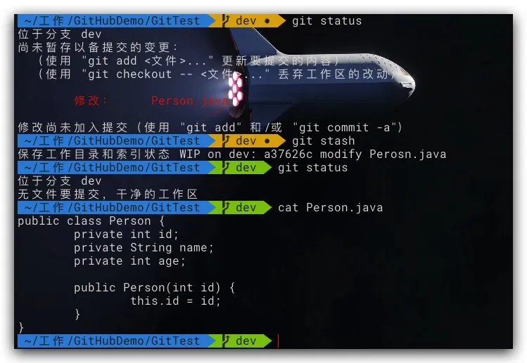
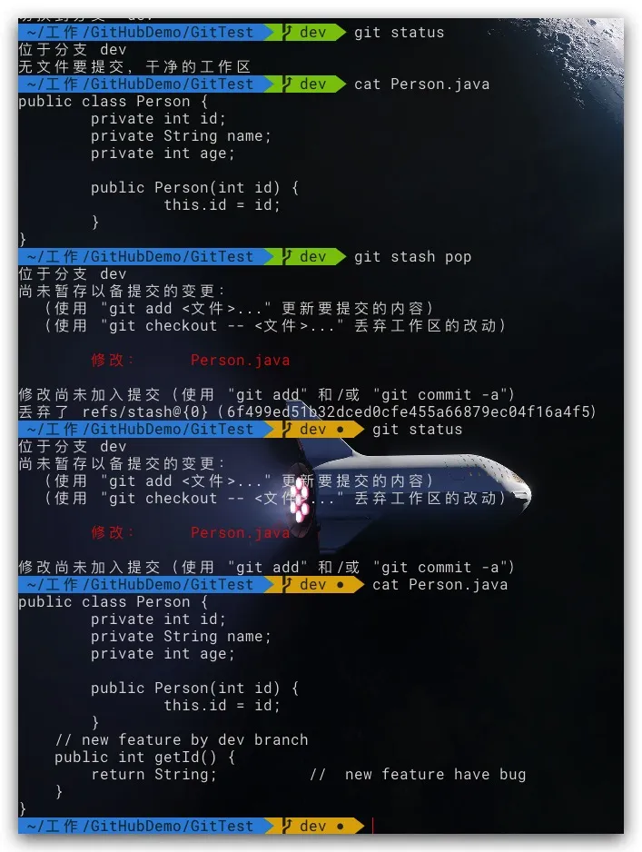
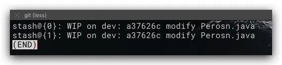
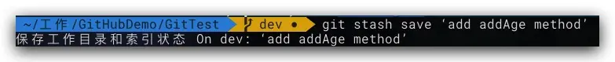
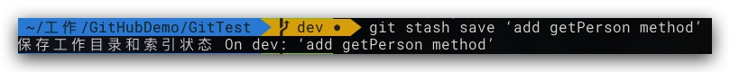
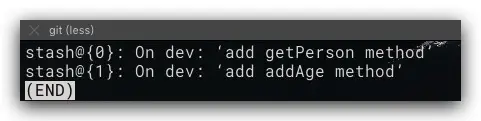
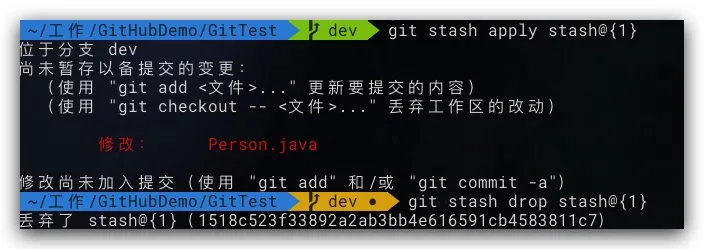

## 应用场景

当我们开发一个新功能时会先从master拉出一个分支dev，然后在这个dev分支下吭哧吭哧的开始写代码开发新功能，就如下代码所示，我们在dev分支下开发Person类的新功能getId

```java
public class Person {
    private int id;
    private String name;
    private int age;
    public Person(int id) {
        this.id = id;
    }
    // new feature by dev branch
    public int getId() {
        return String;      //  new feature have bug
    }
}
```

就在此时，线上版本master出现了bug，我们应该放下手头上新功能的开发工作先将master上的bug修复，这个时候dev分支下的改动怎么处理？ - 向dev分支提交新功能的代码，然后再切换到master下 - 直接切换到master分支下

首先我们新功能的代码还没开发完成，其次新功能这里还有一些bug没解决，就这样把有问题的代码提交到dev分支中，虽然可以解决目前我们的处境但不是很妥；但是第二种方案，直接切换，明显更不妥。怎么办？我们好像陷入了困境……

## git stash 命令

别急，Git提供了一个

执行下述命令来储藏dev分支下的修改

```bash
git stash
```



可以看到此时我们的工作区已经干净了，dev分支中被修改的文件也已经恢复到了版本库中的版本，说明dev分支修改已经被储藏成功了。这个时候我们就可以放心的切换到master分支下去修复我们线上版本的bug了。线上bug修复完成后，我们就可以继续开始之前的新功能的开发了

先切换到dev分支下:

```bash
git checkout dev
```

然后，取出之前储藏的修改

```bash
git stash pop
```



从上图的执行结果可以看出，我们之前开发到一半的新功能又回来啦，这个时候，我们就可以再续前缘啦来接着开发新功能了

## 多次储藏

从上面的介绍，让我们对

## 查看储藏记录

执行下述命令来查看我们两次储藏后的结果

```bash
# 查看储藏记录列表
git stash list
```



从上图结果中，我们发现两次储藏记录的标识信息完全一致，只有其前面的index有别，这让我们很难确定我们所需取出的文件修改是储藏在哪一个中。在git默认按如下规则标识储藏记录(WIP意为work in progess, index用于后面取出所对应储藏的修改)，由于我们在dev分支下的两次修改中均未发生提交，所以其最近一次的提交ID是一致的。

```bash
stash@{index}: WIP on [分支名]: [最近一次的commitID] [最近一次的提交信息]
```

## 标识储藏记录

可以通过下述命令来标记此次储藏，以便后期查看

```bash
git stash save [stashMessage]
```

如下所示，进行两次 修改-储藏 操作，并进行自定义标识





然后再执行 



## 取出储藏

前文提到的可以通过

```bash
# 取出指定index的储藏的修改到工作区中
git stash apply stash@{index} 
# 将指定index的储藏从储藏记录列表中删除
git stash drop stash@{index}
```



**Note:**

1. **git stash pop**