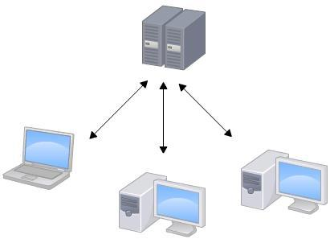
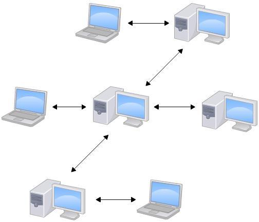
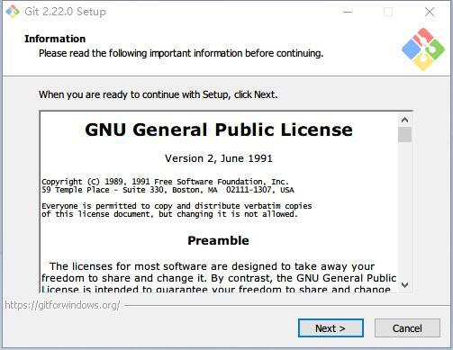
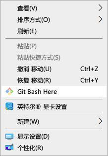
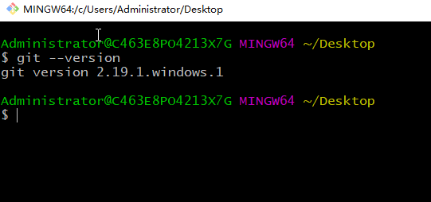

# 1、版本控制

## 1.1什么是版本控制？

我们为什么要关心它呢？版本控制是一种记录一个或若干文件内容变化，以便将来查阅特定版本修订情况的系统

## 1.2为什么要使用版本控制?

软件开发中采用版本控制系统是个明智的选择。有了它你就可以将某个文件回溯到之前的状态，甚至将整个项目都回退到过去某个时间点的状态。就算你乱来一气把整个项目中的文件改的改删的删，你也照样可以轻松恢复到原先的样子。但额外增加的工作量却微乎其微。你以比较文件的变化细节，查出最后是谁修改了哪个地方，从而找出导致怪异问题出现的原因，又是谁在何时报告了某个功能缺陷等等。

- 集中化的版本控制系统

集中化的版本控制系统诸如 CVS，svn 以及 Perforce 等，都有一个单一的集中管理的服务器，保存所有文件的修订版本，而协同工作的人们都通过客户端连到这台服务器，取出最新的文件或者提交更新。多年以来，这已成为版本控制系统的标准做法



这种做法带来了许多好处，现在，每个人都可以在一定程度上看到项目中的其他人正在做些什么。而管理员也可以轻松掌控每个开发者的权限，并且管理一个集中化的版本控制系统; 要远比在各个客户端上维护本地数据库来得轻松容易

事分两面，有好有坏。这么做最显而易见的缺点是中央服务器的单点故障。如果 服务器 宕机一小时，那么在这一小时内，谁都无法提交更新，也就无法协同工作。

( 并不是说服务器故障了就没有办法写代码了, 只是在服务器故障的情况下, 编写的代码是没有办法得到保障的.想 试想 svn 中央服务器挂机一天. 你还拼命写了一天代码, 其中 12 点之前的代码 都是高质量可靠的, 而且有很多闪光点.而 而 12 点之后的代码由于你想尝试一个比较大胆的想法, 将代码改的面目全非了. 这样下来你 12 点之前做的工作也都白费了 有记录的版本只能是 svn 服务器挂掉时保存的版本!)

要是中央服务器的磁盘发生故障，碰巧没做备份，或者备份不够及时，就会有丢失数据的风险。最坏的情况是彻底丢失整个项目的所有历史更改记录，而被客户端偶然提取出来的保存在本地的某些快照数据就成了恢复数据的希望。但这样的话依然是个问题，你不能保证所有的数据都已经有人事先完整提取出来过。只要整个项目的历史记录被保存在单一 位置，就有丢失所有历史更新记录的风险。

- 分布式 的 版本控制系统

于是分布式版本控制系统面世了。在这类系统中，像 Git，BitKeeper 等， 客户端并不只提取最新版本的文件快照，而是把代码仓库完整地镜像下来。这么一来，任何一处协同工作用的服务器发生故障，事后都可以用任何一个镜像出来的本地仓库恢复。因为每一次的提取操作，实际上都是一次对代码仓库的完整备份



更进一步，许多这类系统都可以指定和若干不同的远端代码仓库进行交互。籍此，你就可以在同一个项目中分别和不同工作小组的人相互协作。

分布式的版本控制系统在管理项目时 存放的不是项目版本与版本之间的差异. 它存的是索引( 所需磁盘空间很少 所以每个客户端都可以放下整个项目的历史记录)

分布式的版本控制系统出现之后, 解决了集中式版本控制系统的缺陷:

1. 断网的情况下也可以进行开发( 因为版本控制是在本地进行的)

1. 使用 github 进行团队协作, 哪怕 github 挂了 每个客户端保存的也 都是整个完整的项目( 包含历史记录的!!!)

# 2、Git 简史

Git 是目前世界上最先进的分布式版本控制系统。同生活中的许多伟大事件一样，Git诞生于一个极富纷争大举创新的年代。Linux 内核开源项目有着为数众广的参与者。绝大多数的 Linux 内核维护工作都花在了提交补丁和保存归档的繁琐事务上（1991－2002年间）。到 2002 年，整个项目组开始启用分布式版本控制系统 BitKeeper 来管理和维护代码。

到了 2005 年，开发 BitKeeper 的商业公司同 Linux 内核开源社区的合作关系结束，他们收回了免费使用 BitKeeper 的权力。这就迫使 Linux 开源社区（特别是 Linux的缔造者 Linus Torvalds ）不得不吸取教训，只有开发一套属于自己的版本控制系统才不至于重蹈覆辙。他们对新的系统制订了若干目标：

- 分支切换速度快  

- 容量小( 压缩) 

- 简单的设计 

- 完全分布式

- 对非线性开发模式的强力支持（允许上千个并行开发的分支）

- 有能力高效管理类似 Linux 内核一样的超大规模项目（速度和数据量）

自诞生于 2005 年以来，Git 日臻成熟完善，在高度易用的同时，仍然保留着初期设定的目标。它的速度飞快，极其适合管理大项目，它还有着令人难以置信的非线性分支管理系统可以应付各种复杂的项目开发需求。

# 3、Git安装

- 在 Windows 上安装

- git 地址 : 

下载完安装包之后，双击 exe 安装包，可以看到如下图窗口界面，一直点击



完成安装之后，就可以使用命令行的 git 工具（已经自带了 ssh 客户端）;

图示如下:



当你点击 git bash Here 菜单之后，可以看到一个终端窗口，在终端里面输入命令 git --version ，如果可以看到 git 的版本信息，则说明安装成功，如下图所示：



- 在 Mac 上安装

- git 地址 : 

下载下来之后可以看到一个 dmg 文件，双击打开 压缩文件，可以看到里面有一个文件， 再次双击 pkg 文件，就可以进行安装，然后按照引导一直点击继续按钮就可以完成安装了.

# 3、Git 初始化设置

一般在新的系统上，我们都需要先配置下自己的 Git 工作环境。配置工作只需一次，以后升级时还会沿用现在的配置。当然，如果需要，你随时可以用相同的命令修改已有的配置。

Git 提供了一个叫做 git config 的命令来配置或读取相应的工作环境变量而正是由这些环境变量，决定了 Git 在各个环节的具体工作方式和行为。这些变量可以存放在以下三个不同的地方：

```
/etc/gitconfig 文件：    系统中对所有用户都普遍适用的配置。若使用 gitconfig 时用 --system 选项，读写的就是这个文件。
~/.gitconfig 文件：    用户目录下的配置文件只适用于该用户。若使用 gitconfig 时用 --global 选项，读写的就是这个文件。
.git/config 文件 ：    当前项目的 Git 目录中的配置文件（也就是工作目录中的 .git/config 文件）这里的配置仅仅针对当前项目有效。
```

每一个级别的配置都会覆盖上层的相同配置

## 3.1 配置内容

- 用户信息

第一个要配置的是你个人的用户名称和电子邮件地址。这两条配置很重要，每次 Git 提交时都会引用这两条信息，说明是谁提交了更新，所以会随更新内容一起被永久纳入历史记录：

```
$ git config --global user.name "damu"
$ git config --global user.email damu@example.com
git config --list           #要检查已有的配置信息
git config --global --unset user.email #删除配置信息 
```