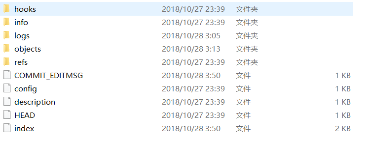
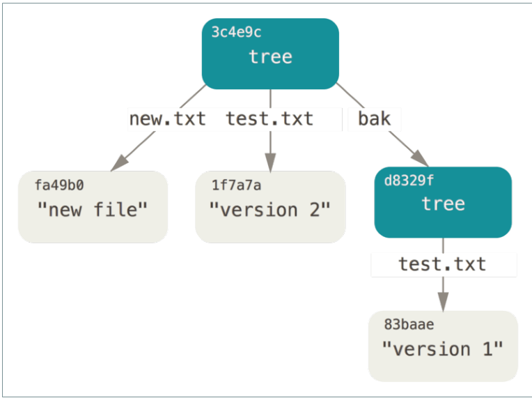
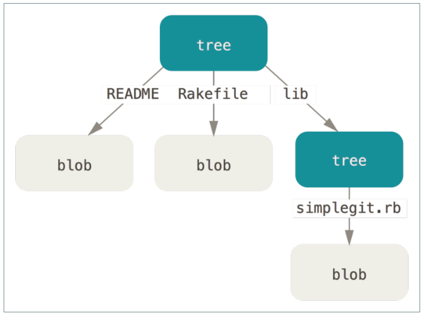
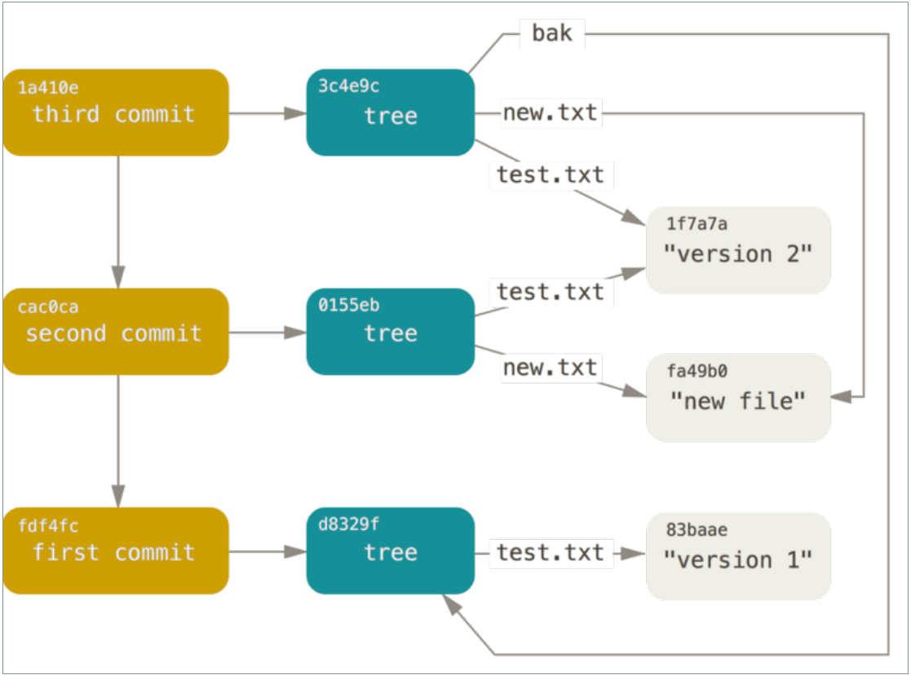

# **1、Git 底层概念（底层命令）**

# 1、基础的 linux 命令

```
clear ：    #清除屏幕
echo 'test content'：    #往控制台输出信息 echo 'test content' > test.txt
ll ：                    #将当前目录下的 子文件&子目录平铺在控制台
find 目录名：             #将对应目录下的子孙文件&子孙目录平铺在控制台
find 目录名 -type f ：    #将对应目录下的文件平铺在控制台
rm 文件名 ：              #删除文件
mv 源文件 重命名文件:      #重命名
cat 文件的 url :          #查看对应文件的内容
vim 文件的 url( 在英文模式下)
```

# 2、初始化新仓库

- 命令：git init

- 解析：要对现有的某个项目开始用 Git 管理，只需到此项目所在的目录，执行：git init

- 作用：初始化后，在当前目录下会出现一个名为 .git 的目录，所有 Git 需要的数据和资源都存放在这个目录中。

不过目前，仅仅是按照既有的结构框架初始化好了里边所有的文件和目录，但我们还没有开始跟踪管理

项目中的任何一个文件。

# 3、git 目录



```
hooks         #目录包含客户端或服务端的钩子脚本；
info          #包含一个全局性排除文件
logs          #保存日志信息
objects       #目录存储所有数据内容；
refs          #目录存储指向数据的提交对象的指针（分支）
config        #文件包含项目特有的配置选项
description   #用来显示对仓库的描述信息
HEAD          #文件指示目前被检出的分支
index         #文件保存暂存区信息 
```

# 4、git 对象

Git 的核心部分是一个简单的键值对数据库。你可以向该数据库插入任意类型的内容，它会返回一个键值，通过该键值可以在任意时刻再次检索该内容

- 向数据库写入内容 并返回对应键值

```
命令：
echo 'test content' | git hash-object -w --stdin
    -w 选项指示 hash-object 命令存储数据对象；若不指定此选项，则该命令仅返回对应的键值
    -- stdin （ standard input ） 选项则指示该命令从标准输入读取内容；
        若不指定此选项 ，则须在命令尾部给出待存储文件的路径
        git hash-object -w 文件路径存文件
        git hash-object  文件路径 ，返回对应文件的键值
            >> d670460b4b4aece5915caf5c68d12f560a9fe3e4    
返回：>> 该命令输出一个长度为 40 个字符的校验和。 这是一个 SHA-1 哈希值
```

- 查看 Git 是如何存储数据的

```
命令：
    find .git/objects -type f
返回：>>  .git/objects/d6/70460b4b4aece5915caf5c68 d12f560a9fe3e4
这就是开始时 Git 存储内容的方式 ： 一个文件对应一条内容 。
用于命名子目录，余下的 38 个字符则用作文件名。
```

- 根据键值拉取数据

```
命令：
    git cat-file  -p d670460b4b4aece5915caf5c68d12f560a9fe3e4
        -p  #print,打印对象的内容
        -t  #type，显示对象的类型
        -s  #size,显示对象的内容大小
返回：>> 对应文件的内容
```

#  5、对一个文件进行简单的版本控制

- 创建一个新文件并将其内容存入数据库

```
命令：
    echo 'version 1' > tes t.txt
    git hash-object -w test.txt
返回:>> 83baae61804e65cc73a7201a7252750c76066a30
```

- 向文件里写入新内容，并再次将其存入数据库

```
命令：
    echo 'version 2' > test.txt
    git hash-object -w test.txt    #-w,write  写入
返回：>> 1f7a7a472abf3dd9643fd615f6da379c4acb3e3a
```

- 查看数据库内容

```
命令：
    find .git/objects -type f
    git cat-file -p 83baae61804e65cc73a7201a7252750c76066a30
    git cat-file -p 1f7a7a472abf3dd9643fd615f6da379c4acb3e3a     #-p path,路径
    git cat-file -t 1f7a7a472abf3dd9643fd615f6da379c4acb3e3a     #-t type，类型
利用 cat-file -t 命令，可以让 Git 告诉我们其内部存储的任何对象类型
返回：>> blob
```

问题：

1. 记住文件的每一个版本所对应的 SHA-1 值并不现实

1. 在 Git 中，文件名并没有被保存——我们仅保存了文件的内容

解决方案：

- 注意

当前的操作都是在对本地数据库进行操作 不涉及暂存区

# 6、构建树对象

树对象（tree object），它能解决文件名保存的问题，也允许我们将多个文件组织到一起。Git 以一种类似于 UNIX 文件系统的方式存储内容。所有内容均以树对象和数据对象(git 对象)的形式存储，其中树对象对应了 UNIX 中的目录项，数据对象(git 对象)则大致上对应文件内容。一个树对象包含了一条或多条记录（每条记录含有一个指向 git 对象或者子的 树对象的 SHA-1 指针 ， 以及相应的模式、类型、文件名信息 ）。一个树对象也可以包含另一个树对象。

我们可以通过

假设我们做了一系列操作之后得到一个树对像

## 6.1操作

1. 利用 update-index 命令 为 test.txt 文件的首个版本——创建一个暂存区。并通过 write-tree 命令生成树对像。

```
命令：
    git update-index  --add --cacheinfo 100644 83baae61804e65cc73a7201a7252750c76066a30 test.txt
    git write-tree
文件模式为：
    100644 ，表明这是一个普通文件
    100755 ，表示一个可执行文件；
    120000 ，表示一个符号链接。 。
-- add 选项 ：
    因为此前该文件并不在暂存区中 首次需要 — add
-- cacheinfo 选项 ：
    因为将要添加的文件位于 Git 数据库中，而不是位于当前目录下 所有需要 --cacheinfo
```

1. 新增 new.txt 将 new.txt 和 test.txt 文件的第二个个版本塞入暂存区。并通过 write- -e tree 命令生成树对像。

```
命令：
    echo 'new file' > new.txt
    git update-index  --cacheinfo 100644  f7a7a472abf3dd9643fd615f6da379c4acb3e3a test.txt
    git update-index  --add new.txt
    git write-tree
```

1. 将第一个树对象加入第二个树对象，使其成为新的树对象

```
命令：
    git read-tree --prefix=bak d8329fc1cc938780ffdd9f94e0d364e0ea74f579
    git write-tree
        #read-tree 命令，可以把树对象读入暂存区
```

- 图示（最后的树对象）



- 问题

现在有三个树对象（执行了三次 write-tree），分别代表了我们想要跟踪的不同项目快照。然而问题依旧：若想重用这些快照，你必须记住所有三个SHA-1 哈希值。 并且，你也完全不知道是谁保存了这些快照，在什么时刻保存的，以及为什么保存这些快照。 而以上这些，正是提交对象（commit object）能为你保存的基本信息

# 7、 树对象

- 查看暂存区当前的样子

```
git ls-files -s
```

- 查看树对象

```
命令：
git cat-file -p master^{tree} （或者是树对象的 hash ）
    #master^{tree} 语法表示 master 分支上最新的提交所指向的树对象。
返回: >>
    100644 blob a906cb2a4a904a152e80877d4088654daad0c859 README
    100644 blob 8f94139338f9404f26296befa88755fc2598c289 Rakefile
    040000 tree 99f1a6d12cb4b6f19c8655fca46c3ecf317074e0 lib
```

**图示：**



**注意，**

```
git cat-file -p 99f1a6d12cb4b6f19c8655fca46c3ecf317074e0 100644 blob 47c6340d6459e05787f644c2447d2595f5d3a54b simplegit.rb
```

- 解析树对象

Git 根据某一时刻暂存区（即 index 区域）所表示的状态创建并记录一个对应的树对象，如此重复便可依次记录（某个时间段内）一系列的树对象。

其实树对象是对暂存区内操作的抽象，这颗树对象相对于就是快照。当我们的工作区有任何更改同步到暂存区时。便会调用 write-tree 命令

通过 write-tree 命令向暂存区内容写入一个树对象。它会根据当前暂存区状态自动创建一个新的树对象。即每一次同步都产生一颗树对象。且该命令会返回一个 hash 指向树对象。

在 Git 中每一个文件（数据）都对应一个 hash（类型 blob）每一个树对象都对应一个 hash（类型 tree）

- 总结

- 我们可以认为树对象就是我们项目的快照

# 8 、提交对象

我们可以通过调用 commit-tree 命令创建一个提交对象，为此需要指定一个树对象的 SHA-1 值，以及该提交的父提交对象（如果有的话 第一次将暂存区做快照就没有父对象）

-  创建提交对象

```
echo 'first commit' | git commit-tree d8329f
返回：>> fdf4fc3344e67ab068f836878b6c4951e3b15f3d
```

- 查看提交对象

```
git cat-file -p fdf4fc3
返回：>> 
    tree d8329fc1cc938780ffdd9f94e0d364e0ea74f579
    author Scott Chacon <schacon@gmail.com> 1243
    committer Scott Chacon <schacon@gmail.com> 1243
        first commit
```

- 提交对象格式

提交对象的格式很简单：

它先指定一个顶层树对象，代表当前项目快照；然后是作者/提交者信息（依据你的 user.name 和 user.email 配置来设定，外加一个时间戳）；留空一行，最后是提交注释

接着，我们将创建另两个提交对象，它们分别引用各自的上一个提交（作为其父提交对象）：

```
echo 'second commit' | git commit-tree 0155eb -p fdf4fc3
    >> cac0cab538b970a37ea1e769cbbde608743bc96d
echo 'third commit' | git commit-tree 3c4e9c -p cac0cab
    >> 1a410efbd13591db0
```

图示：



**注意**

**git commit-tree**