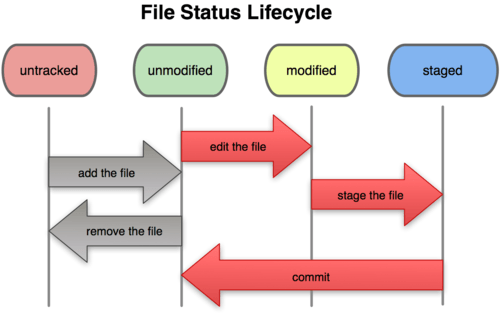

**Git本地操作（高层命令）**

# 1、初始化新仓库

- 命令：**git init**

- 解析：要对现有的某个项目开始用 Git 管理，只需到此项目所在的目录，执行：git init

- 作用：初始化后，在当前目录下会出现一个名为 .git 的目录，所有 Git 需要的数据和资源都存放在这个目录中。不过目前，仅仅是按照既有的结构框架初始化好了里边所有的文件和目录，但我们还没有开始跟踪管理项目中的任何一个文件。

# 2、记录每次更新到仓库

工作目录下面的所有文件都不外乎这两种状态： 已跟踪 或 未跟踪已跟踪的文件是指本来就被纳入版本控制管理的文件，在上次快照中有它们的记录，工作一段时间后，它们的状态可能是

所有其他文件都属于未跟踪文件。它们既没有上次更新时的快照，也不在当前的暂存区域。

初次克隆某个仓库时，工作目录中的所有文件都属于已跟踪文件，且状态为已提交；在编辑过某些文件之后，Git 将这些文件标为已修改。我们逐步把这些修改过的文件放到暂存区域，直到最后一次性提交所有这些暂存起来的文件。

使用 Git 时的文件状态变化周期如下图所示：



# 3、检查当前文件状态

- 命令：**git status**

- 作用：确定文件当前处于什么状态

## 3.1 克隆仓库 后的文件

如果在克隆仓库之后立即执行此命令，会看到类似这样的输出：

```
On branch master
nothing to commit, working directory clean
```

这说明你现在的工作目录相当干净。换句话说，所有已跟踪文件在上次提交后都未被更改过。此外，上面的信息还表明，当前目录下没有出现任何处于未跟踪的新文件，否则 Git 会在这里列出来。最后，该命令还显示了当前所在的分支是 master，这是默认的分支名称，实际是可以修改的，现在先不用考虑。

## 3.2 未跟踪文件

如果创建一个新文件README,保存退出后运行 git status 会看到该文件出现

在未跟踪文件列表中：

```
On branch master
Untracked files:
(use "git add <file>..." to include in what will be committed)
    README
nothing added to commit but untracked files present (use "git add" totrack)
```

在状态报告中可以看到新建的 README 文件出现在“Untracked files”下面。未跟踪的文件意味着 Git 在之前的快照（提交）中没有这些文件；Git 不会自动将之纳入跟踪范围，除非你明明白白地告诉它“我需要跟踪该文件”，因而不用担心把临时文件什么的也归入版本管理。

# 4、基本操作

## 4.1 跟踪新文件（暂存）

```
命令：**git add 文件名**
    作用：跟踪一个新文件再次运行 git status 命令，会看到 README 文件已被跟踪，并处于暂存
    状态：
        Changes to be committed:
        (use "git reset HEAD <file>..." to unstage)
        new file: README
```

只要在 “Changes to be committed” 这行下面的，就说明是已暂存状态。如果此时提交，那么该文件此时此刻的版本将被留存在历史记录中。在 git add 后面可以指明要跟踪的文件或目录路径。如果是目录的话，就说明要递归跟踪该目录下的所有文件。（译注：其实 git add 的潜台词就是把目标文件快照放入暂存区域，也就是 add file into staged area，同时未曾跟踪过的文件标记为已跟踪。）

## 4.2 暂存已修改文件

现在 README 文件都已暂存，下次提交时就会一并记录到仓库。假设此时，你想要在 README 里再加条注释，重新编辑存盘后，准备好提交。不过且慢，再运行 git status 看看：

```
On branch master
Changes to be committed:
(use "git reset HEAD <file>..." to unstage)
    new file: README
Changes not staged for commit:
(use "git add <file>..." to update what will be committed)
(use "git checkout -- <file>..." to discard changes in working directory)
    modified: README
```

README 文件出现了两次！一次算已修改，一次算已暂存，这怎么可能呢？

好吧，实际上 Git 只不过暂存了你运行 git add 命令时的版本，如果现在提交，那么提交的是添加注释前的版本，而非当前工作目录中的版本。所以，运行了 git add 之后又作了修订的文件，需要重新运行 git add 把最新版本重新暂存起来：

```
$ git add README
$ git status
On branch master
Changes to be committed:
(use "git reset HEAD <file>..." to unstage)
    new file: README
```

## 4.3 查看已暂存和未暂存的更新

实际上 

好了下次提交？

1. 当前做的哪些更新还没有暂存？，

1. 命令：**git diff（不加参数直接输入 git diff）**

1. 有哪些更新已经暂存起来准备好了下次提交？

1. 命令：** git diff –cached 或者 git diff –staged**(1.6.1 以上)

## 4.4 提交更新

当暂存区域已经准备妥当可以提交时，在此之前，请一定要确认还有什么修改过的或新建的文件还没有 git add 过，否则提交的时候不会记录这些还没暂存起来的变化。所以，每次准备提交前，先用 git status 看下，是不是都已暂存起来了，然后再运行提交命令

命令：

注意：这种方式会启动文本编辑器以便输入本次提交的说明默认的提交消息包含最后一次运行 git status 的输出，放在注释行里，另外开头还有一空行，供你输入提交说明。你完全可以去掉这些注释行，不过留着也没关系，多少能帮你回想起这次更新的内容有哪些。

另外也可以用 -m 参数后跟提交说明的方式，在一行命令中提交更新：

命令：

提交时记录的是放在暂存区域的快照，任何还未暂存的仍然保持已修改状态，可以在下次提交时纳入版本管理。每一次运行提交操作，都是对你项目作一次快照，以后可以回到这个状态，或者进行比较

## 4.4 跳过使用暂存区域

尽管使用暂存区域的方式可以精心准备要提交的细节，但有时候这么做略显繁琐。Git 提供了一个跳过使用暂存区域的方式，只要在提交的时候，给 

**git commit -a**

## 4.5 移除文件

要从 Git 中移除某个文件，就必须要从已跟踪文件清单中注册删除（确切地说，是在暂存区域注册删除），然后提交。可以用 git rm 命令完成此项工作，并连带从工作目录中删除指定的文件，这样以后就不会出现在未跟踪文件清单中了。

1. 从工作目录中手工删除文件

```
git status
On branch master
Changes not staged for commit:
(use "git add/rm <file>..." to update what will be committed)
(use "git checkout -- <file>..." to discard changes in working directory)
    deleted: grit.gemspec
no changes added to commit (use "git add" and/or "git commit -a")
```

1. 再运行 git rm 记录此次移除文件的操作

```
git status
On branch master
Changes to be committed:
(use "git reset HEAD <file>..." to unstage)
    deleted: grit.gemspec
```

1.  最后提交的时候，该文件就不再纳入版本管理了

## 4.6 文件改名

```
git mv file.from file.to
git status
    On branch master
    Changes to be committed:
    (use "git reset HEAD <file>..." to unstage)
        renamed: README.txt -> README
```

其实，运行 git mv 就相当于运行了下面三条命令：

```
$ mv README.txt README
$ git rm README.txt
$ git add README
```

## 4.7 查看历史记录

-  git log

在提交了若干更新，又或者克隆了某个项目之后，你也许想回顾下提交历史。完成这个任务最简单而又有效的工具是 git log 命令

```
$ git log
commit 085bb3bcb608e1e8451d4b2432f8ecbe6306e7e7
Author: Scott Chacon 
Date: Sat Mar 15 16:40:33 2008 -0700
    removed unnecessary test
commit a11bef06a3f659402fe7563abf99ad00de2209e6
Author: Scott Chacon 
Date: Sat Mar 15 10:31:28 2008 -0700
    first commit
```

默认不用任何参数的话， git log 会按提交时间列出所有的更新，最近的更新排在最上面。 正如你所看到的，这个命令会列出每个提交的 SHA-1 校验和、作者的名字和电子邮件地址、提交时间以及提交说明。

- git log 参数

```
git log --pretty=oneline
git log --oneline
```