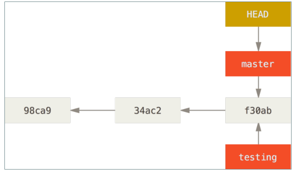
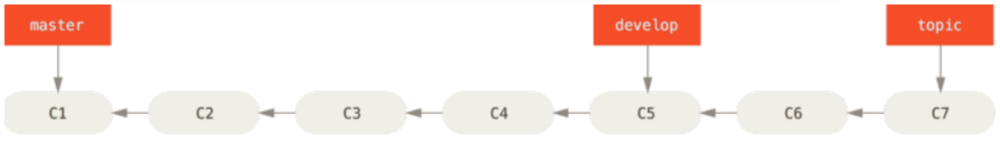

**Git 分支操作(杀手功能)**

几乎所有的版本控制系统都以某种形式支持分支。 使用分支意味着你可以把你的工作从开发主线上分离开来，以免影响开发主线。 在很多版本控制系统中，这是一个略微低效的过程——常常需要完全创建一个源代码目录的副本。对于大项目来说，这样的过程会耗费很多时间。而 Git 的分支模型极其的高效轻量的。是 Git 的必杀技特性，也正因为这一特性，使得 Git 从众多版本控制系统中脱颖而出。

# 1、创建分支

```
命令：git branch
作用：
    为你创建了一个可以移动的新的指针。 比如，创建一个 testing 分支：git branch testing。这会在当前所在的提交对象上创建一个指针
```

**注意：**



```
git branch             #不只是可以创建与删除分支。 如果不加任何参数运行它，会得到当前所有分支的一个列表
git branch -d name     #删除分支
git branch -v	       #可以查看每一个分支的最后一次提交
git branch name commitHash	#新建一个分支并且使分支指向对应的提交对象
git branch –merged	        #查看哪些分支已经合并到当前分支，在这个列表中分支名字前没有 * 号的分支通常可以使用
git branch -d 	        #删除掉；
git branch --no-merged	#查看所有包含未合并工作的分支，
#尝试使用 git branch -d 命令删除在这个列表中的分支时会失败。
#如果真的想要删除分支并丢掉那些工作，可以使用 -D 选项强制删除它。
```

# 2、查看当前分支所指对象

```
命令：git log --oneline –-decorate
（提供这一功能的参数是 --decorate）
```

# 3、切换分支

## 3.1 命令& & 图示

```
git checkout testing    #切换到test分支
```


## 3.2 做出修改在提交


## 3.3 切回master

```
命令：
git checkout master
```


**注意：**

分支切换会改变你工作目录中的文件在切换分支时，一定要注意你工作目录里的文件会被改变。 如果是切换到一个较旧的分支，你的工作目录会恢复到该分支最后一次提交时的样子。 如果 Git 不能干净利落地完成这个任务，它将禁止切换分支每次在切换分支前 提交一下当 前分支。

# 4、 查看项目分叉历史

```
git log --oneline --decorate --graph --all
```

# 5、 分支合并

```
命令：git merge 分支名
```

## 5.1 实际案例

- 工作流：

- 1.开发某个网站。

- 2.为实现某个新的需求，创建一个分支。

- 3.在这个分支上开展工作。

正在此时，你突然接到一个电话说有个很严重的问题需要紧急修补。 

你将按照如下方式来处理：

1.切换到你的线上分支（production branch）。

2.为这个紧急任务新建一个分支，并在其中修复它。

3.在测试通过之后，切换回线上分支，然后合并这个修补分支，最后将改动推送到线上分支。

4.切换回你最初工作的分支上，继续工作。

-  Git 流

首先，我们假设你正在你的项目上工作，并且已经有一些提交。


现在，你已经决定要解决你的公司使用的问题追踪系统中的 #53 问题。 

想要新建一个分支并同时切换到那个分支上，你可以运行一个带有 -b 参数的 git checkout 命令：

```
git checkout -b iss53
相当于
    git branch iss53
    git checkout iss53
```


你继续在 #53 问题上工作，并且做了一些提交。 在此过程中，iss53 分支在不断的向前推进，因为你已经检出到该分支


**！！！现在你接到那个电话，有个紧急问题等待你来解决**

有了 Git 的帮助，你不必把这个紧急问题和 iss53 的修改混在一起，你也不需要花大力气来还原关于 53# 问题的修改，然后再添加关于这个紧急问题的修改，最后将这个修改提交到线上分支。 你所要做的仅仅是切换回 master 分支

但是，在你这么做之前，要留意你的工作目录和暂存区里那些还没有被提交的修改，它可能会和你即将检出的分支产生冲突从而阻止 Git 切换到该分支。 最好的方法是，在你切换分支之前，保持好一个干净的状态。（提交你的所有修改）

```
git checkout master
```

这个时候，你的工作目录和你在开始 #53 问题之前一模一样，现在你可以专心修复紧急问题了。 请牢记：当你切换分支的时候，Git 会重置你的工作目录，使其看起来像回到了你在那个分支上最后一次提交的样子。 Git 会自动添加、删除、修改文件以确保此时你的工作目录和这个分支最后一次提交时的样子一模一样。

！！！接下来，你要修复这个紧急问题。 让我们建立一个针对该紧急问题的分支（hotfix branch），在该分支上工作直到问题解决：

```
git checkout -b hotfix
做出修改
git commit -a -m 'fixed the broken email address'
```


！！！你可以运行你的测试，确保你的修改是正确的，然后将其合并回你的 master 分支来部署到线上。 你可以使用 git merge 命令来达到上述目的

```
git checkout master
git merge hotfix
```

在合并的时候，有时候会出现"快进（fast-forward）"这个词。 由于当前 master 分支所指向的提交是你当前提交的直接上游，所以 Git 只是简单的将指针向前移动。 换句话说，当你试图合并两个分支时，如果顺着一个分支走下去能够到达另一个分支，那么 Git 在合并两者的时候，只会简单的将指针向前推进（指针右移），因为这种情况下的合并操作没有需要解决的分歧——这就叫做 “快进（fast-forward）


！！！关于这个紧急问题的解决方案发布之后，你准备回到被打断之前时的工作中。 然而，你应该先删除 hotfix 分支，因为你已经不再需要它了—— master 分支已经指向了同一个位置。 你可以使用带 -d 选项的 git branch 命令来删除分支。现在你可以切换回你正在工作的分支继续你的工作，也就是针对 #53 问题的那个分支

```
git branch -d hotfix
git checkout iss53
```


你在 hotfix 分支上所做的工作并没有包含到 iss53 分支中。 如果你需要拉取 hotfix 所做的修改，你可以使用 git merge master 命令

将 master 分支合并入 iss53 分支，或者你也可以等到 iss53 分支完成其使命，再将其合并回 master 分支。

```
git checkout master
git merge iss53
```

- 典型合并

当前的合并和你之前合并 hotfix 分支的时候看起来有一点不一样。 在这种情况下，你的开发历史从一个更早的地方开始分叉开来（diverged）。 因为， master 分支所在提交并不是 iss53 分支所在提交的直接祖先，Git 不得不做一些额外的工作。 出现这种情况的时候，Git 会使用两个分支的末端所指的快照（ C4 和 C5 ）以及这两个分支的工作祖先（ C2 ），做一个简单的三方合并。


和之前将分支指针向前推进所不同的是，Git 将此次三方合并的结果做了一个新的快照并且自动创建一个新的提交指向它。 这个被称作一次 合并提交，它的特别之处在于他有不止一个父提交。


需要指出的是，Git 会自行决定选取哪一个提交作为最优的共同祖先，并以此作为合并的基础；这和更加古老的 CVS 系统或者 Subversion （1.5 版本之前）不同，在这些古老的版本管理系统中，用户需要自己选择最佳的合并基础。 Git 的这个优势使其在合并操作上比其他系统要简单很多.

最终删除 iss53 号分支

```
git branch -d iss53
```

- 冲突
	有时候合并操作不会如此顺利。 如果你在两个不同的分支中，对同一个文件的同一个部分进行了不同的修改，Git 就没法干净的合并它们。 如果你对 #53 问题的修改和有关 hotfix 的修改都涉及到同一个文件的同一处，在合并它们的时候就会产生合并冲突
	此时 Git 做了合并，但是没有自动地创建一个新的合并提交。 Git 会暂停下来，等待你去解决合并产生的冲突。 你可以在合并冲突后的任意时刻使用 git status 命令来查看那些因包含合并冲突而处于未合并（unmerged）状态的文件任何因包含合并冲突而有待解决的文件，都会以未合并状态标识出来。

```
<<<<<<< HEAD:index.html
<div id="footer">contact : email.support@github.com</div>
<div id="footer">
please contact us at support@github.com
</div>
>>>>>>>>iss53:index.html
```

在你解决了所有文件里的冲突之后，对每个文件使用 git add 命令来将其标记为冲突已解决。 

一旦暂存这些原本有冲突的文件，Git 就会将它们标记为冲突已解决

# 6 、 分支模式

## 6.1 长期分支


许多使用 Git 的开发者都喜欢使用这种方式来工作，比如只在 master 分支上保留完全稳定的代码——有可能仅仅是已经发布或即将发布的代码。 他们还有一些名为 develop 或者 next 的平行分支，被用来做后续开发或者测试稳定性——这些分支不必保持绝对稳定，但是一旦达到稳定状态，它们就可以被合并入 master 分支了。等待下一次的发布。

随着你的提交而不断右移的指针。 稳定分支的指针总是在提交历史中落后一大截，

而前沿分支的指针往往比较靠前。



- 特性分支（topic ）

特性分支对任何规模的项目都适用。 特性分支是一种短期分支，它被用来实现单一特性或其相关工作。 也许你从来没有在其他的版本控制系统（ VCS ）上这么做过，因为在那些版本控制系统中创建和合并分支通常很费劲。 然而，在 Git 中一天之内多次创建、使用、合并、删除分支都很常见。

实例：

考虑这样一个例子，你在 master 分支上工作到 C1 ，这时为了解决一个问题而新建 iss91 分支，在 iss91 分支上工作到 C2 ，这时思路断了，你暂时放弃修复 iss91 ，切回主分支又工作到了 c3 （画了几个页面）。这时你突然对 iss91 问题有了新的想法，你切回 iss91 继续工作到了 c6 。在完成了对 iss91 的 bug 修复之后。你发现你 C4 之后的修改都没有使用 ES6语法。于是你再新建一个 iss91v2 分支重新使用 ES6 语法开发到 C8，写了一会写累了。接着你回到 master 分支又画了一会页面到 C10，画完页面后你一咬牙切回 iss91v2 完成 es6 版本的修改到 C11. 你又冒出了一个不太确定的想法，切回 master 后新建一个 dumbidea 分支，并在上面做些实验。 你的提交历史看起来像下面这个样子：


现在，我们假设两件事情：你决定使用第二个方案来解决那个问题，即使用在 iss91v2 分支中方案；另外，你将 dumbidea 分支拿给你的同事看过之后，结果发现这是个惊人之举。 这时你可以抛弃 iss91 分支（即丢弃 C5 和 C6 提交），然后把另外两个分支合并入主干分支。 最终你的提交历史看起来像下面这个样子：

- 在 master 分支是先合并 dumbidea 分支

- 切回 iss91v2 分支合并掉 iss91

- 删除 iss91

- 切回 master 分支再合并 iss91v2 分支


# 7、分支本质

Git 的分支，其实本质上仅仅是指向提交对象的可变指针

- 注意

Git 的 “master” 分支并不是一个特殊分支。 它就跟其它分支完全没有区别。 之所以几乎每一个仓库都有 master 分支，是因为 git init 命令默认创建它，并且大多数人都懒得去改动它。

-  图示


# 8、分支原理

- .git/refs 目录

这个目录中保存了分支及其对应的提交对象

- HEAD 引用

当运行类似于 git branch (branchname) 这样的命令时，Git会取得当前所在分支最新提交对应的 SHA-1 值，并将其加入你想要创建的

任何新分支中。

当你执行 git branch (branchname) 时，Git 如何知道最新提交的 SHA-1 值呢？ 答案是 HEAD 文件。

HEAD 文件是一个符号引用（symbolic reference），指向目前所在的分支。 所谓符号引用，意味着它并不像普通引用那样包含一个 SHA-1 值。它是一个指向其他引用的指针