**撤销& 重置**

#  1、撤销

- **git commit --amend**

```
git commit –-amend
命令: git commit --amend
    作用:
    这个命令会将暂存区中的文件提交。如果自上次提交以来你还未做任何修改（例如，在上次提交后马上执
    行了此命令），那么快照会保持不变，而你所修改的只是提交信息如果你提交后发现忘记了暂存某些需要的修改，可以像下面这样操作
git commit -m 'initial commit'
git add forgotten_file
git commit –amend
    最终你只会有一个提交 - 第二次提交将代替第一次提交的结果
```

-  **git reset**

```
git reset
    命令：git reset HEAD 文件名
    作用：将暂存区中还没有提交的文件，恢复到上一个版本。
```

- **git checkout**

```
命令：git checkout -- 文件名
作用：将在工作目录中对文件的修改撤销
注意：
    git checkout -- [file] 是一个危险的命令，这很重要。 你对那个文件做的任
        何修改都会消失 - 你只是拷贝了另一个文件来覆盖它。 除非你确实清楚不想要那个文件了，否则不要使用这个命令
        -将该文件，恢复成暂存区中的对应的文件的版本。
            相当于如果你修改了该文件，但是并没有进行追踪的话，就会恢复成上次追踪的内容。
```

# 2、HEAD

HEAD 是当前分支引用的指针，它总是指向该分支上的最后一次提交。这表示 HEAD 将是下一次提交的父结点。通常，理解 HEAD 的最简方式，就是将它看做 当前提交 的快照。

```
git cat-file -p HEAD    #查看当前提交对象
git ls-tree -r HEAD     #查看当前提交对象对应 的树对像的内容
```

-  暂存区（索引区）

```
git ls-files -s    #查看暂存区当前的样子
```

- 工作目录

你可以把工作目录当做 沙盒。在你将修改提交到暂存区并记录到历史之前，可以随意更改。

- 细化基本流程

当我们运行 git init ，这会创建一个 Git 仓库，其中的 HEAD 引用指向未创建的分支。此时，只有工作目录有内容

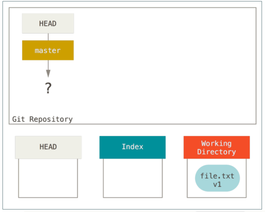

现在我们想要提交这个文件，所以用 git add 来获取工作目录中的内容，并将其复制到索引中。

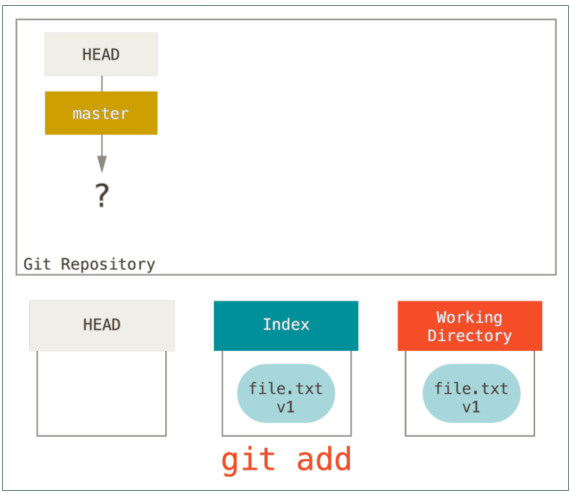

接着运行 git commit ，它会取得索引中的内容并将它保存为一个永久的快照，然后创建一个指向该快照的提交对象，最后更新 master 来指向本次提交。

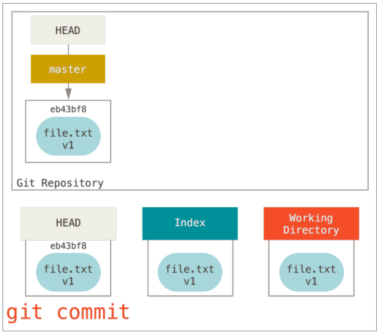

此时如果我们运行 git status ，会发现没有任何改动，因为现在三棵树完全相同

现在我们想要对文件进行修改然后提交它。 我们将会经历同样的过程；首先在工作目录中修改文件。 我们称其为该文件的 v2 版本，并将它标记为红色。

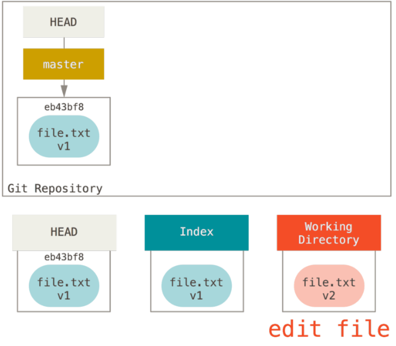

如果现在运行 git status ，我们会看到文件显示在 “Changes not staged for commit,” 下面并被标记为红色，因为该条目在索引与工作目录之间存在不同。

接着我们运行 git add 来将它暂存到索引中

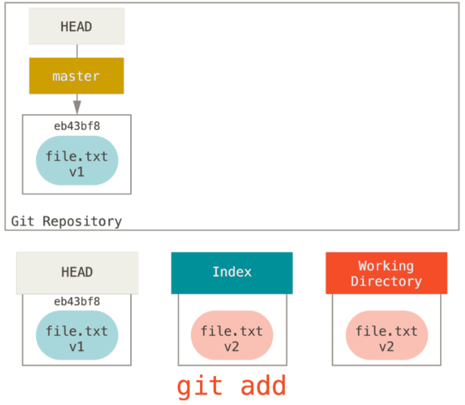

此时，由于索引和 HEAD 不同，若运行 git status 的话就会看到“Changes to be committed” 下的该文件变为绿色 ——也就是说，现在预期的下一次提交与上一次提交不同。 最后，我们运行 git commit 来完成提交。

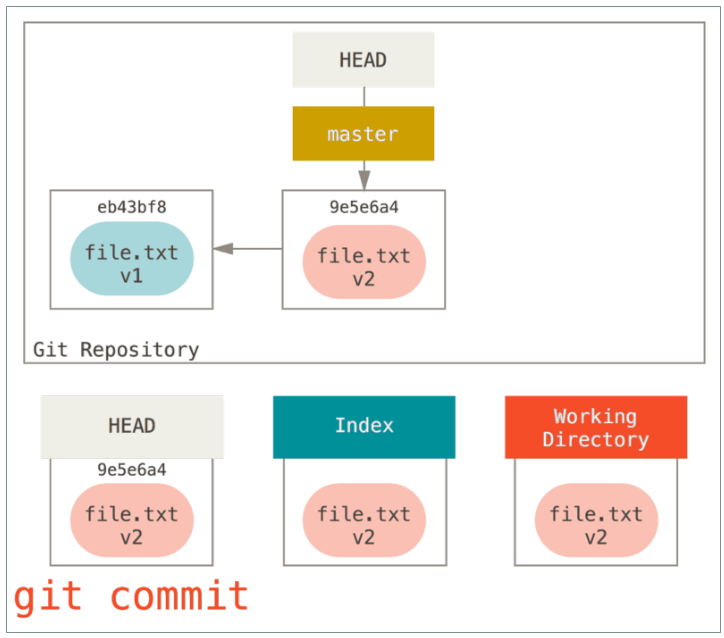

现在运行 git status 会没有输出，因为三棵树又变得相同了。

切换分支或克隆的过程也类似。 当检出一个分支时，它会修改 HEAD 指向将 新的分支引用，将 索引 填充为该次提交的快照，然后将 索引 的内容复制到工作目录 中。

# 3、重置 rest

## 3.1 rest 三部曲（commitHash）

### 3.1.1 移动HEAD

reset 做的第一件事是移动 HEAD 的指向。

假设我们再次修改了 file.txt 文件并第三次提交它。 现在的历史看起来是这样。

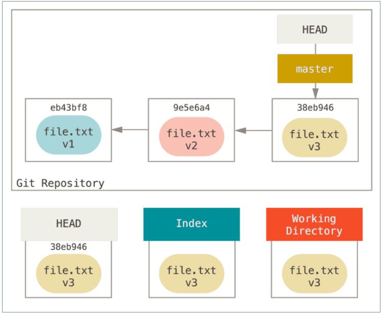

git reset –soft HEAD~

这与改变 HEAD 自身不同（checkout 所做的）；reset 移动 HEAD 指向的分支。

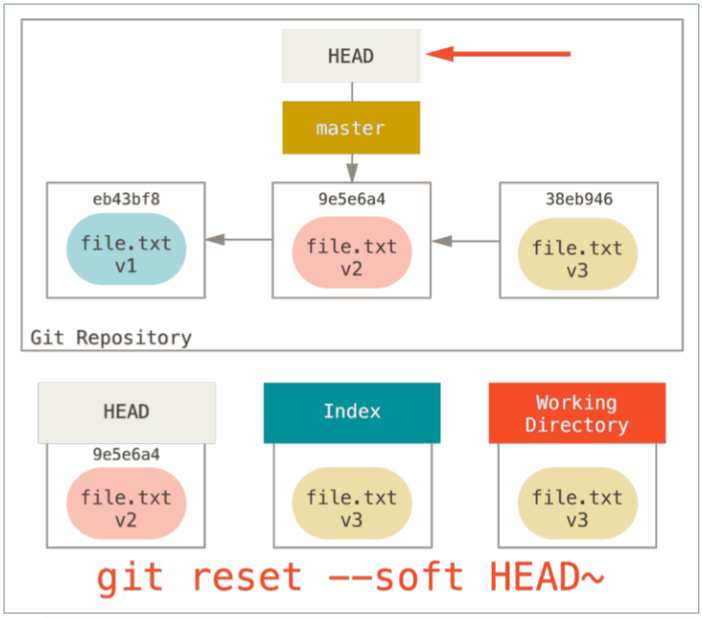

看一眼上图，理解一下发生的事情：它本质上是撤销了上一次 git commit 命令。 当你在运行 git commit 时，Git 会创建一个新的提交，并移动 HEAD 所指向的分支来使其指向该提交。

当你将它 reset 回 HEAD~ （HEAD 的父结点）时，其实就是把该分支移动回原来的位置，而不会改变索引和工作目录。 现在你可以更新索引并再次运行 git commit 来完成 git commit --amend 所要做的事情了。

### 3.1.2 更新暂存区（索引）

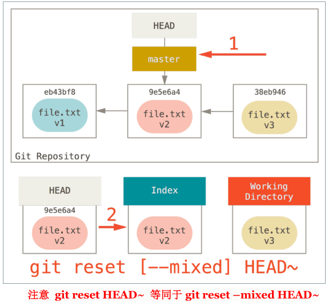

理解一下发生的事情：它依然会撤销一上次 提交，但还会 取消暂存 所有的东西。 于是，我们回滚到了所有 git add 和 git commit 的命令执行之前。

### 3.1.3 更新工作目录


你撤销了最后的提交、 git add 和 git commit 命令 以及工作目录中的所有工作。

## 3.2 注意点

必须注意， --hard 标记是 reset 命令唯一的危险用法，它也是 Git 会真正地销毁数据的仅有的几个操作之一。 其他任何形式的 reset 调用都可以轻松撤消，但是 --hard 选项不能，因为它强制覆盖了工作目录中的文件。在这种特殊情况下，我们的 Git 数据库中的一个提交内还留有该文件的 v3 版本，我们可以通过 reflog 来找回它。但是若该文件还未提交，Git 仍会覆盖它从而导致无法恢复。

## 3.3 路径rest

前面讲述了 reset 基本形式的行为，不过你还可以给它提供一个作用路径。 若指定了一个路径，reset 将会跳过第 1 步，并且将它的作用范围限定为指定的文件或文件集合。 这样做自然有它的道理，因为 HEAD 只是一个指针，你无法让它同时指向两个提交中各自的一部分。 不过索引和工作目录 可以部分更新，所以重置会继续进行第 2、3 步。

现在，假如我们运行 git reset file.txt （这其实是 git reset --mixed HEADfile.txt 的简写形式，），它会：

- 移动 HEAD 分支的指向 （因为是文件这一步忽略）

- 让索引看起来像 HEAD

所以它本质上只是将 file.txt 从 HEAD 复制到索引中

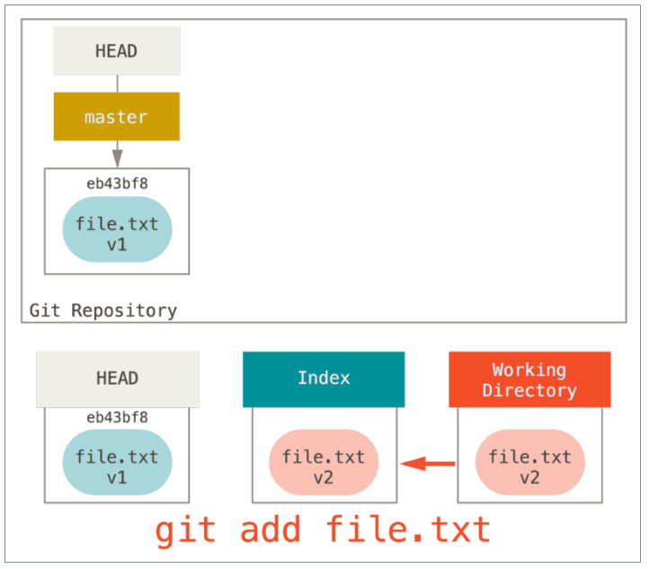

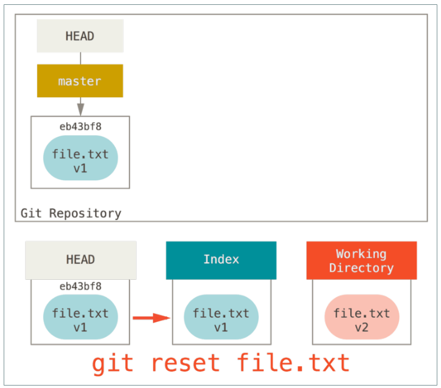

## 3.4 chekout

### 3.4.1 不带路劲

- git checkout [branch]

运行 git checkout [branch] 与运行 git reset --hard [branch] 非常相似，它会更新三者使其看起来像 [branch] ，不过有两点重要的区别

首先不同于 reset --hard ，checkout 对工作目录是安全的，它会通过检查来确保不会将已更改的文件弄丢。而 reset --hard 则会不做检

查就全面地替换所有东西。第二个重要的区别是如何更新 HEAD。 reset 会移动 HEAD 分支的指向，而 checkout 只会移动 HEAD 自身来指向另一个分支。

例如，假设我们有 master 和 develop 分支，它们分别指向不同的提交；我们现在在 develop 上。 如果我们运行 git reset master，那么 develop 自身现在会和 master 指向同一个提交。 而如果我们运行 gitcheckout master 的话，develop 不会移动，HEAD 自身会移动。 现在HEAD 将会指向 master。

所以，虽然在这两种情况下我们都移动 HEAD 使其指向了提交 A，但做法_是非常不同的。 reset 会移动 HEAD 分支的指向，而 checkout 则移动 HEAD 自身。

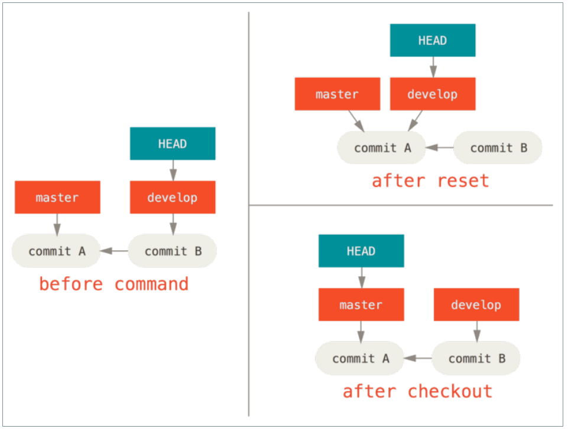

### 3.4.2 带路径

- git checkout commithash <file>

运行 checkout 的另一种方式就是指定一个文件路径，这会像 reset 一样不会移动 HEAD。 它就像是 git reset --hard [branch] file。 这样对工作目录并不安全，它也不会移动 HEAD 将会跳过第 1 步 更新暂存区 和 工作目录

- git checkout -- <file>

 相比于 git reset – hard commitHash 跟文件名的形式第一 第二步都没做