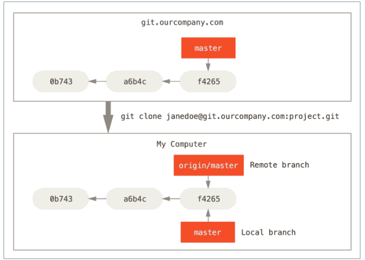

# 1、忽略某些文件

一般我们总会有些文件无需纳入 Git 的管理，也不希望它们总出现在未跟踪文件列表。通常都是些自动生成的文件，比如日志文件，或者编译过程中创建的临时文件等。我们可以创建一个名为 .gitignore 的文件，列出要忽略的文件模式。

*.[oa]

*~

第一行告诉 Git 忽略所有以 .o 或 .a 结尾的文件。一般这类对象文件和存档文件都是编译过程中出现的，我们用不着跟踪它们的版本。第二行告诉 Git 忽略所有以波浪符（~）结尾的文件，许多文本编辑软件（比如 Emacs）都用这样的文件名保存副本。此外，你可能还需要忽略 log，tmp 或者 pid 目录，以及自动生成的文档等等。要养成一开始就设置好 .gitignore 文件的习惯，以免将来误提交这类无用的文件

## 1.1  .gitignore 的格式规范

所有空行或者以注释符号 ＃ 开头的行都会被 Git 忽略。

可以使用标准的 glob 模式匹配。

```
*     代表匹配任意个字符
？    代表匹配任意一个字符
**     代表匹配多级目录
```

- 匹配模式前跟反斜杠（/） 这个斜杠代表项目根目录

- 匹配模式最后跟反斜杠（/）说明要忽略的是目录。

- 要忽略指定模式以外的文件或目录，可以在模式前加上惊叹号（!）取反。

## 1.2 示例

```
#此为注释 – 将被 Git 忽略
#忽略所有 .a 结尾的文件
    *.a
#但 lib.a 除外
    !lib.a
#仅仅忽略项目根目录下的 TODO 文件，不包括 subdir/TODO
    /TODO
#忽略 build/ 目录下的所有文件
    build/
#会忽略 doc/notes.txt 但不包括 doc/server/arch.txt
    doc/*.txt
#忽略 doc/ 目录下所有扩展名为 txt 的文件
    doc/**/*.txt（**通配符从 Git 版本 1.8.2 以上已经可以使用）
```

GitHub 有一个十分详细的针对数十种项目及语言的 .gitignore 文件列 表，你可以在 [https://github.com/github/gitignore](https://github.com/github/gitignore) 找到它!!!

# 2、什么是远程仓库

为了能在任意 Git 项目上团队协作，你需要知道如何管理自己的远程仓库。 远程仓库是指托管在因特网或其他网络中的你的项目的版本库。 你可以有好几个远程仓库，通常有些仓库对你只读，有些则可以读写。 与他人协作涉及管理远程仓库以及根据需要推送或拉取数据。 管理远程仓库包括了解如何添加远程仓库、移除无效的远程仓库、管理不同的远程分支并定义它们是否被跟踪等等。

# 3、远程协作基本流程

GitHub 是最大的 Git 版本库托管商，是成千上万的开发者和项目能够合作进行的中心。 大部分 Git 版本库都托管在 GitHub，很多开源项目使用 GitHub 实现 Git 托管、问题追踪、代码审查以及其它事情。 所以，尽管这不是 Git 开源项目的直接部分，但如果想要专业地使用 Git，你将不可避免地与 GitHub 打交道。

地址：[https://github.com/](https://github.com/) 注册成功之后邮箱内有份邮件一定要点！！！

## 3.1 项目经理 创建 远程仓库


通过点击面板右侧的“New repository”按钮，或者顶部工具条你用户名旁边的 + 按钮。点击后会出现“new repository” 表单:


这里除了一个你必须要填的项目名，其他字段都是可选的。 现在只需要点击 “Create Repository” 按钮，Duang!!! – 你就在 GitHub 上拥有了一个以 <user>/<project_name> 命名的新仓库了。

因为目前暂无代码，GitHub 会显示有关创建新版本库或者关联到一个已有的 Git 版本库的一些说明

现在你的项目就托管在 GitHub 上了，你可以把 URL 给任何你想分享的人 。 GitHub 上 的 项 目 可 通 过 HTTP 或 SSH 访 问 ， 格 式 是 ：

- **HTTP ： **

- **SSH ： git@github.com:<user>/<project_name> 。**

Git 可以通过以上两种 URL 进行抓取和推送，但是用户的访问权限又因连接时使用的

证书不同而异。

通常对于公开项目可以优先分享基于 HTTP 的 URL，因为用户克隆项目不需要有一个 GitHub 帐号。 如果你分享 SSH URL，用户必须有一个帐号并且上传 SSH 密钥才能访问你的项目。 HTTP URL 与你贴到浏览器里查看项目用的地址是一样的

## 3.2项目经理创建本地库

## 3.3项目经理为远程仓库配置别名& 用户信息

```
git remote add <shortname> <url>    #添加一个新的远程 Git 仓库，同时指定一个你可以轻松引用的简写
git remote –v        #显示远程仓库使用的 Git 别名与其对应的 URL
git remote show [remote-name]    #查看某一个远程仓库的更多信息
git remote rename pb paul    #重命名
git remote rm [remote-name]
    #如果因为一些原因想要移除一个远程仓库 - 你已经从服务器上搬走了或
    #不再想使用某一个特定的镜像了，又或者某一个贡献者不再贡献了
```

## 3.4项目经理 推送 本地项目 到远程仓库

初始化一个本地仓库然后：

```
git push [remote-name] [branch-name]
#将本地项目的 master 分支推送到 origin （别名）服务器
```

## 3.5 成员克隆远程仓库到本地

```
git clone url （克隆时不需要 git init ）
    默认克隆时为远程仓库起的别名为 origin
    远程仓库名字 “origin” 与分支名字 “master” 一样，在 Git 中并没有任何特别
的含义一样。 同时 “master” 是当你运行 git init 时默认的起始分支名字，原因仅仅
是它的广泛使用，“origin” 是当你运行 git clone 时默认的远程仓库名字。 如果你运
行 git clone -o booyah，那么你默认的远程仓库别名为 booyah
```

## 3.6 项目经理邀请成员加入团队

如果你想与他人合作，并想给他们提交的权限，你需要把他们添加为“Collaborators”。 如果 Ben，Jeff，Louise 都在 GitHub 上注册了，你想给他们推送的权限，你可以将他们添加到你的项目。 这样做会给他们 “推送” 权限，就是说他们对项目有读写的权限点击边栏底部的 “Settings” 链接


然后从左侧菜单中选择 “Collaborators” 。 然后，在输入框中填写用户名，点击 “Add collaborator.” 如果你想授权给多个人，你可以多次

重复这个步骤。 如果你想收回权限，点击他们同一行右侧的 “X”


## 3.7 成员推送提交 到远程仓库

- **git push [remote-name] [branch-name]**

只有当你有所克隆服务器的写入权限，并且之前没有人推送过时，这条命令才能生效。 当你和其他人在同一时间克隆，他们先推送到上游然后你再推送到上游，你的推送就会毫无疑问地被拒绝。 你必须先将他们的工作拉取下来并将其合并进你的工作后才能推送

## 3.8 项目经理更新成员提交的内容

- **git fetch [remote-name]**

这个命令会访问远程仓库，从中拉取所有你还没有的数据。 执行完成后，你将会拥有那个远程仓库中所有分支的引用，可以随时合并或

查看必须注意 git fetch 命令会将数据拉取到你的本地仓库 - 它并不会自动合并或修改你当前的工作。 当准备好时你必须手动将其合并入你的工作。

# 4、 深入理解远程库

## 4.1  远程跟踪分支

远程跟踪分支是远程分支状态的引用。它们是你不能移动的本地分支。当你做任何网络通信操作时，它们会自动移动。

它们以 (remote)/(branch) 形式命名，例如，如果你想要看你最后一次 与 远 程 仓 库 origin 通 信 时 master 分 支 的 状 态 ， 你 可 以 查看 origin/master 分支

当 克 隆 一 个 仓 库 时 ， 它 通 常 会 自 动 地 创 建 一 个 跟踪 origin/master 的 master 分支。

假设你的网络里有一个在 git.ourcompany.com 的 Git 服务器。 如果你从这里克隆，Git 的 clone 命令会为你自动将其命名为 origin ，拉取它的所有数据，创建一个指向它的 master 分支的指针，并且在本地将其命名为 origin/master 。 Git 也会给你一个与 origin/master 分支在指向同一个地方的本地 master 分支，这样你就有工作的基础



如果你在本地的 master 分支做了一些工作，然而在同一时间，其他 人 推 送 提 交 到 git.ourcompany.com 并 更 新 了 它的 master 分支，那么你们的提交历史将向不同的方向前进。 只要你不与 origin 服务器连接，你的 origin/master 指针就不会移动。


如果要同步你的工作，运行 git fetch origin 命令。 这个命令查找 “origin” 是哪一个服务器（在本例中，它是 git.ourcompany.com ），

从中抓取本地没有的数据，并且更新本地数据库，移动 origin/master 指针指向新的、更新后的位置。

## 4.2 推送其他分支

当你想要公开分享一个分支时，需要将其推送到有写入权限的远程仓库上。 本地的分支并不会自动与远程仓库同步 - 你必须显式地推送想要分享的分支。 这样，你就可以把不愿意分享的内容放到私人分支上，而将需要和别人协作的内容推送到公开分支如果希望和别人一起在名为 serverfix 的分支上工作，你可以像推送第一个分支那样推送它。

```
git push origin serverfix
```

这里有些工作被简化了。 Git 自动将 serverfix 分支名字展开为 refs/heads/serverfix:refs/heads/serverfix你也可以运行 git push origin serverfix:serverfix ，它会做同样的事 - 相当于它说，“推送本地的 serverfix 分支，将其作为远程仓库的 serverfix 分支”

```
git push origin serverfix:awesomebranch
```

如果并不想让远程仓库上的分支叫做 serverfix ，可以运行以上命 令 将 本 地 的 serverfix 分 支 推 送 到 远 程 仓 库 上的 awesomebranch 分支。

```
git fetch origin
```

下一次其他协作者从服务器上抓取数据时，他们会在本地生成一个远程 跟 踪 分 支 origin/serverfix ， 指 向 服 务 器的 serverfix 分支的引用。 要特别注意的一点是当抓取到新的远程跟踪分支时，本地不会自动生成一份可编辑的副本（拷贝）。 换一句话说，这种情况下，不会有一个新的 serverfix 分支 - 只有一个不可以修改的 origin/serverfix 指针。

```
git merge origin/serverfix ( 其他协作者)
```

可以运行 git merge origin/serverfix 将这些工作合并到当前所在的分支。

如果想要在自己的 serverfix 分支上工作，可以将其建立在远

程跟踪分支之上：

```
git checkout -b serverfix origin/serverfix （其他协作者）
```

## 4.3 跟踪分支

从一个远程跟踪分支（ origin/master ）检出一个本地分支会自动创建一个叫做 “跟踪分支” （有时候也叫做 “上游分支” ： master ）。

支 只有主分支 并且 克隆时才会自动建跟踪分支.跟踪分支是与远程分支有直接关系的本地分支。 如果在一个跟踪分支上输入 git pull ，Git 能自动地识别去哪个服务器上抓取、合并到哪个分支。

```
#如果你愿意的话可以设置其他的跟踪分支，或者不跟踪 master 分支。
    git checkout -b [branch] [remotename]/[branch]
    git checkout -b serverfix origin/serverfix
#这是一个十分常用的操作所以 Git 提供了 --track 快捷方式
    git checkout --track origin/serverfix
#如果想要将本地分支与远程分支设置为不同名字
    git checkout -b sf origin/serverfix
#设置已有的本地分支跟踪一个刚刚拉取下来的远程分支，或者想要修
#改正在跟踪的跟踪分支，你可以在任意时间使用 -u 选项运行 git branch 来显式地设置
    git branch -u origin/serverfix （ （ --set-upstream-to ） ）
    git branch -vv
#查看设置的所有跟踪分支
    git branch -vv
```

# 5、 删除远程分支

```
git push origin --delete serverfix
//删除远程分支
git remote prune origin --dry-run
//列出仍在远程跟踪但是远程已被删除的无用分支
git remote prune origin
// 清除上面命令列出来的远程跟踪
```

# 6、 pull request 流程

如果你想要参与某个项目，但是并没有推送权限，这时可以对这个项目进行“派生”（Fork）。 派生的意思是指，GitHub 将在你的空间中创建一个完全属于你的项目副本，且你对其具有推送权限。通过这种方式，项目的管理者不再需要忙着把用户添加到贡献者列表并给予他们推送权限。 人们可以派生这个项目，将修改推送到派生出的项目副本中，并通过创建合并请求（Pull Request）来让他们的改动进入源版本库。

基本流程：

1. 从 master 分支中创建一个新分支 （自己 fork 的项目）

1. 提交一些修改来改进项目 （自己 fork 的项目）

1. 将这个分支推送到 GitHub 上 （自己 fork 的项目）

1. 创建一个合并请求

1. 讨论，根据实际情况继续修改

1. 项目的拥有者合并或关闭你的合并请求

注意点：

每次在发起新的 Pull Request 时 要去拉取最新的源仓库的代码而不是自己 fork 的那个仓库。

```
git remote add <shortname 源仓库> <url 源仓库>
git fetch 远程仓库名字
git merge 对应的远程跟踪分支
```

# 7、SSH

```
ssh-keygen –t rsa –C 你的邮箱：生成公私钥
.ssh 文件位置：C:\Users\Administrator.ssh
ssh -T git@github.com ：测试公私钥是否已经配对
```