# 1、问题描述

在利用[github](https://so.csdn.net/so/search?q=github&spm=1001.2101.3001.7020)实现多人合作程序开发的过程中，我们有时会出现错误提交的情况，此时我们希望能撤销提交操作，让程序回到提交前的样子，本文总结了两种解决方法：回退（[reset](https://so.csdn.net/so/search?q=reset&spm=1001.2101.3001.7020)）、反做（revert）。

# 2、背景知识

git的版本管理，及HEAD的理解

使用git的每次提交，Git都会自动把它们串成一条时间线，这条时间线就是一个分支。如果没有新建分支，那么只有一条时间线，即只有一个分支，在Git里，这个分支叫主分支，即master分支。有一个HEAD指针指向当前分支（只有一个分支的情况下会指向master，而master是指向最新提交）。每个版本都会有自己的版本信息，如特有的版本号、版本名等。如下图，假设只有一个分支：

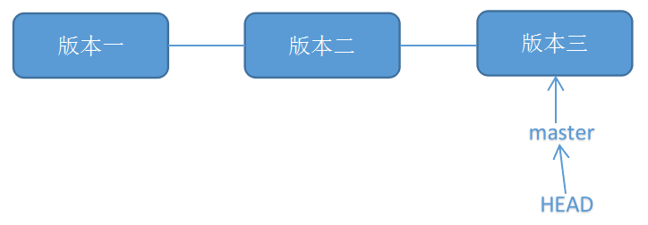

# 3、解决办法

## **方法一：git reset (重置)**

**原理：**

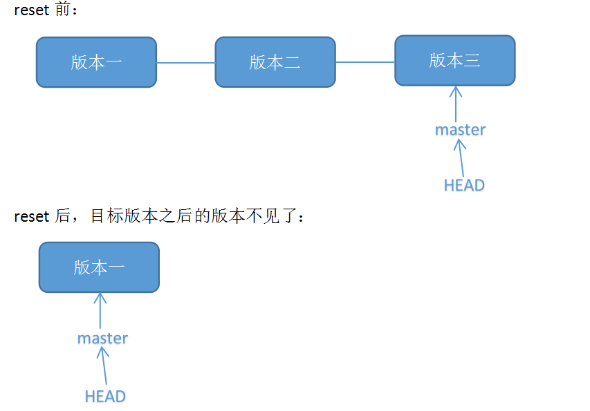

**适用场景：**

**具体操作：**

**1. 查看版本号：**

可以使用命令“git log”查看：

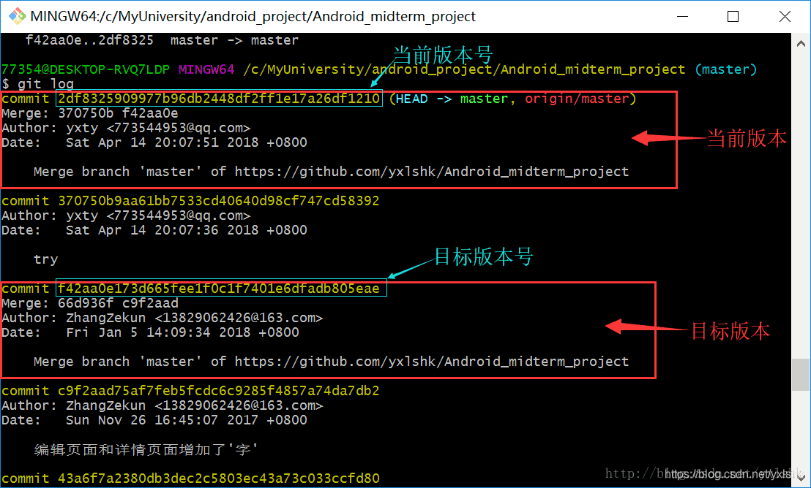

**2. 使用“git reset --hard 目标版本号”命令将版本回退：**

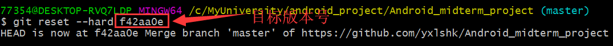

再用“git log”查看版本信息，此时本地的HEAD已经指向之前的版本：

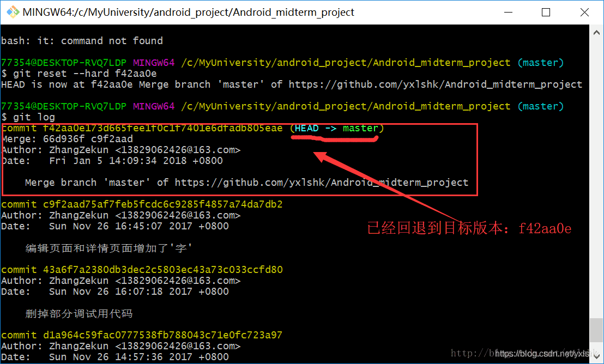

**3. 使用“git push -f”提交更改：**

此时如果用“git push”会报错，因为我们本地库HEAD指向的版本比远程库的要旧：

所以我们要用“git push -f”强制推上去，就可以了：

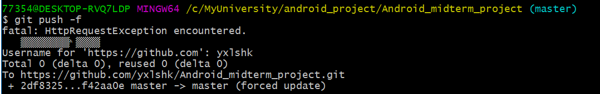

在github图形化界面上看，远程库的HEAD也已经指向目标版本：

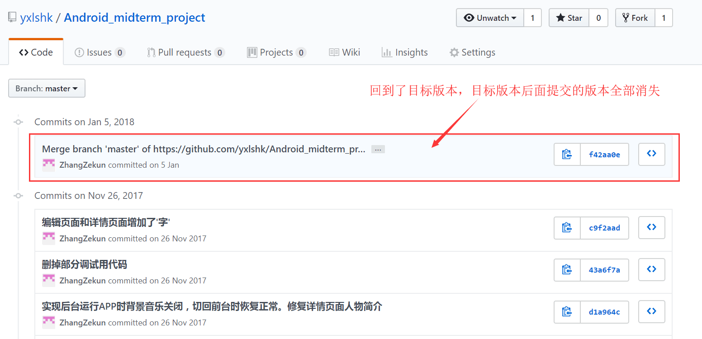

**回退成功！**

## 方法二：git revert (反做)

原理： git revert是用于“反做”某一个版本，以达到撤销该版本的修改的目的。比如，我们commit了三个版本（版本一、版本二、 版本三），突然发现版本二不行（如：有bug），想要撤销版本二，但又不想影响撤销版本三的提交，就可以用 git revert 命令来反做版本二，生成新的版本四，这个版本四里会保留版本三的东西，但撤销了版本二的东西。如下图所示：

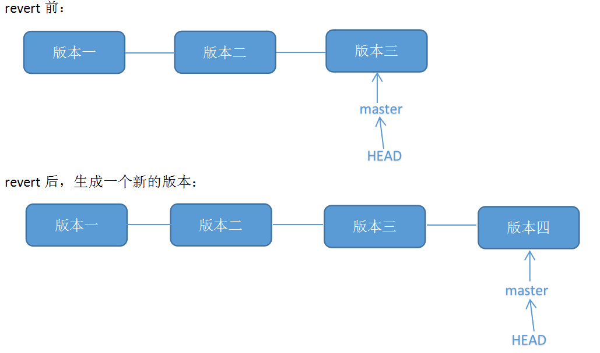

**适用场景：**

**具体操作：**

举个例子，现在库里面有三个文件：READ.md、text.txt、text2.txt。

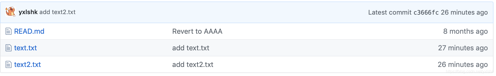

1. 查看版本号：

可以通过命令行查看（输入git log）：

如图，最近的两个版本分别叫：“add text.txt”（即新增了文件text.txt）、“add text2.txt”（新增了文件text2.txt）。这个时候我们不需要text.txt这个文件了，那就是说不想要“add text.txt”那个版本的操作，那可以通过反做“add text.txt”这个版本来实现。

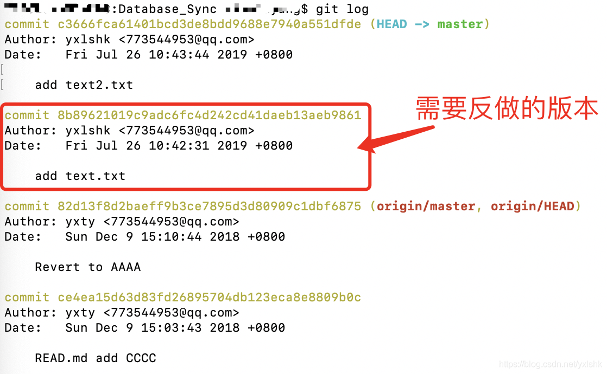

**2.使用“git revert -n 版本号”反做，并使用“git commit -m 版本名”提交：**

（1）反做，使用“git revert -n 版本号”命令。如下命令，我们反做版本号为8b89621的版本：

```shell
git revert -n 8b89621019c9adc6fc4d242cd41daeb13aeb9861
```

**注意：**

（2）提交，使用“git commit -m 版本名”，如：

```shell
git commit -m "revert add text.txt" 
```

此时可以用“git log”查看本地的版本信息，可见多生成了一个新的版本，该版本反做了“add text.txt”版本，但是保留了“add text2.txt”版本：

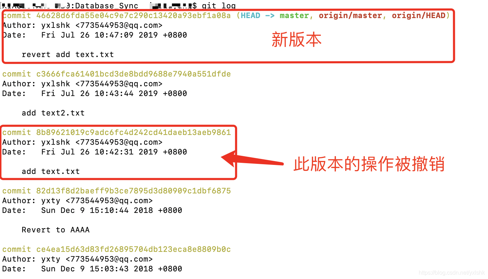

**3.使用“git push”推上远程库：**

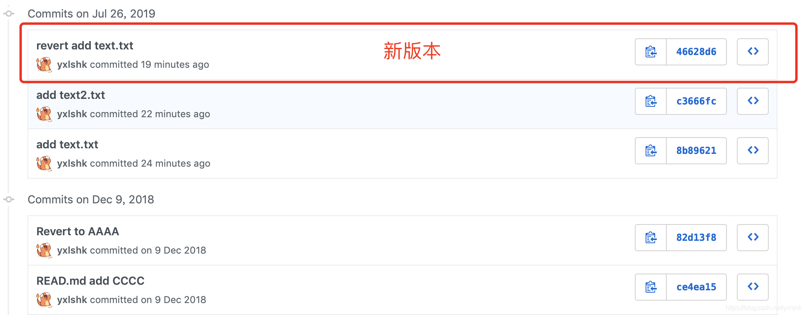

**反做成功！**