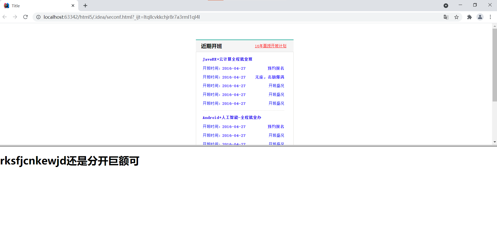

```javascript
<!DOCTYPE html>
<html lang="en">
<head>
    <meta charset="UTF-8">
    <title>Title</title>
    <link rel="stylesheet"  type="text/css" href="style.css" />
    <style type="text/css">
      .box1{

      }
    </style>

</head>
    <!--
    框架集合和内联框架的作用类似，都是用于一个页面中引入其他外部的页面，
        框架集可以同时引入更多的页面，而内联框架只能引入一个，
        在H5标准中，推荐使用框架集，而不是用内联框架

        使用framset来创建一个框架集，注意frameset不能和body出现在同一个页面中
            所以要使用框架集，页面中就不能出现body标签

            属性：
                -rows: 指定框架集中的所有框架，一行一行的排列
                -cols: 指定框架集中的所有页面，一列一列的排列

                这两个属性frameset必须选择一个，而且需要在属性中指定每一部分所占的大小

                frameset中也可以在嵌套frameset

                frameset和iframe一样，它里面的内容不会被搜索引擎检索，
                    所以如果搜索引擎检索到的页面是一个框架页面的话，它是不能去判断里边的内容的
                   

    -->
    <frameset rows="50% ,50%">
        <frame src="fisrst.html" />
        <frame src="third.html" />

    </frameset>
</html>
```




