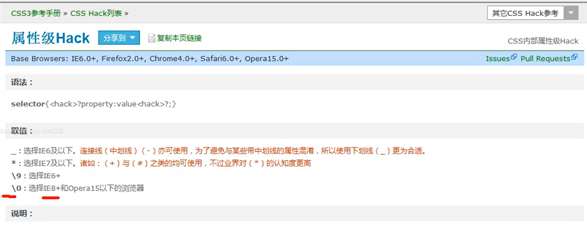

# 1、条件Hack

```javascript
<body>
   <!--
       有一些情况，有一些特殊的代码我们只需要某些特殊的浏览器执行，
           而在其他的浏览器中不需要执行，这时就可以使用CSS Hack来解决该问题
        CSS Hack实际上指的是一个特殊的代码，这段代码只在某些浏览器中可以识别（比如：IE浏览器）
           而在其他浏览器中不能识别，通过这种方式，来为一些浏览器设置特殊的代码
   -->

   <!--
       条件Hack，条件Hack只对IE浏览器有效，其他的浏览器都将会将它识别为注释
           IE10以及以上的浏览器已经不支持这种方式
   -->

   <!--以下内容只在IE6中生效-->
   <!--[if IE 6]>
    <p>远离IE6</p>
       <![endif]-->


</body>
```


---

# 2、属性Hack

```javascript

```





