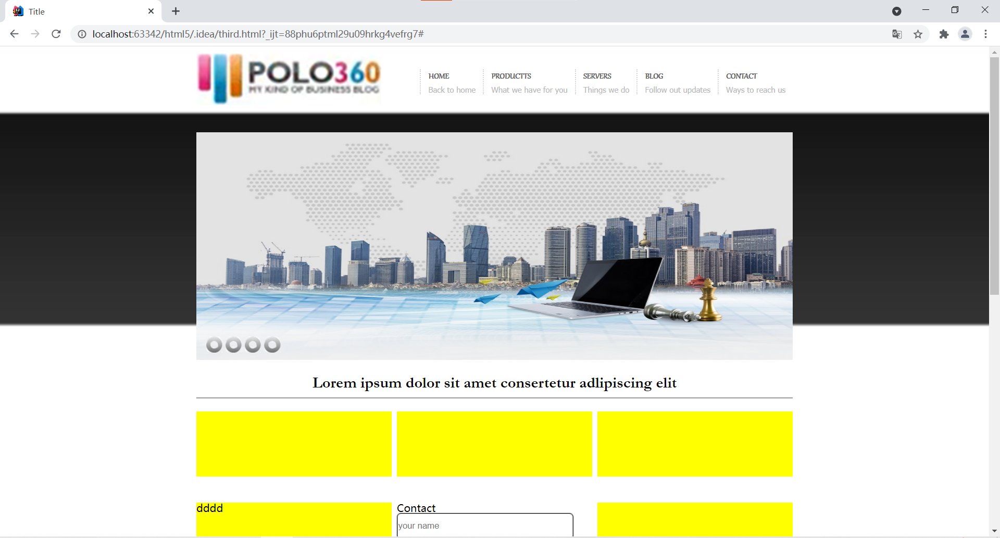
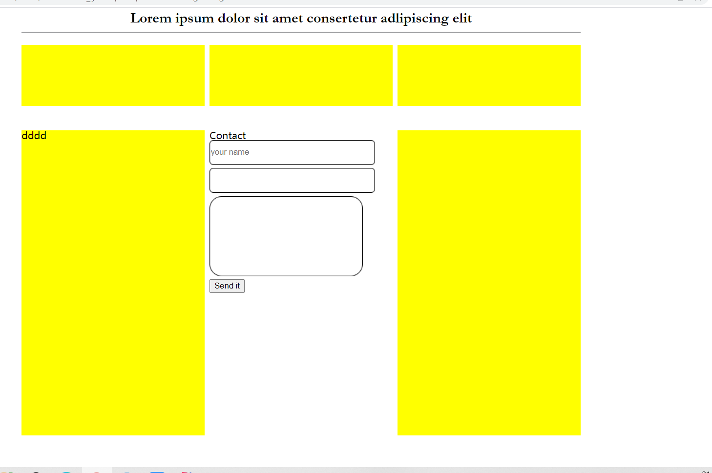

---

# 1、html

```javascript
<!DOCTYPE html>
<html lang="en">
<head>
    <meta charset="UTF-8">
    <title>Title</title>
    <!--引入reset.css用来清除浏览器默认样式-->
    <link rel="stylesheet"  type="text/css" href="../css/reset.css" />
     <!--引入page-index-->
    <link rel="stylesheet"  type="text/css" href="../css/page-index.css" />
    <style type="text/css">


    </style>
</head>
<body>
    <!--
        id class和文件的命名规范
            -命名时尽量使用英文，如果不会可以用拼音
            -命名格式
                -驼峰命名法
                    首字母小写，第二个单词首字母大写
    -->
    <div class="w ">
        <div class="header">
        <ul class="nav">
            <li>
                <a href="#">HOME</a>
                <p>Back to home</p>
            </li>
            <li>
                <a href="#">PRODUCTTS</a>
                <p>What we have for you</p>
            </li>
            <li>
                <a href="#">SERVERS</a>
                <p>Things we do</p>
            </li>
            <li>
                <a href="#">BLOG</a>
                <p>Follow out updates</p>
            </li>
            <li>
                <a href="#">CONTACT</a>
                <p>Ways to reach us</p>
            </li>
        </ul>

        <div class="logo">      <!--设置logo-->
            <a herf="#">
                
            </a>
        </div>
        </div>
        <!--******************设置Header**********************-->
    <div class="banner">
        
        <div class="button">
            <a href="#" ></a>
            <a href="#"></a>
            <a href="#"></a>
            <a href="#"></a>
        </div>

    </div>
    <!--************************设置banner*********************-->
    <div class="content clearfix">
        <h1>Lorem ipsum dolor sit amet consertetur adlipiscing elit</h1>
        
        <div class="p1">
            
        </div>
        <div class="cs">

        </div>
        <div class="uc">

        </div>
    </div>
     <!--**********************设置content****************************-->
     <div class="contact clearfix">
         <div class="sc">
        dddd
         </div>
         <div class="ct">
            <h2>Contact</h2>
             <form action="#" method="post">        <!--表单-->
                 <input type="text" class="txt" placeholder="your name"/><br>
                 <input type="text" class="txt"/>
                 <textarea name="" rows="" cols="" class="tarea"></textarea>
                 <button class="btn">Send it</button>
             </form>
         </div>
         <div class="nu">

         </div>

     </div>

        

    </div>
    
<br><br><br>
    <br><br><br>
    <br><br><br><br><br><br>

    <br><br><br>
    <br><br><br>


<b></b>
</body>
</html>
```


---

# 2、page-index.css

```javascript
body{
    background-image: url("../image/bg1.png");
    background-repeat: repeat-x;    /* 设置背景水平方向重复 */
}

.w{                 /* 全局设置 */
    width: 916px;
    margin: 0 auto;
}

.clearfix:before ,
.clearfix:after{
    content: "";
    display: table;
    clear: both;
    zoom: 1;
}

.header {
    padding-top: 10px;
    padding-bottom: 40px;
}

.logo{

}

.header .nav{
    float:right;
    margin-top: 25px;
}


.nav li{
    float: left;
    padding: 0 11px;
    border-left:2px #d6d6d6 dotted;
}

.nav a{
    color: #666;
    font:bold 14px Gabriola;
    text-decoration: none;   /* 取消下划线 */
}

.nav a:hover{
    color: red;
}

.nav p{
    font-size: 12px;
    color: #b7b7b7;
    font:11px Tahoma;
}

/* *********设置header***************** */
    .banner{
        position: relative;
        padding-bottom: 20px;
    }

    .banner a img{
        width:25px;
    }

    .banner a:hover{
        background-color: blue;
    }

  .banner  .button{
      position: absolute;
      top:314px;
      left: 15px;
    }
  /* ***********设置banner************** */

    .content{


    }

    .content h1{
        text-align: center;
        font: bold 24px  Garamond;
        padding-bottom: 10px;
        background: url("../image/hr.png") repeat-x bottom center ;
    }

    .content .p1 ,.content .uc{
        margin-top: 20px;
        width: 300px;
        height: 100px;
        background-color: yellow;
        float: left;
    }

    .content .cs{
        width: 300px;
        height: 100px;
        background-color: yellow;
        float: left;
        margin: 20px 8px 0 8px;
    }
    /* **************设置conten******************* */
    .contact{
        margin-top:20px ;

    }
    .contact .sc ,.contact .nu{
    margin-top: 20px;
    width: 300px;
    height: 500px;
    background-color: yellow;
    float: left;
}

    .contact .ct{
    width: 300px;
    height: 500px;

    float: left;
    margin: 20px 8px 0 8px;
}

    .contact h2{

    }

    .contact .txt{
        width: 267px;
        height:39px;
        background-image:url("../image/text.png");
        background-repeat: no-repeat;
        border: none;
        margin-bottom: 5px;
    }

    .contact .tarea{
        width: 248px;
        height: 131px;
        background-image: url("../image/text2.png");
        background-repeat: no-repeat;
        border: none;
        resize: none;
    }
```

