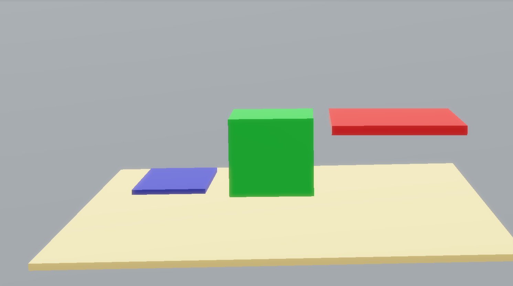
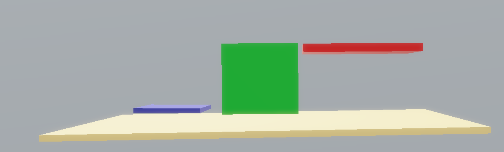
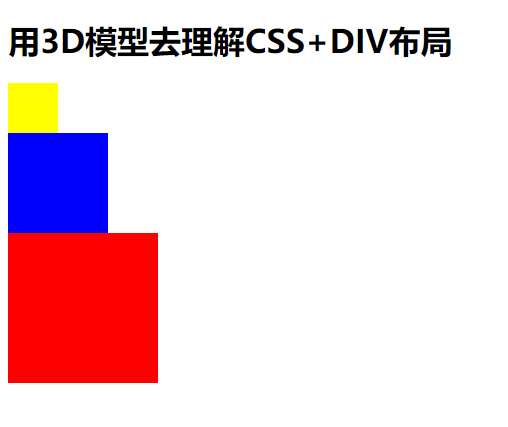
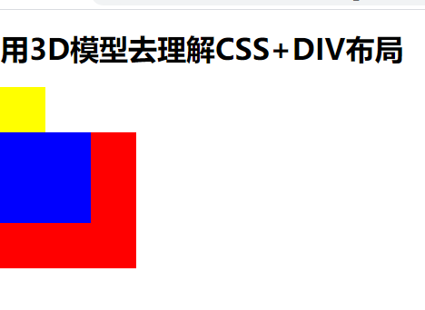
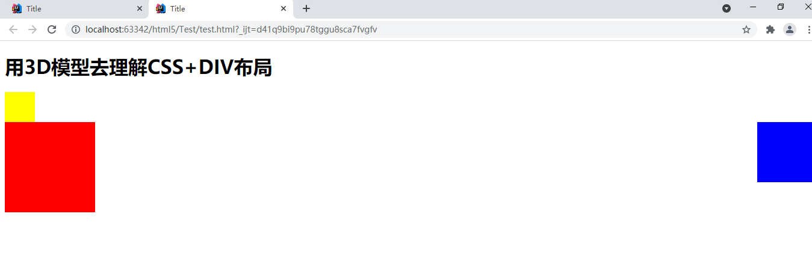
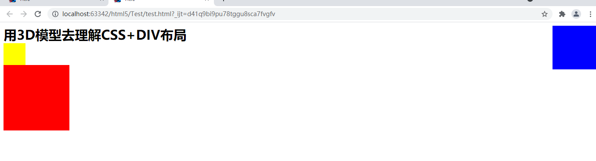
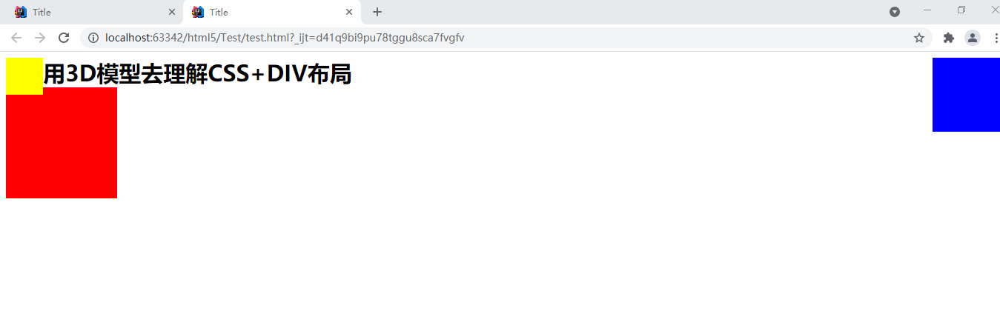

如上图所示，我们假设把黄色面板看成是文档流，蓝色面板看成是行内元素，绿色方块看成是块元素，红色面板看成是浮动元素;（并假设把浮动元素所占据的空间称为“浮动空间”）


# 1、那么可以得出以下结论：

- 行内元素：只会据文档流的空间；

- 块元素	   ：同时占据文档流的空间和浮动空间；

- 浮动元素 ：会占据浮动空间；


注：普通的块元素实际上会占据文档流的一整行，上述图中所示 仅仅只是为了便于观察


并规定：

1）块元素可以自动地移动到浮动元素的下面

2）而浮动元素却无法自动地移动到块元素的上面


---

# 2、实践验证

```javascript
  <style>
        .box1{
            background-color: yellow;
            width: 50px;
            height: 50px;
        }

        .box2{
            background-color: blue;
            width: 100px;
            height: 100px;
           
        }

        .box3{
            background-color: red;
            width: 150px;
            height: 150px;
        }
    </style>
</head>
<body>
    <b style="font-size: 30px">用3D模型去理解CSS+DIV布局<b>
    <div class="box1">

    </div>
    <div class="box2">

    </div>
    <div class="box3">

    </div>
</body>
```




## 1）由代码可知：

- 黑字是行内元素

- 下面三个方块是块元素

因为一个普通的块元素会占据一整行的文档流，所有四个元素进行了从上到下的排列；


2）如果设置蓝色方块左浮动：

```javascript
.box2{
    background-color: blue;
    width: 100px;
    height: 100px;
    float: left;		//设置左浮动
}
```




显示结果分析：

- 因为块元素可以自动地移动到浮动元素的下面，当蓝色方块浮动时，红色方块就移动到了蓝色方块下面；

- 因为浮动元素无法自动地移动到块元素的上面，所以蓝色方块停留在了原来的位置；


- 如果设置蓝色方块右浮动：

```javascript
.box2{
    background-color: blue;
    width: 100px;
    height: 100px;
    float: right;
}

```





结果显示如上图；


3）如果就是想要蓝色方块浮动到右侧顶层

### 方法一：

因为蓝色方块div实体是在黄色方块div的下面，导致蓝色方块浮动时无法向上移动，（如代码3.1）

所以只需要将蓝色方块的div放在黄色方块div的上面即可（如代码3.2）


代码3.1

```javascript
<b style="font-size: 30px">用3D模型去理解CSS+DIV布局<b>	//行内元素
<div class="box1">		//黄色方块

</div>
<div class="box2">		//蓝色方块

</div>
<div class="box3">		//红色方块

</div>
```


代码3.2

```javascript
<b style="font-size: 30px">用3D模型去理解CSS+DIV布局<b>
<div class="box2">		//蓝色方块

</div>
<div class="box1">		//红色方块

</div>
<div class="box3">

</div>
```

结果如下：蓝色方块浮动到了顶层；



### 方法二：

因为蓝色方块div实体是在黄色方块div的下面，并且黄色方块是块元素，导致蓝色方块浮动时无法向上移动，（如代码3.1）

所以如果将黄色方块也设置为浮动元素，那么蓝色方块也可以再向上移动；


设置黄色方块左浮动：

```javascript
.box1{
    background-color: yellow;
    width: 50px;
    height: 50px;
    float: left;
}
```




显示结果分析：

- 因为黄色方块设置了浮动，而黑字是内行元素，不占据浮动空间，黄色方块浮动到了内行元素上方，

- 因为黄色方块进行了浮动，那么蓝色方块的前面释放了块元素占据的浮动空间，蓝色方块前面很空旷，所以也进行了浮动；

- 同理红色方块也向上浮动；


所以建议不要使用方法二。


3、高度塌陷的解决方法


