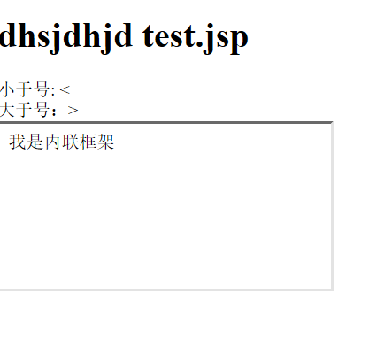

# **1、<meta>
**

• 作用：

```
– <meta> 标签可提供有关页面的元信息，比如
针对搜索引擎和更新频度的描述和关键词。
– <meta> 标签位于文档的头部，不包含任何内
容。<meta> 标签的属性定义了与文档相关联
的名		称/值对。
```

## **1）meta的用法
**

• 设置页面的字符集

```javascript
– <meta charset="utf-8">
```

• 设置网页的描述

```javascript
– <meta name="description" content="描述的内容">
#name="descrption",声明content的内容是描述的内容；
```

• 设置网页的关键字

```javascript
– <meta name="keywords" content="关键字的内容">	
#name="keywords",用于声明content的内容是关键字；
```

• 请求的重定向

```javascript
– <meta http-equiv="refresh" content="5;url=http://www.baidu.com"/>
#5秒后重定向到百度页面；
```

# **2、<html>
**

• 作用：

– <html>标签用于告诉浏览器这个文档中包含
的信息是用HTML编写的。

• 用法：

– 所有的网页的内容都需要编写到html标签中，
一个页面中html标签只能有一个。

– html标签中有两个子标签head和body 。

# **3、<head>
**

• 作用：

```
– <head>标签用来表示网页的元数据，head中
包含了浏览器和搜索引擎使用的其他不可见信
息。
```

• 用法：

```
– head标签作为html标签的子元素的出现，一
个网页中只能有一个head。
```

# **4、<title>
**

• 作用：

```
– <title>标签表示网页的标题，一般会在网页的标
题栏上显示。
– title标签中的文字，是页面优化的最重要因素。在
搜索引擎的搜索时最先看到的、最醒目的内容。
```

• 用法：

– 建议将title标签紧贴着head标签编写，这样搜索
引擎可以快速检索到标题标签。

– 网站中的多个页面的title也不应该重复，这样不利
于搜索隐藏检索。

# **5、<body>
**

• 作用：

– <body>标签用来设置网页的主体，所有在页
面中能看到的内容都应该编写到body标签中。

• 用法：

– body标签作为html的子标签使用。

# **6、<h1>~<h6>
**

• 作用：

– h1~h6都是网页中的标题标签，用来表示网页
中的一个标题，不同的是，从h1~h6重要性越

来越低。

– 标题标签相当于正文的标题，通常认为重要性
仅次于页面的title。

– 一般标题标签我们只会使用到h3，h3以后的标
题标签对于搜索引擎就没有什么意义了。

– 一个页面中只会使用一个h1标签。

# **7、<p>段落
**

• 作用：

– <p>标签表示网页中的一个段落。

– 一般浏览器会在段落的前和后各加上一个换行，
也就是段落会在页面中自成一行。

# **8、<br />换行
**

• 作用

– <br />标签表示一个换行标签，使用br标签可
以使br标签后的内容另起一行。

# **9、<hr />水平线
**

• 作用：

– <hr />标签是水平线标签，使用hr标签可以在
页面中打印一条水平线，水平线可以将页面分

成上下两个部分。

# **10、图片
**

• 作用：

– < img />标签是图片标签，可以用来向页面中
引入一张外部的图片。

• 属性：

```javascript
– src
		:指向一个外部的图片的路径。
    路径：../表示相对于网页位置上一层路径；
      #如图一；
    
– alt
		:图片的描述,图片不能显示时，有效；
-width		:设置图片的宽度，单位px;
-height		：设置图片的高度,单位px;如果高和宽，只写一个，图片会自动调整宽高；

```

# **图1：**



# **11、<a>超链接
**

• 作用：

– <a>标签是超链接标签，通过a标签，可以快
速跳转到其他页面。

# **• 属性：
**

```javascript
– href
		： 指向一个链接地址，可以是id值；
– target
		：设置打开目标页面的位置，
    可选值：
    _blank		新的窗口中更新；
    
_self		当前窗口，更新；
    tom		在内联窗口中显示，其中iframe的name="tom";
<a href="http://www.baidu.com" target="tom">我是一个超链接</a>
<iframe  src="..." name="tom" >
```

# **12、实体
**

• 在HTML中预留了一些字符。

• 这些预留字符是不能在网页中直接使用的。

• 比如<和>,我们不能直接在页面中使用<和
>号，因为浏览器会将它解析为html标签。

• 为了可以使用这些预留字符，我们必须在
html中使用字符实体。

• 语法: &实体名;



```javascript
• 小于号<
			– &lt;	#small,l;
• 大于号>
			– &gt;	#big ,g;	
• 空格
			– &nbsp;
• 和符号&
			– &amp;
• 版权©
			– &copy;
• 引号”
			– &quot;
• 注册商标®
			– &reg;
• 商标™
			– &trade;
```

# **13、<center>**

```javascript
<center>我在中间</center>	#此标签中的内容，均在网页中间显示；
```

# **14、<iframe>内联框架**

# **(现实开发中，不推荐使用，因为内联框架中的内容，不会被搜索引擎检索）**

```javascript
<iframe src="second.jsp"></iframe>
属性：
    -src		:指定一个外部页面的路径，可以使用相对路径；
    -width		:设定宽度；
    -height	：设定高度；
    -name		:指定一个name属性；
```

```javascript
<body>
	<h1>dhsjdhjd test.jsp</h1>
	小于号: &lt; <br>
	大于号：&gt; <br>
	
	<iframe src="second.jsp"></iframe>
</body>
```

