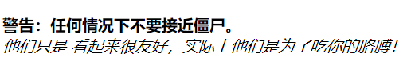
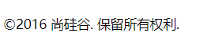
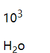
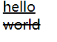
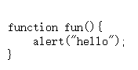

# **1、<em>和<strong>
**

• em标签用于表示一段内容中的着重点。

• strong标签用于表示一个内容的重要性。

• 这两个标签可以单独使用，也可以一起使
用。

```javascript
<p>
<strong>警告：任何情况下不要接近僵尸。</strong>
<em>他们只是看起来很友好，实际上他们是为了吃你的胳膊！</em>
</p>
```

• 通常em显示为斜体，而strong显示为粗体。





# **2、<i>和<b>
**

• i标签会使文字变成斜体。

• b标签会使文字变成粗体。

• 这两个标签和em和strong类似，但是这两
个标签没有语义。

• 所以根据html5标准，当我们只想设置文本
特殊显示，而不需要强调内容时就可以使
用i和b标签。

# **3、<small>
**

• small标签表示细则一类的旁注，通常包括
免责声明、注意事项、法律限制、版权信
息等。

• 浏览器在显示small标签时会显示一个比父
元素小的字号。

```javascript
<p><small>&copy;2016 尚硅谷. 保留所有权利.</small></p>
```



# **4、<cite>
**

• 使用cite标签可以指明对某内容的引用或参
考。例如，戏剧、文章或图书的标题，歌
曲、电影、照片或雕塑的名称等。

```javascript
<p>
<cite>《七龙珠》</cite>讲的是召唤神龙的故事。
</p>
```

# **5、<blockquote>和<q>
**

• blockquote和q表示标记引用的文本。

• blockquote用于长引用，q用于短引用。q标签浏览器会自动加"号；

• 在两个标签中还可以使用cite属性来表示引
用的地址。

孟子曾经说过：

```javascript
<blockquote>天将降大任于是人也...</blockquote>
他说的真对啊！
<p>孔子曾经说过：<q>学而时习之不亦说乎</q></p>
```

# **6、<sup>和<sub>
**

• sup和sub用于定义上标和下标。

• 上标主要用于表示类似于10 3 中的3。

• 下标则用于表示类似余H 2 O中的2。

```javascript
<p>10<sup>3</sup></p>
<p>H<sub><small>2</small></sub>o</p>
```



# **7、<ins>和<del>
**

• ins表示插入的内容，显示时通常会加上下
划线。

• del表示删除的内容，显示时通常会加上删
除线。

```javascript
<ins>hello</ins><br>
<del>world</del>
```



# **8、<code>和<pre>
**

• 如果你的内容包含代码示例或文件名，就
可以使用code元素。

• pre元素表示的是预格式化文本，可以使用
pre包住code来表示一段代码。

```javascript
<pre>
<code>
function fun(){
alert("hello");
}
</code>
</pre>
```

