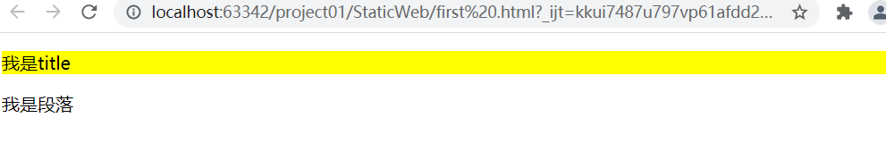

# **1、CSS**

# **使用/*   内容   */注释****
**

• 

• css可以用来为网页创建样式表，通过样式
表可以对网页进行装饰。

• 所谓层叠，可以将整个网页想象成是一层
一层的结构，层次高的将会覆盖层次低的。

• 而css就可以分别为网页的各个层次设置样
式。

# **2、基本语法
**

• CSS的样式表由一个一个的样式构成，一个
样式又由选择器和声明块构成。

• 语法：

```javascript
– 选择器 {样式名:样式值；样式名:样式值 ; }
– p{
    color:red ;
    font-size:12px;
    }
```

# **3、行内样式
**

• 可以直接将样式写到标签内部的style属性
中，这种样式不用填写选择器，直接编写
声明即可。

• 这种方式编写简单，定位准确。但是由于
直接将css代码写到了html标签的内部，导
致结构与表现耦合，同时导致样式不能够
复用，所以这种方式我们不使用。

```javascript
<p style="color: red;font-size: 30px"></p>
```

# **4、内部样式表
**

• 可以直接将样式写到<style>标签中。

• 这样使css独立于html代码，而且可以同时为
多个元素设置样式，这是我们使用的比较多的
一种方式。

• 但是这种方式，样式只能在一个页面中使用，
不能在多个页面中重复使用。

```javascript
<style>
p{color:red; font-size: 30px;}
</style>
```

# **5、外部样式表
**

• 可以将所有的样式保存到一个外部的css文
件中，然后通过<link>标签将样式表引入
到文件中。

```javascript
<link rel="stylesheet" type="text/css"
  href="style.css">
```

• 这种方式将样式表放入到了页面的外部，
可以在多个页面中引入，同时浏览器加载
文件时可以使用缓存，这是我们开发中使用的最多的方式。

# **6、选择器
**

• 选择器（selector），会告诉浏览器：网页
上的哪些元素需要设置什么样的样式。

• 比如：p这个选择器就表示选择页面中的所
有的p元素，在选择器之后所设置的样式会
应用到所有的p元素上。

# **7、元素选择器
**

• 元素选择器（标签选择器），可以根据标
签的名字来从页面中选取指定的元素。

• 语法：

```javascript
标签名 { }
```

• 比如

选中页面中的所有h1标签。



# **8、类选择器****（属性值可以重复）****
**

• 类选择器，可以根据元素的class属性值选
取元素。

• 语法：

```javascript
.className { 
    	color：red;
     	font-size:50px;
}
<p class="calssnam">内容<p>    //有效
```

• 比如.hello会选中页面所有class属性为
hello的元素。



# **9、ID选择器****(id属性值不可以重复）****
**

• ID选择器，可以根据元素的id属性值选取

元素。

• 语法：

```javascript
#p1 { 			
    color：red;
    font-size:50px;
}
<p id="p1">内容<p>  //有效
```



• 比如#box会选中页面中id属性值为box的
元素，和class属性不同，id属性是不能重
复的。



# **10、复合选择器****（交集）****
**

• 复合选择器，可以同时使用多个选择器，

这样可以选择同时满足多个选择器的元素。

• 语法：

```javascript
– 选择器1选择器2{}
 span.p3{
     backgroud-color:yellow; 
 }
 
  <span class="p3">内容OMG<span>		//有效
```

• 例如div.box1会选中页面中具有box1这个
class的div元素。

# **11、群组选择器（****并集****）
**

• 群组选择器，可以同时使用多个选择器，

多个选择器将被同时应用指定的样式。

• 语法：

```javascript
选择器1,选择器2,选择器3 { }
.p1,#p2,.p3{
    
}
<p class="p1"> 	//起效；
<p id="p2">	//有效；
<p class="p3">	//有效；
```

• 比如p,.hello,#box会同时选中页面中p元素，
class为hello的元素，id为box的元素。

# **
**

# **12、通用选择器
**

• 通用选择器，可以同时选中页面中的所有
元素。

• 语法：

```javascript
*{ }
```

# **13、标签之间的关系
**

• 祖先元素

– 直接或间接包含后代元素的元素。

• 后代元素

– 直接或间接被祖先元素包含的元素。

• 父元素

– 直接包含子元素的元素。

• 子元素

– 直接被父元素包含的元素。

• 兄弟元素

– 拥有相同父元素的元素。

# **14、后代选择器
**

• 后代选择器可以根据标签的关系，为处在
元素内部的代元素设置样式。

• 语法：

```javascript
祖先元素 后代元素 后代元素 { }
 div p span{   }
 
  <div>		
  	<p>  <span>  内容    </span>  </p>   #有效 
   </div> 
#####################################################
#p3 span{  }  
     
<p id="p3">
    <span> 内容   </span>	//有效
</p>       	
```





# **15、伪类和伪元素
**

• 有时候，你需要选择本身没有标签，但是
仍然易于识别的网页部位，比如段落首行
或鼠标滑过的连接。CSS为他们提供一些选

择器：伪类和伪元素。

# **16、给链接定义样式（****顺序固定，必须link在前面，如下顺序）****
**

• 有四个伪类可以让你根据访问者与该链接的交
互方式，将链接设置成4种不同的状态。

```javascript
• 正常链接
	– a:link
• 访问过的链接
	– a:visited（只能定义字体颜色）
• 鼠标滑过的链接
	– a:hover
• 正在点击的链接
	– a:active
 a:link {
     color:red; 
 }
 <a href="www.baidu.com">我是一个超链接</a>	  //有效
```

## **其他
**

```javascript
• 获取焦点
	– :focus
• 指定元素前
	– :before
• 指定元素后
	– :after
• 选中的元素
	– ::selection	//就是两个冒号：：
```

# **17、伪元素择器
**



给段落定义样式

```javascript
• 首字母
	– :first-letter
• 首行
	– :first-line
 p:first-letter{  }
 ######################################## 
 -before	:在前面有效
 -after	:在后面有效
 
 <head>		//如例1所示；

<style type="text/css">
	p:before{
		content:"我在最前面";
		color:red;
		}
	
	p:after{
		content:"我在最后面";
		color:orange;
</style>

</head>
<body>
	<p>
		我是一个段落
	</p>
</body>
```

例1：


# **18、属性选择器
**

• 属性选择器可以挑选带有特殊属性的标签。

• 语法:

```javascript
p[属性名]{ }
p[属性名="属性值"]{ }		
p[属性名~="属性值"]{ }
p[属性名|="属性值"]{ }
p[属性名^="属性值"]{ }		//指定属性值开头
p[属性名$="属性值"]{ }		//指定属性值结尾
p[属性名*="属性值"]{ }		//指定属性值包含某字符
  p[title]{
      background-color:yellow  
  } 
  
<p title="hello">我是title </p>
<p>我是段落</p>   
```



# **19、子元素选择器
**

• 子元素选择器可以给另一个元素的子元素
设置样式。

• 语法：

```javascript
父元素 > 子元素 { }
```



• 比如body > h1将选择body子标签中的所
有h1标签。



## **其他子元素选择器
**

```javascript
• :first-child
		– 选择第一个子标签
• :last-child
		– 选择最后一个子标签
• :nth-child
(n|even|odd)	– 选择指定位置的子元素	//n是数字，even表示偶数，odd表示基数
• p:first-of-type		- 选择p标签的第一个子元素
• :last-of-type
• :nth-of-type
		– 选择指定类型的子元素
 p:first-child{  
 	background-color:yellow;
 }
 <body>
 	<p>hello</p>	//有效	
  	<p>world</p>	//无效
  </body>   
```

# **20、兄弟选择器
**

• 除了根据祖先父子关系，还可以根据兄弟
关系查找元素。

• 语法:
	– 查找后边一个兄弟元素

```javascript
• 兄弟元素 + 兄弟元素{}
	– 查找后边一个紧挨着的兄弟元素
• 兄弟元素 ~ 兄弟元素{}
	-选中后面所有的兄弟元素
p + span{ }
<p>hello</p>
<span>world</span>		//有效
<span>haha</span>		//无效
```

# **21、否定伪类
**

• 否定伪类可以帮助我们选择不是其他东西
的某件东西。

• 语法

```javascript
:not(选择器){}
 p:not(.yello){ }
 
<p>hello</p>	 //有效
<p class="yellow">  //无效   
```

• 比如p:not(.hello)表示选择所有的p元素但
是class为hello的除外。


