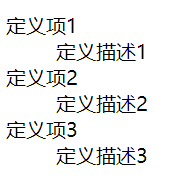

# 1、有序列表


• 使用ol和li来创建一个有序列表。(order)


```javascript
<ol>	//<ul type="1|a|A">
    <li>列表项1</li>
    <li>列表项2</li>
    <li>列表项3</li>
</ol>
```


---

# 2、无序列表


• 使用ul和li来创建一个无序列表。（表：list)


```javascript
<ul>	//<ul type=" ">
    <li>列表项1</li>
    <li>列表项2</li>
    <li>列表项3</li>
</ul>
```

## 去掉开头符号：


```javascript
<style type="text/css">
ul{
    list-style: none;
}

</style>
```


---

# 3、定义列表


• 使用dl、dd、dt来创建一个定义列表。


```javascript
<dl>
    <dt>定义项1</dt>
    <dd>定义描述1</dd>
<dt>定义项2</dt>
    <dd>定义描述2</dd>
<dt>定义项3</dt>
    <dd>定义描述3</dd>
</dl>
```




