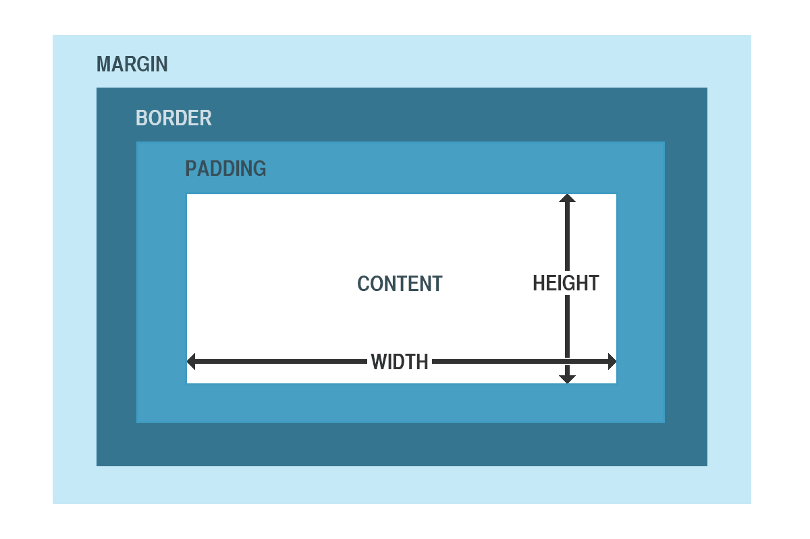
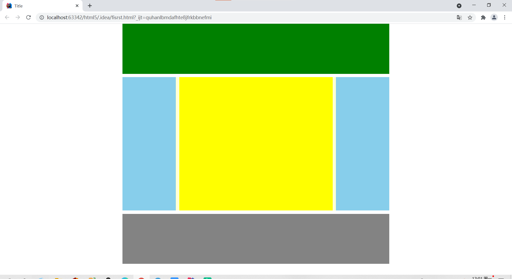
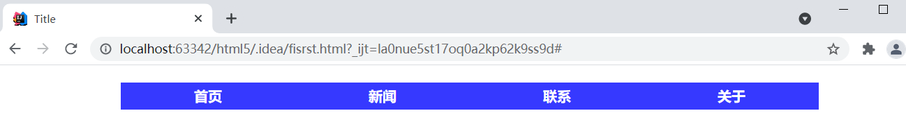
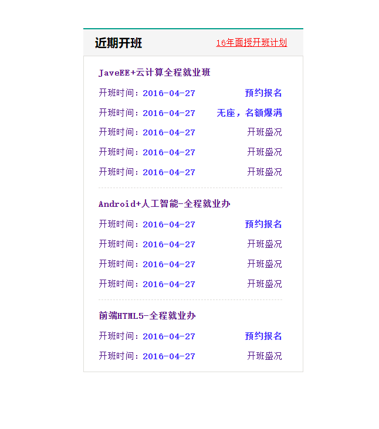



# **1、盒子
**

• CSS处理网页时，它认为每个元素都包含在一
个不可见的盒子里。

• 为什么要想象成盒子呢？因为如果把所有的元
素都想象成盒子，那么我们对网页的布局就相
当于是摆放盒子。

• 我们只需要将相应的盒子摆放到网页中相应的
位置即可完成网页的布局。

# **2、盒子模型
**

• 一个盒子我们会分成几个部分：

```javascript
– 内容区(content)
– 内边距(padding)
– 边框(border)
– 外边距(margin)
```



# **
**

# **3、内容区
**

• 内容区指的是盒子中放置内容的区域，也就是元素
中的文本内容，子元素都是存在于内容区中的。

• 如果没有为元素设置内边距和边框，则内容区大小
默认和盒子大小是一致的。

• 通过width和height两个属性可以设置内容区的大
小。

• width和height属性只适用于块元素。

# **4、内边距
**

• 顾名思义，内边距指的就是元素内容区与边框以内
的空间。

• 默认情况下width和height不包含padding的大小。

• 使用padding属性来设置元素的内边距。

• 例如：

```javascript
– padding:10px 20px 30px 40px
	– 这样会设置元素的上、右、下、左四个方向的内边距。

• padding:10px 20px 30px;
		– 分别指定上、左右、下四个方向的内边距
• padding:10px 20px;
		– 分别指定上下、左右四个方向的内边距
• padding:10px;
			– 同时指定上左右下四个方向的内边距
• 同时在css中还提供了padding-top、padding-right、padding-
right、padding-bottom分别用来指定四个方向的内边距。
```

# **5、边框
**

• 可以在元素周围创建边框，边框是元素可见框的最外部。

• 可以使用border属性来设置盒子的边框：

```javascript
– border:1px red solid;
		– 上边的样式分别指定了边框的宽度、颜色和样式。
```

• 也可以使用

• 和padding一样，默认width和height并包括边框的宽度。
边框的样式

• 边框可以设置多种样式：

```javascript
– none（没有边框）
– dotted（点线）
– dashed（虚线）
– solid（实线）
– double（双线）
– groove（槽线）
– ridge（脊线）
– inset（凹边）
– outset（凸边）
```

# **6、外边距
**

• 外边距是元素边框与周围元素相距的空间。

• 使用margin属性可以设置外边距。

• 用法和padding类似，同样也提供了四个方向的

• 当将左右外边距设置为

以使元素居中。

- 在网页中垂直方向的相邻的外边距**会发生重叠**，所谓外边距重叠是指兄弟元素之间的相邻外边距取最大值而不是和；

- 当父子之间的外边距的起点重叠时，子div的外边距会传递给父div;

```javascript
margin-left:auto;		//左边外边距最大；
margin：auto;		//左右外边距相等；

```

## **在没有设置边距的情况下，浏览器会自动设置默认的边距，需要手动取消如下：**

```javascript
*{
    margin:0;	//清除浏览器默认样式；
    padding:0;
}
```

**内联元素的样式**

- **内联元素不能设置width和height；**

- **内联元素可以设置水平方向上的内边距；**

- **内联元素可以设置垂直方向上的内边距和边框，但是不会影响布局；**

- **内联元素支持水平方向上的外边距，不支持垂直方向上的外边距；**

**7、属性：display**

• 我们不能为行内元素设置width、height、
margin-top和margin-bottom。

• 我们可以通过修改display来修改元素的性
质。

• 可选值：

```javascript
– block：		设置元素为块元素
– inline：		设置元素为行内元素
– inline-block：	设置元素为行内块元素
– none：		隐藏元素（元素将在页面中完全消失）
```

# **8、visibility
**

• visibility属性主要用于元素是否可见。

• 和display不同，使用visibility隐藏一个元
素，隐藏后其在文档中所占的位置会依然
保持，不会被其他元素覆盖。

• 可选值：

```javascript
– visible：	可见的
– hidden：		隐藏的
```

# **9、属性：overflow
**

• 当相关标签里面的内容超出了样式的宽度
和高度是，就会发生一些奇怪的事情，浏
览器会让内容溢出盒子。

• 可以通过overflow来控制内容溢出的情况。

• 可选值：

```javascript
– visible：	默认值
– scroll：		添加滚动条
– auto：		根据需要添加滚动条
– hidden：		隐藏超出盒子的内容
```

# **10、文档流
**

• 文档流指的是文档中可现实的对象在排列时所占用的位置。

• 将窗体自上而下分成一行行，并在每行中按从左至右的顺序排
放元素，即为文档流。

• 也就是说在文档流中元素默认会紧贴到上一个元素的右边，如
果右边不足以放下元素，元素则会另起一行，在新的一行中继
续从左至右摆放。

• 这样一来每一个块元素都会另起一行，那么我们如果想在文档
流中进行布局就会变得比较麻烦。

# **11、浮动****float****
**

• 所谓浮动指的是使元素脱离原来的文本流，在父元素中浮动起来。

• 浮动使用

• 可选值：

```javascript
– none：不浮动
– left：向左浮动
– right：向右浮动
```

• 块级元素和行内元素都可以浮动，当一个行内元素浮动以后将会自动变为一
个块级元素。

• 当一个块级元素浮动以后，宽度会默认被内容撑开，所以当漂浮一个块级元
素时我们都会为其指定一个宽度。



• 当一个元素浮动以后，其下方的元素会上移。元素中的内容将会围绕
在元素的周围。

• 浮动会使元素完全脱离文本流，也就是不再在文档中在占用位置。

• 元素设置浮动以后，会一直向上漂浮直到遇到父元素的边界或者其他
浮动元素。

• 元素浮动以后即完全脱离文档流，这时不会再影响父元素的高度。也
就是浮动元素不会撑开父元素。

• 浮动元素默认会变为块元素，即使设置display:inline以后其依然是个
块元素。

- 浮动的元素，不会覆盖文字； 



## **清除浮动****（只对兄弟元素有效）****
**

• clear属性可以用于清除元素周围的浮动对元素的影响。

• 也就是元素不会因为上方出现了浮动元素而改变位置。

• 可选值：

```javascript
– left：忽略左侧浮动
– right：忽略右侧浮动
– both：忽略全部浮动
– none：不忽略浮动，默认值
```

## **2）解决高度塌陷**

```javascript
.box1{
    border: 10px red solid;
    clear: both;
}
.box2{
    width: 100px;
    height: 100px;
    background-color: yellow;
    float: left;
}
.clear{
    clear:both;
}
.clearfix:after{
    content: "";
    display: block;
    clear: both;
}
<div class="box1  clearfix">
    <div class="box2">
    </div>
</div>
```

# **12、定位
**

• position属性可以控制Web浏览器如何以
及在何处显示特定的元素。

• 可以使用position属性把一个元素放置到网
页中的任何位置。

• 可选值：

```javascript
– static		//默认值，没有开启定位
– relative		//相对定位
– absolute		//绝对定位
– fixed		//固定定位（是绝对定位的一种）
```

## **1）相对定位
**

• 每个元素在页面的文档流中都有一个自然位置。相
对于这个位置对元素进行移动就称为相对定位。周
围的元素完全不受此影响。

• 当将position属性设置为relative时，则开启了元素
的相对定位。

• 当开启了相对定位以后，可以使用top、right、
bottom、left四个属性对元素进行定位。

### **
	相对定位的特点
**

• 如果不设置元素的偏移量，元素位置不会发生改变。

• 相对定位不会使元素脱离文本流。元素在文本流中
的位置不会改变。

• 相对定位不会改变元素原来的特性。

• 相对定位会使元素的层级提升，使元素可以覆盖文
本流中的元素。

## **2）绝对定位
**

• 绝对定位指使元素相对于html元素或离他最近
的祖先

• 当将position属性设置为absolute时，则开启
了元素的绝对定位。

• 当开启了绝对定位以后，可以使用top、right、
bottom、left四个属性对元素进行定位。

### **绝对定位的特点
**

• 绝对定位会使元素完全脱离文本流。

• 绝对定位的块元素的宽度会被其内容撑开。

• 绝对定位会使行内元素变成块元素。

• 一般使用绝对定位时会同时为其

## **3）固定定位
**

• 固定定位的元素会被锁定在屏幕的某个位置上，当
访问者滚动网页时，固定元素会在屏幕上保持不动。

• 当将position属性设置为fixed时，则开启了元素的
固定定位。

• 当开启了固定定位以后，可以使用top、right、
bottom、left四个属性对元素进行定位。

• 固定定位的其他特性和绝对定位类似。

# **13、z-index****（设定层级****）
**

• 当元素开启定位以后就可以设置z-index这
个属性。

• 这个属性可以提升定位元素所在的层级。

• z-index可以指定一个整数作为参数，值越
大元素显示的优先级越高，也就是z-index
值较大的元素会显示在网页的最上层。

- 父元素的层级无论设置多少都不会比子元素的层级高

```javascript
{
    z-index:2;
}
```

# **opacity 属性设置透明**

- 值为0-1

```javascript
{
    opacity:0.5;
}
-0	：完全透明
-1 ：完全不透明
-0.5 ：半透明
。。。。
/*、
 *opacity属性在IE8及以下的浏览器中不支持
 *IE8及以下的浏览器需要使用如下属性代替
 *alpha(opacity=透明度)
 *透明度，需要一个0-100之间的值
 *0  :完全透明
 *100 ：完全不透明
 */
 {
 	   filter:alpha(opacity=50);
  }
```

# **14、一个简单的布局**

```javascript
<!DOCTYPE html>
<html lang="en">
<head>
    <meta charset="UTF-8">
    <title>Title</title>
    <style typeof="text/css">
        *{
            margin:0;
            padding:0;
        }
        .header{
            width: 800px;
            height: 150px;
            background-color: green;
            margin: 0 auto;        //居中
        }
        .content{
            width: 800px;
            height: 400px;
            background-color: #ffffd4;
            margin: 10px auto;
        }
        .left{
            width:160px;
            height: 100%;
            background-color: skyblue;
            float: left;
        }
        .center{
            width:460px;
            height: 100%;
            background-color: yellow;
            float: left;
            margin:0 10px;
        }
        .right{
            width:160px;
            height: 100%;
            background-color: skyblue;
            float: left;
        }
        .footer{
            width: 800px;
            height: 150px;
            background-color: #838383;
            margin:auto;
        }
    </style>
</head>
<body>
    <div class="header">
    </div>
    <div class="content">
        <div class="left">
         </div>
        <div class="center">
        </div>
        <div class="right">
        </div>
    </div>
      <div class="footer">
    </div>
</body>
</html>
```



# **15、导航条**

```javascript
<head>
    <meta charset="UTF-8">
    <title>Title</title>
    <style typeof="text/css">
     *{
             margin:0;
             padding:0;
         }
     ul{
        list-style: none;
         background-color: #3639ff;
         width: 800px;
         margin: 20px auto;
         overflow: hidden;
    }
        .nav li{
            float: left;
            width: 200px;
        }
        .nav a{
            display: block;  /* 显示为块元素*/
            width: 100%;
            text-align: center;
            padding: 5px 0;
            text-decoration:none ;      /*去掉下划线*/
            color: white;
            font-weight: bold;      /*字体为粗体*/
        }
        .nav a:hover{
            background-color: red;
        }
    </style>
</head>
<body>
  <ul class="nav">
      <li><a href="#">首页</a> </li>
      <li><a href="#">新闻</a></li>
      <li><a href="#">联系</a> </li>
      <li><a href="#">关于</a> </li>
  </ul>
   
</body>
```



# **16、开班信息表**



```javascript
<!DOCTYPE html>
<html lang="en">
<head>
    <meta charset="UTF-8">
    <title>Title</title>
    <style typeof="text/css">
    /* 清除默认样式 */
        *{
            margin:0;
            padding: 0;
        }
        /* 同一页面中的字体 */
        body{
            font: 12px/1 宋体;       /* 12像素，行高1，字体：宋体 */
        }
        /* 外层outer */
        .outer{
            width: 300px;
            height: 470px;
            margin: 50px auto ;
        }
        
        /* 设置title的边框 */
        .title{
            border-top:2px #019e8b solid ;  /* 设置上边框 */
            height: 36px;       /* 设置边框的高度 */
            background-color: #f5f5f5;
            line-height: 36px;
            padding: 0px 22px 0px 16px;     /* 设置内边距 */
        }
        /* 设置title中的a */
        .title a{
            float:right;
            color:red;  /* 设置字体颜色 */
        }
        .title h3{
            font: 16px/36px "微软雅黑";
        }
        /* 设置内容 */
        .content{
            border: 1px solid #deddd9;
            padding: 0px 28px 0px 20px;
        }
        /* 设置内容中的超链接 */
        .content a{
            color: #black;
            text-decoration: none;      /* 去除下划线 */
            font-size: 12px;
        }
        /* 设置ul的样式 */
        .content  ul{
            list-style:none;    /* 去掉开头符号 */
            border-bottom:1px  dashed #deddd9 ;
        }
        .content .no-border{
            border:none;
        }
        /*  设置内容中的红色字体*/
        .content .red{
            color: #2e2dff;
            font-weight: bold;          /* 设置粗体 */
        }
        .content .right{
            float: right;
        }
        .content h3{
            margin-top: 14px;
            margin-bottom: 16px;
        }
        .content li{
            margin-bottom: 15px;
        }
         a:hover{
             color: red;
             text-decoration: underline;
         }
    </style>
</head>
<body>
    <!--创建一个外层div，容纳整个内容-->
    <div class="outer">
        <!--开班信息的头部-->
        <div class="title">
            <a href="#">16年面授开班计划</a>
            <h3><b>近期开班</b></h3>
        </div>
            <!--开班信息的主要内容-->
            <div class="content">
                <h3><a href="#">JaveEE+云计算全程就业班</a> </h3>
                <ul>
                    <li>
                        <a href="#">开班时间：<span class="red">2016-04-27</span></a>
                        <a href="#" class="right"><span class="red">预约报名</span></a>
                    </li>
                    <li>
                        <a href="#">开班时间：<span class="red">2016-04-27</span></a>
                        <a href="#" class="right"><span class="red">无座，名额爆满</span></a>
                    </li>
                    <li>
                        <a href="#">开班时间：<span class="red">2016-04-27</span></a>
                        <a href="#" class="right"><span class="red1">开班盛况</span></a>
                    </li>
                    <li>
                        <a href="#">开班时间：<span class="red">2016-04-27</span></a>
                        <a href="#" class="right"><span class="red1">开班盛况</span></a>
                    </li>
                    <li>
                        <a href="#">开班时间：<span class="red">2016-04-27</span></a>
                        <a href="#" class="right"><span class="red1">开班盛况</span></a>
                    </li>
                </ul>
                <h3><a href="#">Android+人工智能-全程就业办</a> </h3>
                <ul >
                    <li>
                        <a href="#">开班时间：<span class="red">2016-04-27</span></a>
                        <a href="#" class="right"><span class="red">预约报名</span></a>
                    </li>
                    <li>
                        <a href="#">开班时间：<span class="red">2016-04-27</span></a>
                        <a href="#" class="right"><span class="red1">开班盛况</span></a>
                    </li>
                    <li>
                        <a href="#">开班时间：<span class="red">2016-04-27</span></a>
                        <a href="#" class="right"><span class="red1">开班盛况</span></a>
                    </li>
                    <li>
                        <a href="#">开班时间：<span class="red">2016-04-27</span></a>
                        <a href="#" class="right"><span class="red1">开班盛况</span></a>
                    </li>
                </ul>
                <h3><a href="#">前端HTML5-全程就业办</a> </h3>
                <ul class="no-border">
                    <li>
                        <a href="#">开班时间：<span class="red">2016-04-27</span></a>
                        <a href="#" class="right"><span class="red">预约报名</span></a>
                    </li>
                    <li>
                        <a href="#">开班时间：<span class="red">2016-04-27</span></a>
                        <a href="#" class="right"><span class="red1">开班盛况</span></a>
                    </li>
                </ul>
            </div>
    </div>
</body>
</html>
```