原文地址：[弹性布局（display:flex;）属性详解 - cdgogo - 博客园 (cnblogs.com)](https://www.cnblogs.com/hellocd/p/10443237.html)

> Flexbox 是 flexible box 的简称（注：意思是“灵活的盒子容器”），是 CSS3 引入的新的布局模式。它决定了元素如何在页面上排列，使它们能在不同的屏幕尺寸和设备下可预测地展现出来。


**它之所以被称为 Flexbox ，是因为它能够扩展和收缩 flex 容器内的元素，以最大限度地填充可用空间**

- 在不同方向排列元素

- 重新排列元素的显示顺序

- 更改元素的对齐方式

- 动态地将元素装入容器

 

## 一、基本概念

采用 Flex 布局的元素，称为 Flex 容器（flex container），简称"容器"。它的所有子元素自动成为容器成员，称为 Flex 项目（flex item），简称"项目"。

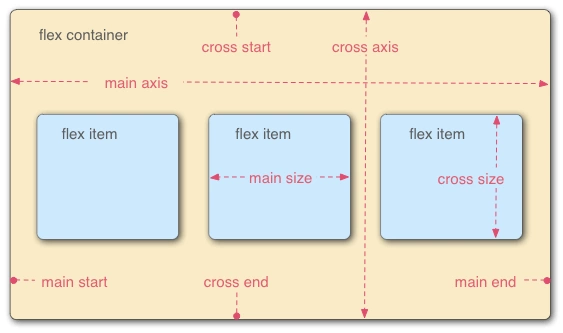

在 Flexbox 模型中，有三个核心概念：

– flex 项（注：也称 flex 子元素），需要布局的元素

– flex 容器，其包含 flex 项

– 排列方向（direction），这决定了 flex 项的布局方向

 

##  二、容器属性

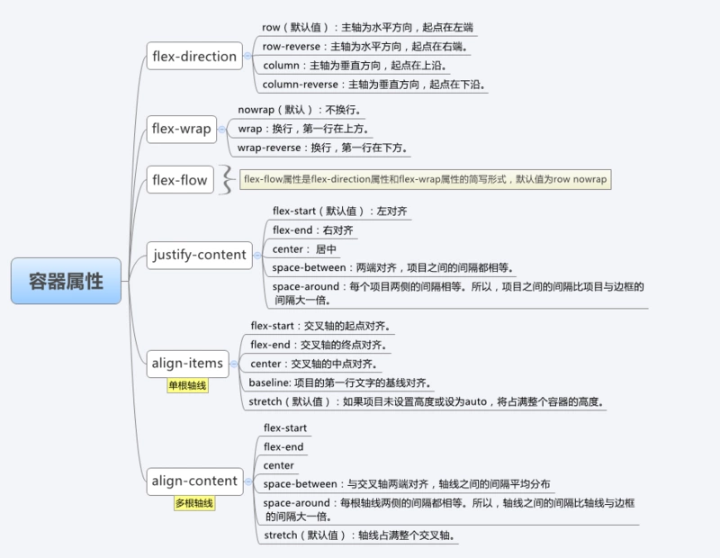

 

### 2.1  flex-direction:

- row（默认值）：主轴为水平方向，起点在左端。

- row-reverse：主轴为水平方向，起点在右端。

- column：主轴为垂直方向，起点在上沿。

- column-reverse：主轴为垂直方向，起点在下沿。

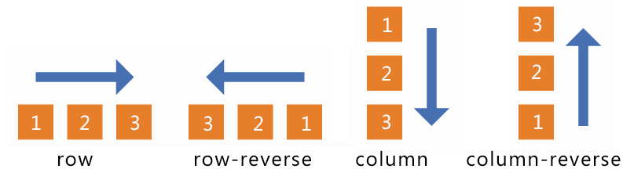

 

### 2.2   flex-wrap:

- nowrap（默认）：不换行。

- wrap：换行，第一行在上方。

- wrap-reverse：换行，第一行在下方。 

### 2.3  justify-content:

- flex-start（默认值）：左对齐

- flex-end：右对齐

- center： 居中

- space-between：两端对齐，项目之间的间隔都相等。

- space-around：每个项目两侧的间隔相等。所以，项目之间的间隔比项目与边框的间隔大一倍。

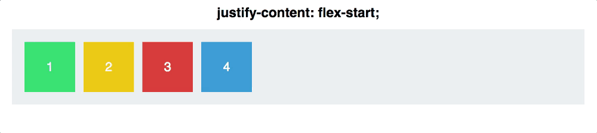

### 2.4  align-items:

- flex-start：交叉轴的起点对齐。

- flex-end：交叉轴的终点对齐。

- center：交叉轴的中点对齐。

- baseline: 项目的第一行文字的基线对齐。

- stretch（默认值）：如果项目未设置高度或设为auto，将占满整个容器的高度。

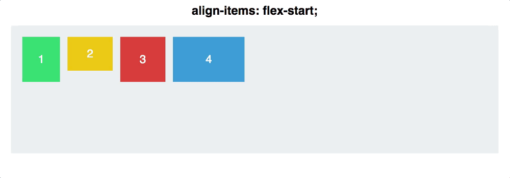

### 2.5  align-content:

定义了多根轴线的对齐方式，如果项目只有一根轴线，那么该属性将不起作用

- flex-start：与交叉轴的起点对齐。

- flex-end：与交叉轴的终点对齐。

- center：与交叉轴的中点对齐。

- space-between：与交叉轴两端对齐，轴线之间的间隔平均分布。

- space-around：每根轴线两侧的间隔都相等。所以，轴线之间的间隔比轴线与边框的间隔大一倍。

- stretch（默认值）：轴线占满整个交叉轴。

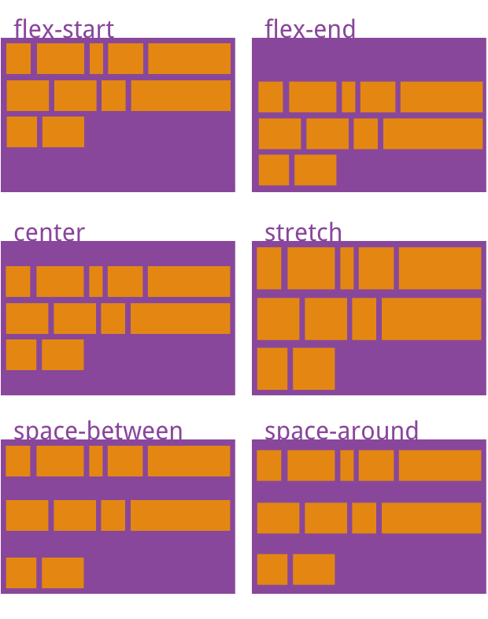

### 结合 justify-content和align-items，看看在 flex-direction 两个不同属性值的作用下，轴心有什么不同：

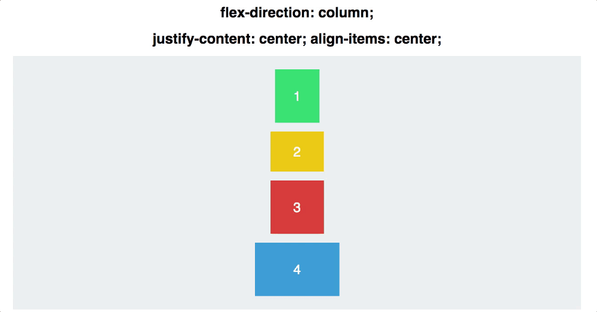

## 三、项目属性

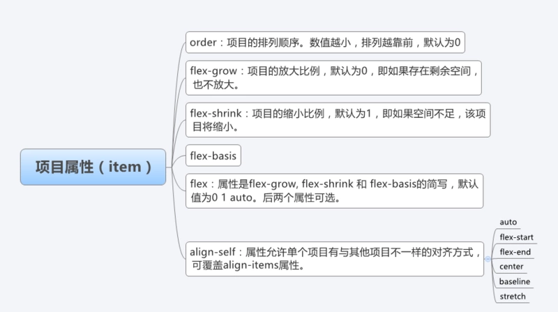

 

## 3.1 order属性

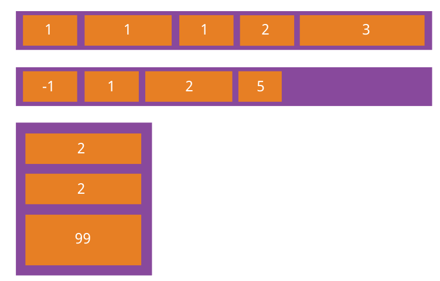

 

## 3.2 flex-grow属性

flex-grow

 

如果所有项目的

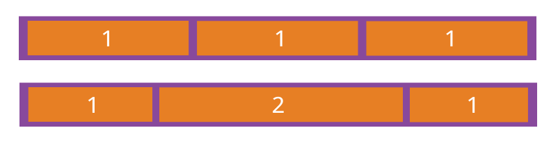

 

 

## 3.3 flex-shrink属性

flex-shrink

```
.item {
  flex-shrink: <number>; /* default 1 */
}
```

 


 

如果所有项目的

负值对该属性无效。

 

## 3.4 align-self属性

align-self

```
.item {
  align-self: auto | flex-start | flex-end | center | baseline | stretch;
}
```

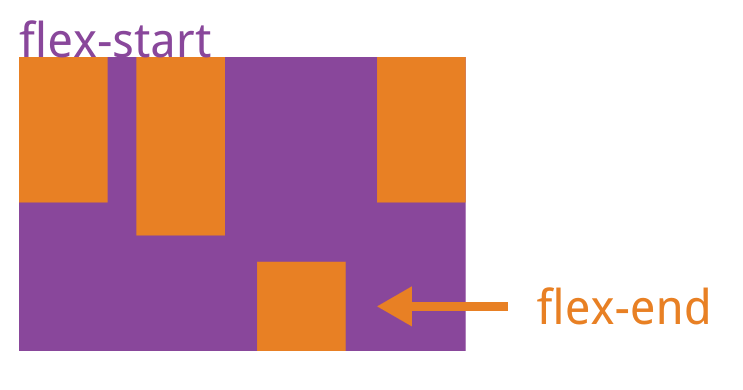

**弹性布局默认不改变项目的宽度，但是它默认改变项目的高度。如果项目没有显式指定高度，就将占据容器的所有高度。**