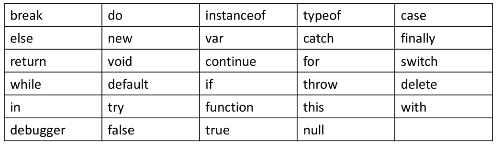
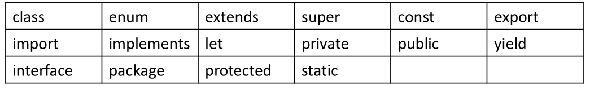
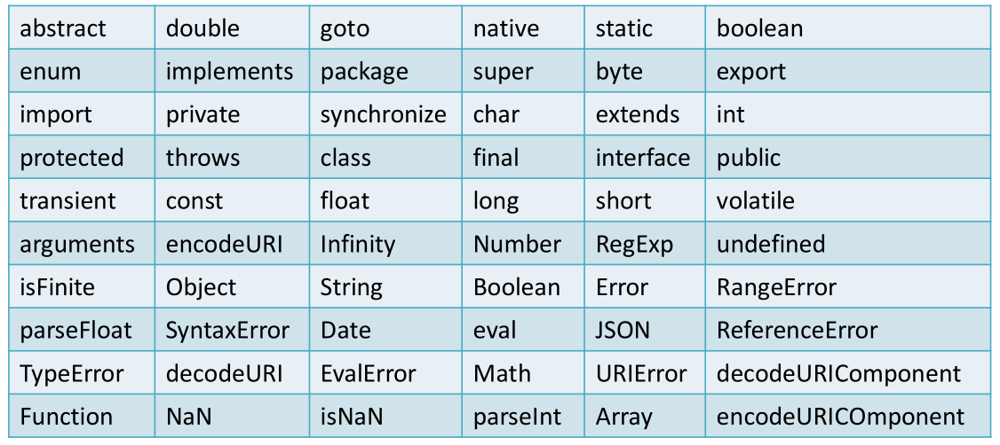
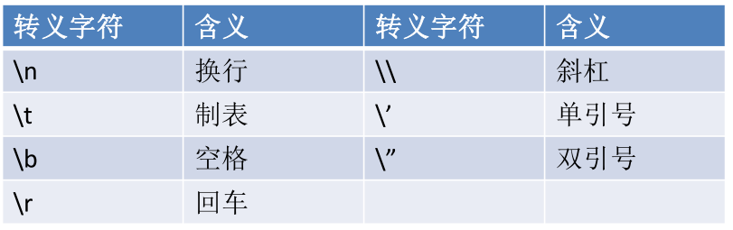
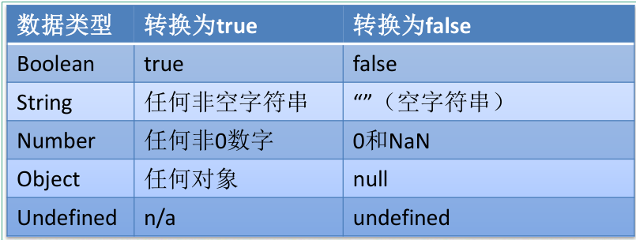
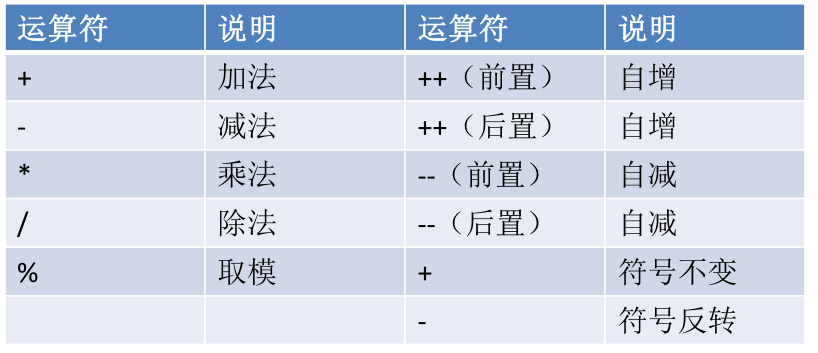
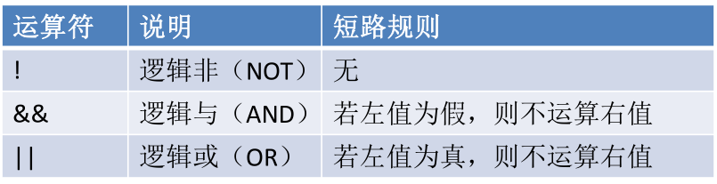
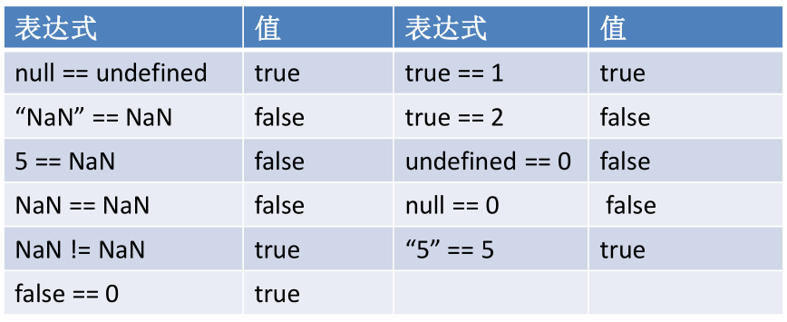

# **1、编写位置
**

• 我们目前学习的JS全都是客户端的JS，也就是说全都是需要在
浏览器中运行的，所以我们我们的JS代码全都需要在网页中编
写。

• 我们的JS代码需要编写到<script>标签中。

• 我们一般将script标签写到head中。（和style标签有点像）

• 属性：

```javascript
– type：默认值text/javascript可以不写，不写也是这个值。
– src：当需要引入一个外部的js文件时，使用该属性指向文件的地址。
```

# **2、Hello World
**

• 创建一个html文件。

• 在html文件的的head标签中创建一个
script标签，并编写如下代码。

```javascript
<script type="text/javascript">
console.log("Hello World");
</script>
```

# **3、严格区分大小写
**

• JavaScript是严格区分大小写的，也就是abc和Abc会被解析器
认为是两个不同的东西。

• 所以在编写上边的HelloWorld时，一定要注意区分大小写。
注释

• 注释中的内容不会被解析器解析执行，但是会在
源码中显示，我们一般会使用注释对程序中的内
容进行解释。

• JS中的注释和Java的的一致，分为两种：

```javascript
– 单行注释：//注释内容
– 多行注释：/*注释内容*/
```

# **4、标识符
**

• 所谓标识符，就是指变量、函数、属性的名字，或函数的参数。

• 标识符可以是按照下列格式规则组合起来的一或多个字符：

```javascript
– 第一个字符必须是一个字母、下划线（ _ ）或一个美元符号（ $ ）。
– 其他字符可以是字母、下划线、美元符号或数字。
```

• 按照惯例，ECMAScript 标识符采用驼峰命名法。

• 但是要注意的是JavaScript中的标识符不能是关键字和保留字
符。

# **5、关键字和保留字符
**

• 关键字





• 保留字符







其他不建议使用的标识符







# **6、变量
**

• 变量的作用是给某一个值或对象标注名称。

• 比如我们的程序中有一个值123，这个值我们是需要反复使用的，这个时候
我们最好将123这个值赋值给一个变量，然后通过变量去使用123这个值。

• 变量的声明：

```javascript
– 使用var关键字声明一个变量。
– var a;
```

• 变量的赋值：

```javascript
– 使用=为变量赋值。
– a=123;
```

• 声明和赋值同时进行：

```javascript
– var a = 123;
```

# **7、数据类型
**

• 数据类型决定了一个数据的特征，比如：123和”123”，直观上看这两个
数据都是123，但实际上前者是一个数字，而后者是一个字符串。

• 对于不同的数据类型我们在进行操作时会有很大的不同。

• JavaScript中一共有5种基本数据类型：

```javascript
– 字符串型（String）
– 数值型（Number）
– 布尔型（Boolean）
– null型（Null）
– undefined型（Undefined）
```

• 这5种之外的类型都称为Object，所以总的来看JavaScript中共有六种数
据类型。

# **7、typeof运算符
**

• 使用typeof操作符可以用来检查一个变量的数据类型。

• 使用方式：typeof 数据，例如 typeof 123。

• 返回结果：

```javascript
– typeof 数值 number
– typeof 字符串 string
– typeof 布尔型 boolean
– typeof undefined undefined
– typeof null object
```

# **8、String
**

• String用于表示一个字符序列，即字符串。

• 字符串需要使用 ’或“ 括起来。

## **• 转义字符：**





## **• 将其他数值转换为字符串有三种方式：toString()、String()、
拼串。
**



```javascript
a=a.toString();
a=String(a);
```

- **null和undefind,不能调用toString();**

# **9、Number
**

• Number 类型用来表示整数和浮点数，最常用的功能就是用来
表示10进制的整数和浮点数。

• Number表示的数字大小是有限的，范围是：

```javascript
– ± 1.7976931348623157e+308
– 如果超过了这个范围，则会返回± Infinity。
```

• NaN，即非数值（Not a Number）是一个特殊的数值，JS中
当对数值进行计算时没有结果返回，则返回NaN。

- **如果使用JS进行浮点数的运算，可能会得到一个不精确的结果，所以不要使用JS进行高精度运算；**

# **10、数值的转换
**

• 有三个函数可以把非数值转换为数值：Number()、parseInt()
和parseFloat()。

## **• Number()可以用来转换任意类型的数据，而后两者只能用于
转换字符串。**

```javascript
a="abc";
a=Number(a);   //a的值为“NaN”
b="123";
b=Number(b);   //b的值为：123
c=false或者c=NaN;或者c=undefind;
c=Number(c);   //c的值为0；
```





## **• parseInt()只会将字符串转换为整数，而parseFloat()可以转换
为浮点数。parseInt(a,n);//n表示指定的进制数
**

```javascript
a="123px";
a=parseInt(a);	//a的值为：123；
b="070"
b=parseInt(b,10);	//b的值为70；
```

## **16进制自动转换（0x开头);8进制转换（0开头）;二进制（0b开头)**

```javascript
a=0x10;
console.log(a);	//a 的值为10（10进制数），输出时自动以10进制输出；
b=0xcafe;
console.log(b);  	//b的值为：51966；
//八进制
c=070;
console.log(c)	//c的值为56；
```

# **11、Boolean(布尔型)
**

• 布尔型也被称为逻辑值类型或者真假值类型。

• 布尔型只能够取真（true）和假（false）两种数值。除此以外，
其他的值都不被支持。

• 其他的数据类型也可以通过Boolean()函数转换为布尔类型。

• 转换规则：





# **12、Undefined
**

• Undefined 类型只有一个值，即特殊的 undefined 。

• 在使用 var 声明变量但未对其加以初始化时，这个变量的值就
是 undefined。例如：

```javascript
– var message;
– message 的值就是 undefined。
```

• 需要注意的是typeof对没有初始化和没有声明的变量都会返回
undefined。

# **13、Null
**

• Null 类型是第二个只有一个值的数据类型，这个特殊的值是
null 。

• 从语义上看null表示的是一个空的对象。所以使用typeof检查
null会返回一个Object。

• undefined值实际上是由null值衍生出来的，所以如果比较
undefined和null是否相等，会返回true；

# **14、运算符
**

• JS中为我们定义了一套对数据进行运算的
运算符。

• 这其中包括：算数运算符、位运算符、关
系运算符等。

# **15、算数运算符
**

• 算数运算符顾名思义就是进行算数操作的运算符。

• JS中为我们提供了多种算数运算符。

• 算数运算符：







```javascript
result=1+2+"3";	//result="33";
result="1"+2+3;	//result="123";
```

# **16、自增和自减
**

• 自增 ++ 自减 --

– 自增和自减分为前置运算和后置元素。

– 所谓的前置元素就是将元素符放到变量的前边，而后置将元素符放到变
量的后边。

– 例子：

```javascript
• 前置自增：++a
• 后置自减：a—
```

– 运算符在前置时，表达式值等于变量原值。

– 运算符在后置是，表达式值等于变量变更以后的值。

# **17、逻辑操作符
**

• 一般情况下使用逻辑运算符会返回一个布尔值。

• 逻辑运算符主要有三个：非、与、或。

• 在进行逻辑操作时如果操作数不是布尔类型则会将其转换

布尔类型在进行计算。

• 非使用符号 ! 表示，与使用 && 表示，或使用 || 表示。









# **18、非
**

• 非运算符使用 ! 表示。

• 非运算符可以应用于任意值，无论值是什么类型，这个运
算符都会返回一个布尔值。

• 非运算符会对原值取反，比如原值是true使用非运算符会
返回false，原值为false使用非运算符会返回true。

# **19、与
**

• 与运算符使用 && 表示。

• 与运算符可以应用于任何数据类型，且不一定返回布尔
值。

• 对于非布尔值运算，会先将非布尔值转换为布尔值。

• 对布尔值做运算时，如果两个值都为true则返回true，
否则返回false。

• 非布尔值时：如果两个都为true，则返回第二个值，如
果两个值中有false则返回靠前的false的值。

# **20、或
**

• 或运算符使用 || 表示。

• 或运算符可以应用于任何数据类型，且不一定返回布尔值。

• 对于非布尔值运算，会先将非布尔值转换为布尔值。

• 对布尔值进行运算时，如果两个值都为false则返回false，
否则返回true。

• 非布尔值时：如果两个都为false ，则返回第二个值，否
则返回靠前true的值。

# **21、赋值运算符
**

• 简单的赋值操作符由等于号 （ = ） 表示，
其作用就是把右侧的值赋给左侧的变量。

• 如果在等于号左边添加加减乘除等运算符，
就可以完成复合赋值操作。

• +=、*=、-=、/=、%=

• 比如：a+=10和a=a+10是一样的。

# **22、关系运算符
**

• 小于（<） 、大于（>） 、小于等于（<=）和大于等于（>=）
这几个关系运算符用于对两个值进行比较，比较的规则与我们
在数学课上所学的一样。

• 这几个运算符都返回一个布尔值。用来表示两个值之间的关系

是否成立。

```javascript
– 5 > 10 false
– 5 < 10 true
– 5 <= 10 true
– 5 >= 10 false
```

# **23、相等
**

• JS中使用==来判断两个值是否相等，如果相等则返回
true。

• 使用!=来表示两个值是否不相等，如果不等则返回true。

• 注意：null和undefined使用==判断时是相等的。









# **24、全等
**

• 除了==以外，JS中还提供了===。

• ===表示全等，他和==基本一致，不过==在判断两个值
时会进行自动的类型转换，而===不会。

• 也就是说”55”==55会返回true，而”55”===55会返回
false；

• 同样我们还有!==表示不全等，同样比较时不会自动转型。

• 也就是说”55”!=55会返回false，而”55”!==55会返回
true；

# **25、逗号
**

• 使用逗号可以在一条语句中执行多次操作。

• 比如：var num1=1, num2=2, num3=3;

• 使用逗号运算符分隔的语句会从左到右顺
序依次执行。

# **26、条件运算符
**

• 条件运算符也称为三元运算符。通常运算符写为?:。

• 这个运算符需要三个操作数，第一个操作数在?之前，
第二个操作数在?和:之间，第三个操作数在:之后。

• 例如：x > 0 ? x : -x // 求x的绝对值

• 上边的例子，首先会执行x>0，如果返回true则执行冒
号左边的代码，并将结果返回，这里就是返回x本身，
如果返回false则执行冒号右边的代码，并将结果返回。

# **26、运算符的优先级
**

```javascript
• .、[]、 new
• ()
• ++、 --
• !、~、+(单目)、-(单目)、typeof、void、delete
• %、*、/
• +(双目)、-(双目)
• << 、 >>、 >>>
• <、<=、>、>=
• ==、!==、===
• &
• ^
• |
• &&
• ||
• ?:
• =、+=、-=、*=、/=、%=、<<=、>>=、>>>=、&=、^=、|=
• ,
```

# **27、语句
**

• 前边我所说表达式和运算符等内容可以理解成是我们一
门语言中的单词，短语。

• 而语句（statement）就是我们这个语言中一句一句完
整的话了。

• 语句是一个程序的基本单位，JS的程序就是由一条一条
语句构成的，每一条语句使用;结尾。

• JS中的语句默认是由上至下顺序执行的，但是我们也可
以通过一些流程控制语句来控制语句的执行顺序。

# **28、代码块
**

• 代码块是在大括号 {} 中所写的语句，以此将
多条语句的集合视为一条语句来使用。

• 例如：

• 我们一般使用代码块将需要一起执行的语句进
行分组，需要注意的是，代码块结尾不需要加
分号。

```javascript
{
var a = 123;
a++;
alert(a);
}
```

# **29、条件语句
**

• 条件语句是通过判断指定表达式的值来决
定执行还是跳过某些语句。

• 最基本的条件语句：

```javascript
– if...else
– switch...case
```

# **30、if...else语句
**

• if...else语句是一种最基本的控制语句，它让JavaScript可以有条件的

执行语句。

• 第一种形式:

```javascript
if(expression)
statement
```

• 第二种形式:

```javascript
if(expression)
statement
else
statement
```



• 除了if和else还可以使用 else if 来创建多个条件分支。





# **31、if语句例子
**

• 例1

```javascript
if(age >= 18){
alert(" 您已经成年！");
}
```



• 例2

```javascript
if(age >= 18){
alert(" 您已经成年！");
}else{
alert(" 你还未成年！");
}
```



• 例3





```javascript
if(age < 18){
alert(" 你还未成年！");
}else if(age <= 30){
alert(" 您已经是个青年了！")
}else{
alert(" 你已经是个中年了！");
}
```

# **32、switch...case语句
**

• switch...case是另一种流程控制语句。

• switch语句更适用于多条分支使用同一条语句的情况。

• 语法：

```javascript
switch( 语句){
case 表达式1:
语句...
case 表达式2:
语句...
default:
语句...
}
```



• 需要注意的是case语句只是标识的程序运行的起点，并不是终
点，所以一旦符合case的条件程序会一直运行到结束。所以我
们一般会在case中添加break作为语句的结束。



# **33、循环语句
**

• 和条件语句一样，循环语句也是基本的控
制语句。

• 循环中的语句只要满足一定的条件将会一
直执行。

# **34、while
**

• while语句是一个最基本的循环语句。

• while语句也被称为while循环。

• 语法：

• 和if一样while中的条件表达式将会被转换为布尔类型，只
要该值为真，则代码块将会一直重复执行。

• 代码块每执行一次，条件表达式将会重新计算。

```javascript
while( 条件表达式){
语句...
}
do...while
```

• do...while和while非常类似，只不过它会
在循环的尾部而不是顶部检查表达式的值。

• do...while循环会至少执行一次。

• 语法：

• 相比于while，do...while的使用情况并不
是很多。

```javascript
do{
语句...
}while( 条件表达式);
```

# **35、for
**

• for语句也是循环控制语句，我们也称它为for循环。

• 大部分循环都会有一个计数器用以控制循环执行的次数，
计数器的三个关键操作是初始化、检测和更新。for语句
就将这三步操作明确为了语法的一部分。

• 语法：

```javascript
for(式 初始化表达式 ; 式 条件表达式 ; 更新表达式){
语句...
}
```

# **36、break和continue
**

• break 和 continue 语句用于在循环中精确地控制代码的执行。

• 使用break语句会使程序立刻退出最近的循环，强制执行循环
后边的语句。

• break和continue语句只在循环和switch语句中使用。

• 使用continue语句会使程序跳过当次循环，继续执行下一次循
环，并不会结束整个循环。

• continue只能在循环中使用，不能出现在其他的结构中。

# **37、label
**

• 使用 label 语句可以在代码中添加标签，以便将来使用。

• 语法：

– label: statement

• 例子：

• 这个例子中定义的 start 标签可以在将来由 break 或 continue 语句
引用。加标签的语句一般都要与 for 语句等循环语句配合使用。

```javascript
start: for (var i=0; i < count; i++) {
alert(i);
}
```