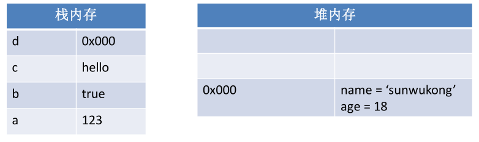
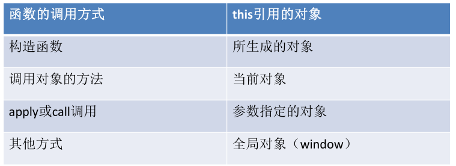
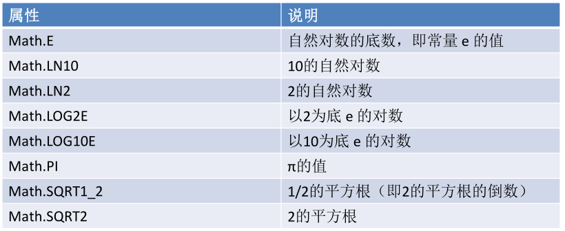

# **1、Object对象
**

• Object类型，我们也称为一个对象。是JavaScript中的引用数据类型。

• 它是一种复合值，它将很多值聚合到一起，可以通过名字访问这些值。

• 对象也可以看做是属性的无序集合，每个属性都是一个名/值对。

• 对象除了可以创建自有属性，还可以通过从一个名为原型的对象那里
继承属性。

• 除了字符串、数字、true、false、null和undefined之外，JS中的值
都是对象。

# **2、创建对象
**

• 创建对象有两种方式：

– 第一种

```javascript
var person = new Object();
person.name = " 孙悟空";
person.age = 18;
```



– 第二种



```javascript
var person = {
name:" 孙悟空",
age:18
};
```

# **3、对象属性的访问
**

• 访问属性的两种方式：

– .访问

• 对象.属性名

– []访问

• 对象[‘属性名’]

# **4、基本数据类型
**

• JS中的变量可能包含两种不同数据类型的值：基本
数据类型和引用数据类型。

• JS中一共有5种基本数据类型：String、Number、
Boolean、Undefined、Null。

• 基本数据类型的值是无法修改的，是不可变的。

• 基本数据类型的比较是值的比较，也就是只要两个
变量的值相等，我们就认为这两个变量相等。

# **5、引用数据类型
**

• 引用类型的值是保存在内存中的对象。

• 当一个变量是一个对象时，实际上变量中保存的并不是
对象本身，而是对象的引用。

• 当从一个变量向另一个变量复制引用类型的值时，会将
对象的引用复制到变量中，并不是创建一个新的对象。

• 这时，两个变量指向的是同一个对象。因此，改变其中
一个变量会影响另一个。

# **6、栈和堆
**

• JavaScript在运行时数据是保存到栈内存和堆内存当中的。

• 简单来说栈内存用来保存变量和基本类型。堆内存用来保存对
象。

• 我们在声明一个变量时实际上就是在栈内存中创建了一个空间
用来保存变量。

• 如果是基本类型则在栈内存中直接保存，

• 如果是引用类型则会在堆内存中保存，变量中保存的实际上对
象在堆内存中的地址。





```javascript
var a = 123;
var b = true;
var c = "hello";
var d = {name:'sunwukong',age:18};
```





# **7、arguments()**

```javascript
/*
*在调用函数时，浏览器每次都会传递两个隐含的参数：
*	1、函数的上下文对象this
*	2、封装实参的对象arguments
*		-arguments是一个类数组对象，它也可以通过索引来操作数据，也可以获取长度
*		-在调用函数时，我们所传递的实参都会在arguments中保存；
*		-我们即是不定义形参，也可以通过arguments来使用实参，只不过比较麻烦
*			arguments[0]表示第一个实参
*			arguments[1]表示第二个实参
*		-它里面有一个属性叫做callee,
*			这个属性对应的一个函数对象，就是当前正在指向的函数的对象
*/
function fun(){
    console.log(arguments.length());
}
fu(1,2,3); //返回值为3；arguments[0]=1;arguments[1]=2;
```

# **8、函数
**

• 函数是由一连串的子程序（语句的集合）所组成的，可以
被外部程序调用。向函数传递参数之后，函数可以返回一
定的值。

• 通常情况下，JavaScript 代码是自上而下执行的，不过函
数体内部的代码则不是这样。如果只是对函数进行了声明，
其中的代码并不会执行。只有在调用函数时才会执行函数
体内部的代码。

• 这里要注意的是JavaScript中的函数也是一个对象。

## **函数的声明（一）
**

• 首先明确一点函数也是一个对象，所以函数也是在
堆内存中保存的。

• 函数声明比较特殊，需要使用function关键字声明。

• 上边的例子就是创建了一个函数对象，并将函数对
象赋值给了sum这个变量。其中()中的内容表示执
行函数时需要的参数，{}中的内容表示函数的主体。

```javascript
var sum = function(a,b){  //方法一
    return a+b
};

```

## **函数的调用
**

• 调用函数时，传递给函数的参数称为实参

（实际参数）。

• 如果想调用我们上边定义的sum函数，可
以这样写：

– 这样表示调用sum这个函数，并将123和456作
为实参传递给函数，函数中会将两个参数求和
并赋值给result。

```javascript
var result = sum(123,456);
```

## **函数的声明（二）
**

• 可以通过函数声明语句来定义一个函数。函数声明语句以关键字
function 开始，其后跟有函数名、参数列表和函数体。其语法如下所

示：

```javascript
function 函数名( 参数, 参数, 参数...){
函数体
}
```

• 例如:

```javascript
function sum(a,b){
return a+b;
}
```

– 上边我们定义了一个函数名为sum，两个参数a和b。函数声明时设置的参数
称为形参（形式参数），这个函数对两个参数做了加法运算并将结果返回。





## **立即执行函数**

```javascript
（function(a,b){
    return a+b;
})(11,22);
```

## **   方法**

```javascript
var obj2={
    name:"猪八戒"；
    age:""18";
    sayName:function(){
        console.log(obj2.name)    
    }
}
```

## **用for查看对象的属性名**

```javascript
var obj={
    name:"张三";
    age:18;
    sex:man;
}
for(var n in obj){
    console.log(n);  //对象的全部属性名
}
```

## **call()和apply()**

```javascript
/*
*call()和apply()
*	-这个两个方法都是函数对象的方法，需要通过函数对象来调用；
*	-当函数调用call()和apply()时都会调用函数执行
*	-在调用call()和apply()时可以将一个对象指定为第一个参数
*		此时这个对象将会成为函数执行时的this;
*	-call()方法可以将实参在对象之后依次传递；
*	-apply()方法需要将实参封装到一个数组中同一传递
*/
var obj={
    name:"obj1"
};
var obj2={
    name:"obj2"
};
var function fun(){
    alert(name.this);
}
fun.call(obj1); //执行结果为：obj1
```

# **9、传递参数
**

• JS中的所有的参数传递都是按值传递的。
也就是说把函数外部的值赋值给函数内部
的参数，就和把值从一个变量赋值给另一
个变量是一样的。

# **10、执行环境
**

• 执行环境定义了变量或函数有权访问的其他数据，决定了它们各自的
行为。

• 每个执行环境都有一个与之关联的变量对象，环境中定义的所有变量
和函数都保存在这个对象中。

• 全局执行环境是最外围的一个执行环境。在 Web 浏览器中，全局执
行环境被认为是 window 对象，因此所有全局变量和函数都是作为
window 对象的属性和方法创建的。

• 某个执行环境中的所有代码执行完毕后，该环境被销毁，保存在其中
的所有变量和函数定义也随之销毁。

• 在内部环境可以读取外部环境的变量，反之则不行。

# **11、函数内部属性
**

• 在函数内部，有两个特殊的对象：

```javascript
– arguments
```

• 该对象实际上是一个数组，用于保存函数的参数。

• 同时该对象还有一个属性callee来表示当前函数。

```javascript
– this
```

• this 引用的是一个对象。对于最外层代码与函数内部的情况，其
引用目标是不同的。

• 此外，即使在函数内部，根据函数调用方式的不同，引用对象也
会有所不同。需要注意的是，this 引用会根据代码的上下文语境
自动改变其引用对象。

# **12、this 引用的规则
**

• 在最外层代码中，this 引用的是全局对象。

• 在函数内，this 根据函数调用方式的不同

而有所不同：







# **13、构造函数
**

• 构造函数是用于生成对象的函数，像之前调用的Object()就是一个构
造函数。

• 创建一个构造函数：

```javascript
function MyClass(x,y) {
this.x = x;
this.y = y;
}
```



• 调用构造函数：

```javascript
– 构造函数本身和普通的函数声明形式相同。
– 构造函数通过 new 关键字来调用，new 关键字会新创建一个对象并返回。
– 通过 new关键字调用的构造函数内的 this 引用引用了（被新生成的）对象。
```



# **14、new关键字
**

• 使用new关键字执行一个构造函数时：

```javascript
– 首先，会先创建一个空的对象。
– 然后，会执行相应的构造函数。构造函数中的this将会引用这个新对象。
– 最后，将对象作为执行结果返回。
```

• 构造函数总是由new关键字调用。

• 构造函数和普通函数的区别就在于调用方式的不同。

• 任何函数都可以通过new来调用，所以函数都可以是构造函数。

• 在开发中，通常会区分用于执行的函数和构造函数。

• 构造函数的首字母要大写。

# **15、属性的访问
**

• 在对象中保存的数据或者说是变量，我们称为是一个对象的属性。

• 读取对象的属性有两种方式：

```javascript
– 对象.属性名
– 对象['属性名']
```

• 修改属性值也很简单：

```javascript
– 对象.属性名 = 属性值
```

• 删除属性

```javascript
– delete 对象.属性名
```

• constructor

```javascript
– 每个对象中都有一个constructor属性，它引用了当前对象的构造函数。
```

# **16、垃圾回收
**

• 不再使用的对象的内存将会自动回收，这
种功能称作垃圾回收。

• 所谓不再使用的对象，指的是没有被任何
一个属性（变量）引用的对象。

• 垃圾回收的目的是，使开发者不必为对象
的生命周期管理花费太多精力。
原型继承

• JS是一门面向对象的语言，而且它还是一个基于原型的面向对
象的语言。

• 所谓的原型实际上指的是，在构造函数中存在着一个名为原型
的(prototype)对象，这个对象中保存着一些属性，凡是通过该
构造函数创建的对象都可以访问存在于原型中的属性。

• 最典型的原型中的属性就是toString()函数，实际上我们的对象
中并没有定义这个函数，但是却可以调用，那是因为这个函数
存在于Object对应的原型中。

# **17、设置原型prototype
**

• 原型就是一个对象，和其他对象没有任何区别，可以通过构造函数来获取原型对象。

```javascript
– 构造函数. prototype
```

• 和其他对象一样我们可以添加修改删除原型中的属性，也可以
修改原型对象的引用。

• 需要注意的是prototype属性只存在于函数对象中，其他对象
是没有prototype属性的。

• 每一个对象都有原型，包括原型对象也有原型。特殊的是
Object的原型对象没有原型。

# **向原型对象中添加方法或者变量**

```javascript
function Myclass(){
    
}
MyClass.prototype.a=123;	//向原型对象中添加了一个变量：a
MyClass.prototype.sayHello=function(){//向原型对象中添加了一个方法：sayHello();
    alert("Hello");
}
var myclass=new MyClass();
myclss.sayHello();	//调用原型对象的方法；
```

## **重写原型对象中的方法**

```javascript
/*
*如果构造函数中，有一个方法和原型对象的一个方法名称相同，则程序执行时则会优先选择构造函数中的
*这个方法，也就相当月重写了原型对象方法；
*但是不要构造函数中直接书写，如果直接书写，所有的对象的中的这个方法都被重写了；
*要使用对象.属性进行书写；
*并且如果想要重写所有对象的某个方法，那么请在原型对象中重写
*/
function Person(){
    
}
var person=new Person();
person.toString(){		//重写了person对象的toString()方法
    alert("哈哈");
}
```

## **hasOwnProperty(),检查对象自身是否含有某个属性**

```javascript
function MyClass(){
    this.a=123;
}
MyCalss.prototype.b=456;
var myclass=new MyClass();
console.log(b in mycalss); //返回值true,使用此方法如果能原型对象中，则返回true;
console.log(myclass.hasOwnProperty(b)); //返回FALSE;
```

# **18、获取原型对象的方法
**

• 除了可以通过构造函数获取原型对象以外，还可以
通过具体的对象来获取原型对象。

```javascript
– Object.getPrototypeOf(对象)
– 对象.__proto__
– 对象. constructor.prototype
 function MyClass(){
    this.a=123;
}
MyCalss.prototype.b=456;
var myclass=new MyClass();
console.log(mycalss._proto_)
```

• 需要注意的是，我们可以获取到Object的原型对象，
也可以对它的属性进行操作，但是我们不能修改
Object原型对象的引用。

# **19、原型链
**

• 基于我们上边所说的，每个对象都有原型对象，原型对象也有原型对象。

• 由此，我们的对象，和对象的原型，以及原型的原型，就构成了一个原型链。

• 比如这么一个对象：

```javascript
– var mc = new MyClass(123,456);
– 这个对象本身，原型MyClass.proprototype原型对象的原型对象是Object，
    Object对
象还有其原型。这组对象就构成了一个原型链。
– 这个链的次序是：mc对象、mc对象原型、原型的原型（Object）、Object的原型
```

• 当从一个对象中获取属性时，会首先从当前对象中查找，如果没有则顺着向
上查找原型对象，直到找到Object对象的原型位置，找到则返回，找不到则
返回undefined。

# **20、instanceof
**

• 之前学习基本数据类型时我们学习了typeof用来检查一个变量
的类型。

• 但是typeof对于对象来说却不是那么好用，因为任何对象使用
typeof都会返回Object。而我们想要获取的是对象的具体类型。

• 这时就需要使用instanceof运算符了，它主要用来检查一个对
象的具体类型。

• 语法：

```javascript
– var result = 变量 instanceof 类型
```

# **21、引用类型
**

• 上边我们说到JS中除了5种基本数据类型以外其余
的全都是对象，也就是引用数据类型。

• 但是虽然全都是对象，但是对象的种类却是非常繁
多的。比如我们说过的Array（数组），Function
（函数）这些都是不同的类型对象。

• 实际上在JavaScript中还提供了多种不同类型的对
象。

# **22、Object
**

• 目前为止，我们看到的最多的类型就是Object，它也是我们在JS中使用的最多的对象。

• 虽然Object对象中并没有为我们提供太多的功能，但是我们会经常会用途来存储和传

输数据。

• 创建Object对象有两种方式：

```javascript
– var obj = new Object();
– var obj = {}
```

• 上边的两种方式都可以返回一个Object对象。

• 但是第一种我们使用了一个new关键字和一个Object()函数。

• 这个函数就是专门用来创建一个Object对象并返回的，像这种函数我们称为构造函数。

# **23、Array
**

• Array用于表示一个有序的数组。

• JS的数组中可以保存任意类型的数据。

• 创建一个数组的方式有两种：

– 使用构造器：

```javascript
• var arr = new Array(数组的长度);
• var arr = new Array(123,’hello’,true);
```

– 使用[]

```javascript
• var arr = [];
• var arr = [123,’hello’,false];
```

• 读取数组中的值使用数组[索引]的方式，注意索引是从0开始的。

# **24、Date对象
**

• Date类型用来表示一个时间。

• Date采取的是时间戳的形式表示时间，所谓的时间戳指的是从
1970年1月1日0时0秒0分开始经过的毫秒数来计算时间。

• 直接使用new Date()就可以创建一个Date对象。

• 创造对象时不传参数默认创建当前时间。可以传递一个毫秒数
用来创建具体的时间。

• 也可以传递一个日期的字符串，来创建一个时间。

```javascript
– 格式为：月份/日/年 时:分:秒
– 例如：06/13/2004 12:12:12
/*
*创建一个Date对象
*如果直接使用构造函数创建一个Date对象，则会封装为当前代码执行的时间
*
*创建一个指定的时间对象
*	-需要在构造函数中传递一个表示时间的字符串作为参数
*		日期格式  月份/日/年 时：分：秒
*		例如：var d2=new Date("12/03/2016 11:10:30");
*/
var d=new Date();
console.log(d);
```

## **Date对象常用方法**

```javascript
/*
*getDate()
*	-获取当前对象是几日；
*
*getDay()
*	-获取当前对象是周几；
*	-会返回一个0-6的值，0表示周日，1是周一
*
*getMonth()
*	-获取当前对象是几月
*	-会返回一个0-11的值，0表示1月份，11表示12月份
*
*getTime()/now()
*	-获取当前日期对象的时间戳
*	-时间戳表示的是格林威治标准时间的1970年1月1日0时0分0秒到当前时间所花费的毫秒数
*/
```

# **25、Function
**

• Function类型代表一个函数，每一个函数都是一个Function类
型的对象。而且都与其他引用类型一样具有属性和方法。

• 由于函数是对象，因此函数名实际上也是一个指向函数对象的
指针，不会与某个函数绑定。

• 函数的声明有两种方式：

```javascript
– function sum(){}
– var sum = function(){};
```

• 由于存在函数声明提升的过程，第一种方式在函数声明之前就
可以调用函数，而第二种不行。

# **26、函数也可以作为参数
**

• 函数也是一个对象，所以函数和其他对象一样
也可以作为一个参数传递给另外一个函数。

• 但是要注意的是使用函数作为参数时，变量后
边千万不要加()，不加()表示将函数本身作为
参数，加上以后表示将函数执行的结果作为参

数。

# **27、函数对象的方法
**

• 每个函数都有两个方法call()和apply()。

• call()和apply()都可以指定一个函数的运行
环境对象，换句话说就是设置函数执行时
的this值。

• 使用方式：

```javascript
– 函数对象.call(this对象,参数数组)
– 函数对象.apply(this对象,参数1,参数2,参数N)
```

# **28、闭包（closure）
**

• 闭包是JS一个非常重要的特性，这意味着
当前作用域总是能够访问外部作用域中的
变量。因为函数是JS中唯一拥有自身作用
域的结构，因此闭包的创建依赖于函数。

• 也可以将闭包的特征理解为，其相关的局
部变量在函数调用结束之后将会继续存在。

# **30、
基本包装类型**

• 基本数据类型是不能去调用方法的，所以JS中还提供了3个特殊的引

用类型：

```javascript
– Boolean
– Number
– String
```

• 这三个类型分别包装了Boolean、Number、String并扩展了许多实
用的方法。

• 他们的使用方式和普通的对象一样。

• 要注意的是使用typeof检查这些包装类型时返回的都是object。

## **Boolean****（开发人员不要用，这是给浏览器自己用的）****
**

• Boolean 类型是与布尔值对应的引用类型。

• 可以采用这种方式创建：

```javascript
– var booleanObject = new Boolean(true);
```

• 我们最好永远不要使用Boolean包装类。

## **Number****（开发人员不要用，这是给浏览器自己用的）****
**

• Number是数值对应的引用数据类型。创
建Number对象只需要在调用构造函数时
传递一个数值：

```javascript
– var num = new Numbaer(20);
```

• 使用数值时我们建议使用基本数值，而不
建议使用包装类。

## **String
**

• String 类型是字符串的对象包装类型，可
以像下面这样使用 String 构造函数来创建。

```javascript
– var str = new String("hello world");
```

• 可以使用length属性来获取字符串的长度。

# **31、toString**

```javascript
/*
*我们直接在页面打印一个对象时，实际上是输出对象的toString()方法的返回值[object Object]
*	如果我们希望在输出时不输出[object Object],我们可以为对象重写toString()方法
*/
```

# **32、String对象的方法**

```javascript
/*
*在底层字符串是以字符数组的形式保存的
*	比如：var str="123456";
*		console.log(str.length); 返回值就是6；
*		console.log(str[2]);	返回值就是3；
*/
```

## **charAt()**

```javascript
/*
*charAt()
*	-可以返回字符串指定位置的字符
*/
str="Hello Atguigu";
var result=str.charAt(0);
console.log(result);   //返回值为H
```

## **charCodeAt()**

```javascript
/*
*charCodeAt()
*	-可以返回指定字符在Unicode中的编码
*/
var str="Hello Atguigu";
result=str.charCodeAt(0);
console.log(result);  //返回值为72；
```

## **fromCharCode()**

```javascript
/*
*fromCharCode()
*	-可以根据Unicode字符编码去获取字符
*/
result=String.fromCharCode(72);
consolse.log(result);	//返回值是H
```

## **concat()**

```javascript
/*
*concat()
*	-可以用来连接两个或者多个字符串，对原字符串没有影响
*	-作用和+号一样
*/
var str=" ";
result=str.concat("你好","再见");
console.log(result); //返回值为你好再见；
```

## **indexOf()**

```javascript
/*
*indexOf("str",index)
*	-可以检索一个字符串是否含有指定的内容
*	-如果字符串中含有该内容，则返回自一次出现的索引
*		如果没有找到指定的内容，就返回-1；
*	-str:检索的内容；
*	-index:指定当前字符串开始查找的位置
*	
*/
var str="hello world";
result=str.indexOf("h");
console.log(result); //返回值为0；
console.log(str.indexOf("p")); //返回值为-1；
```

## **lastIndexOf()**

```javascript
/*
*lastIndexOf("str",index)
*	-该方法和indexOf()用法基本一致，只不过它是从字符串的末尾位置开始查找；
*/
```

## **slice()**

```javascript
/*
*silce(star,end)  //翻译：切片，菜刀
*	-可以从字符串中截取指定的内容
*	-不会影响原字符串，而是将截取的内容返回
*	-参数：
*	    start：开始位置的索引（包括开始位置）
*	      end: 结束位置的索引（不包括此位置）
*		    如果省略此参数，就会截取start后面的全部；
*		    如果为负数，比如-1，就是倒数第一位置的索引；
*/
var str="0123456";
result=str.slice(0,4);
console.log(result)l;	//返回值为：0123
```

## **substring()**

```javascript
/*
*substring(start,end)
*	-可以用来截取一个字符串,和slice()类似，不同的是substring参数不能为负数；
-参数：
*	    start：开始位置的索引（包括开始位置）
*	      end: 结束位置的索引（不包括此位置）
*/
var str="0123456";
result=str.substring(0,4); //返回值为：0123
```

## **split()**

```javascript
/*
*split("str")	//翻译：均分
*	-可以将一个字符串拆分成一个数组
*	-参数
*	    str:这个字符串必须为当前字符窜中的内容，然后将这个str作为分隔符；
*/
var string="abc,efg,hij,klm";
var result=string.split(",");
console.log(result[0]);	//返回值为：abc 
```

## **toUpperCase()**

```javascript
/*
*toUpperCase()
*	-将一个字符串转换成大写，并返回；
*/
var str="abc";
result=str.toUpperCase();
console.log(result);	//返回值为ABC；
```

# **33、支持正则表达式的String方法**

## **split()**

```javascript
/*
*split("str")	//翻译：均分
*	-可以将一个字符串拆分成一个数组
*	-方法中可以传递一个正则表达式作为参数；
*	-参数
*	    str:这个字符串必须为当前字符窜中的内容，然后将这个str作为分隔符；
*/
var string="abc,efg,hij,klm";
var result=string.split(",");
console.log(result[0]);	//返回值为：abc 
/*
*根据任意字母拆分
*/
```

## **search()**

```javascript
/*
*search("str")
*	-可以搜索字符串总是否含有指定的内容
*	-如果搜索到指定内容，就返回第一次出现的索引，如果没有就返回-1
*	-它可以接收一个正则表达式作为参数，然后根据正则表达式去检索
*/
```

## **match()**

```javascript
/*
*match()
*	-可以根据正则表达式，从一个字符串中将符合条件的内容提取出来
*	-默认情况下match只会找到第一个符合要求的内容，找到以后就停止
*		我们可以设置正则表达式为全局匹配模式，这样就会匹配到所有的内容
*	-参数：
*	     g:表示全局匹配模式
*	     i:忽略大小写；
*	-match()会将匹配到的内容封装成一个数组返回；
*	-默认只会替换第一个
*/
var str="1a2b3c4d45e6f7a8g9k";
result=str.match(/[A-z]/ig);
console.log(result);
```

## **replace()**

```javascript
/*
*replace("oldstr","newstr")
*	-可以将字符串中指定内容替换为新的内容
*	-参数：
*     oldstr:被替换的内容，可以接收一个正则表达式
*	   newstr:新的内容
*/
```

# **34、Math
**

• JS 还为保存数学公式和信息提供了一个公
共位置，即 Math 对象。

• 与我们在 JavaScript 直接编写的计算功能
相比， Math 对象提供的计算功能执行起
来要快得多。 Math 对象中还提供了辅助
完成这些计算的属性和方法。

## **Math对象的属性**



## **
**



## **Math的方法
**

### **• 最大最小值
**

```javascript
– Math.max()获取最大值
    var max=Math.max(10,45,30,100);
– Math.min()获取最小值
    var min=Math.min(10,45,30,100);
```

### **• 舍入：
**

```javascript
– 向上舍 Math.ceil()
– 向下舍 Math.floor()
– 四舍五入 Math.round()
```

### **• 随机数random()：**

```javascript
 Math.random()	//生成0-1之间的随机数
 
 /*
 *Math.random()
 *	-可以生成一个0-1之间的随机数
 *	-生成0-10之间的随机数
 *		生成一个0-X之间的随机数：Math.round(Manth.randdom()*x)
 *	-生成1-10
 *	-生成x-y之间的随机数
 *		Math.round(Math.random()*(y-x)+x)
 */ 
```





### **pow(x,y)**

```javascript
/*
*Math.pow(x,y)
*	-返回x的y次幂；
*/
```

### **sqrt(x)**

```javascript
-开平方
```

# **35、函数作用域**

## **var 变量的声明提前**

```javascript
-使用var关键字声明变量，会在代码执行之前被声明（但是不会赋值），
    但是如果声明不使用var关键字，则不会被声明提前
```

## **函数声明提前**

```javascript
-使用函数声明形式创建的函数function 函数名（）{ };
    它会在代码执行之前就被创建
    
    如果使用var fun=function（）{} ;就不会
```

## **在函数中不使用var声明变量，**

```javascript
那么声明的变量就默认是全局变量
function fun(){
    c=12;		//c是全局变量
    var b=10;	//b是局部变量
}
```

# **36、使用工厂方法创建对象**

```javascript
function objecrFactory(name,age,gender){
    var obj=new Object();
    obj.namename;
    obj.age=age;
    obj.gender=gender;
    obj.sayName=function(){
        alert(this.name);    
    }
    return obj；
}
//批量创建对象
var obj1=objectFactory("张三"，16，"男");
var obj2=objectFacyory("李四"，18，"woman");
```

# **37、构造函数**

```javascript
/*
*使用工厂方法创建的对象，使用的构造函数都是Object;
*	所以创建的对象都是Object这个类型，
*	就导致我们无法区分出多种不同类型的对象
*/
/*
*创建一个构造函数，专门用来穿件Person对象
*	构造函数就是一个普通的函数，创建方式和普通的函数没有区别，
*	不同的是构造函数习惯于首字母大写
*
*构造函数和普通函数的区别就是调用的方式不同
*	普通的函数就是直接调用，而构造函数需要使用new关键字来调用
*
*	构造函数的执行流程
*	  1、立即创建一个新的对象
*	  2、将新建的对象设置为函数中this，在我们的构造函数中可以使用this来引用新建的对象
*	  3、逐行执行函数中的代码
*	  4、将新建的对象作为返回值返回
*
*使用同一个构造函数创建对象，我们称为一类对象，也将一个构造函数称为一个类。
*	我们将通过一个构造函数创建的对象，称为该类的实例	 
*
*this的情况：
*	1、当以函数的形式调用时，this是window
*	2、当以方法的形式调用时，谁调用方法this就是谁
*	3、当以构造函数的形式调用时，this就是新创建的对象
*/
function Person(name,age,gender){
    this.name=name";
    this.age=age;
    this.gender=gener;
    this.sayName=function(){  //这个方法不会被共享，是单独属于每一个对象自己的；
        alert(this.name);    
    }
}
var per=new Person("张三"，18，"男");
console.log(per.name);
/*
*使用instanceof可以检查一个对象是否一个类的实例
*	语法：
*	    对象 instanceof 构造函数
*	如果是，返回true,否则返回false;
*/
console.log(per instanceof Person);
```