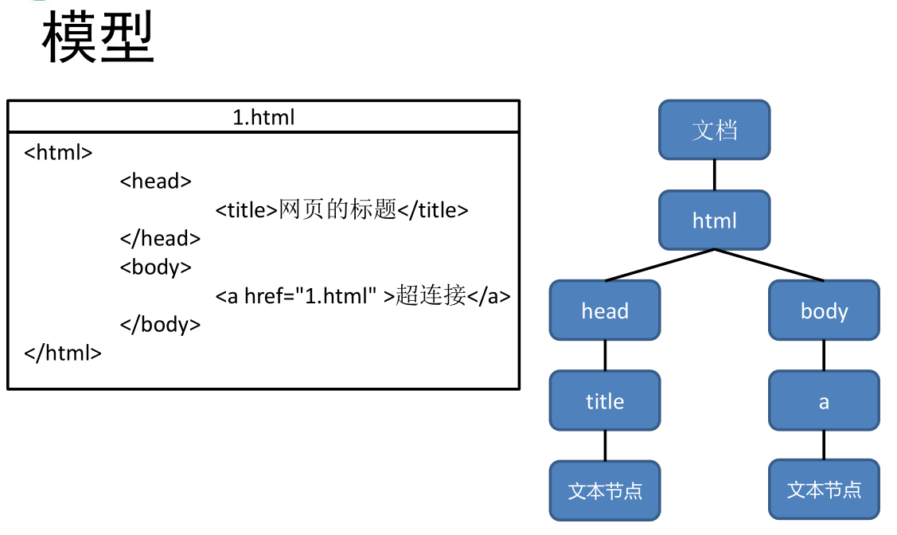
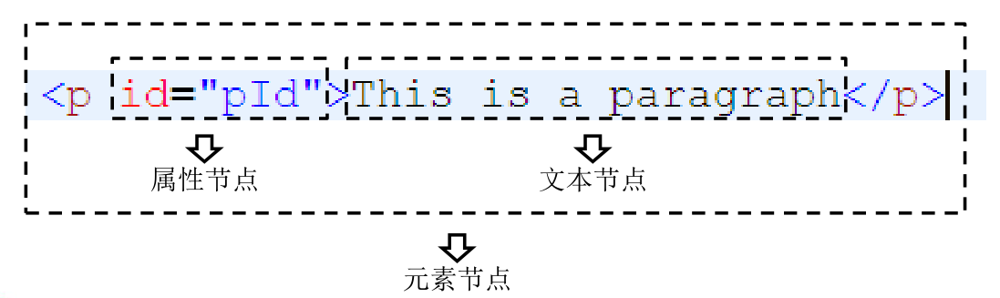
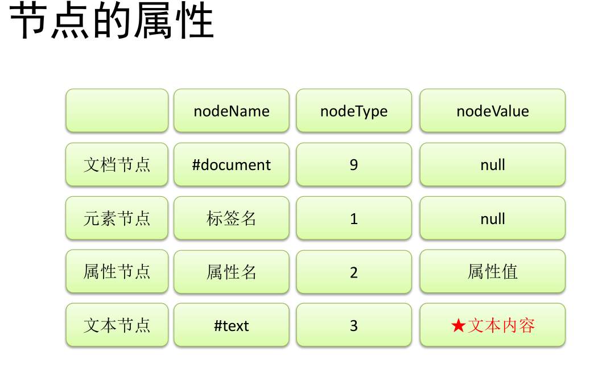

1、什么是DOM


2、节点


3、文档节点（document）


4、元素节点（Element）


5、文本节点（Text）


6、属性节点（Attr）


7、事件


8、获取元素节点


9、元素节点的属性


10、使用CSS选择器进行查询


11、节点的修改


# 1、什么是DOM


• DOM，全称Document Object Model文档对象模型。


• JS中通过DOM来对HTML文档进行操作。只要理解了DOM就可以随
心所欲的操作WEB页面。


• 文档


– 文档表示的就是整个的HTML网页文档


• 对象


– 对象表示将网页中的每一个部分都转换为了一个对象。


• 模型


– 使用模型来表示对象之间的关系，这样方便我们获取对象。





---

# 2、节点


• 节点Node，是构成我们网页的最基本的组成部分，网页中的
每一个部分都可以称为是一个节点。


• 比如：html标签、属性、文本、注释、整个文档等都是一个节
点。


• 虽然都是节点，但是实际上他们的具体类型是不同的。


• 比如：标签我们称为元素节点、属性称为属性节点、文本称为
文本节点、文档称为文档节点。


• 节点的类型不同，属性和方法也都不尽相同。


• 节点：Node——构成HTML文档最基本的单元。


• 常用节点分为四类


```javascript
– 文档节点：整个HTML文档
– 元素节点：HTML文档中的HTML标签
– 属性节点：元素的属性
– 文本节点：HTML标签中的文本内容
```








---

# 3、文档节点（document）


• 文档节点document，代表的是整个HTML文
档，网页中的所有节点都是它的子节点。


• document对象作为window对象的属性存在
的，我们不用获取可以直接使用。


• 通过该对象我们可以在整个文档访问内查找节
点对象，并可以通过该对象创建各种节点对象。


---

# 4、元素节点（Element）


• HTML中的各种标签都是元素节点，这也是我们最常用
的一个节点。


• 浏览器会将页面中所有的标签都转换为一个元素节点，
我们可以通过document的方法来获取元素节点。


• 比如：


```javascript
– document.getElementById()
– 根据id属性值获取一个元素节点对象。
```


---

# 5、文本节点（Text）


• 文本节点表示的是HTML标签以外的文本内容，任意非HTML的文本


都是文本节点。


• 它包括可以字面解释的纯文本内容。


• 文本节点一般是作为元素节点的子节点存在的。


• 获取文本节点时，一般先要获取元素节点。在通过元素节点获取文本
节点。


• 例如：


```javascript
– 元素节点.firstChild;
– 获取元素节点的第一个子节点，一般为文本节点
-innerText ：可以获取元素内部的文本内容，它和innerHTML类似，不同的是它会自动将HTML标签去除
```


---

# 6、属性节点（Attr）


• 属性节点表示的是标签中的一个一个的属
性，这里要注意的是属性节点并非是元素
节点的子节点，而是元素节点的一部分。


• 可以通过元素节点来获取指定的属性节点。


• 例如：


```javascript
– 元素节点.getAttributeNode("属性名");
```

• 注意：我们一般不使用属性节点。


---

# 7、事件


• 事件，就是文档或浏览器窗口中发生的一
些特定的交互瞬间。


• JavaScript 与 HTML 之间的交互是通过事
件实现的。


• 对于 Web 应用来说，有下面这些代表性的
事件：点击某个元素、将鼠标移动至某个
元素上方、按下键盘上某个键，等等。


- 属性：

- onclick:单机

- ondbclick:双击

```javascript
<script type="text/javascript">
    //获取button对象
    //修改按钮中的文字

    /*
     *浏览器加载页面时，是按照自上而下的顺序加载的，
     *  读取到一行就运行一行，如果将scrip标签写到页面的上边，
     *  在代码执行时页面还没有加载,没有加载DOM对象
     *
     *onload事件会在整个页面加载完后，才触发
     * 为window绑定一个onload事件
     *      该事件对应的响应函数将会在页面加载完成之后执行，
     *      这样可以确保我们的代码执行时，所有的DOM对象已经加载了
     */

    window.onload=function () {
        var btn=document.getElementById("btn");
        btn.onclick=function () {
            alert("点我")
        }
    }
</script>
<body>
    <button id="btn" >我是一个按钮</button>

</body>
```


---

# 8、获取元素节点


• 通过document对象调用


```javascript
1. getElementById()
	– 通过id属性获取一个元素节点对象
2. getElementsByTagName()
	– 通过标签名获取一组元素节点对象
3. getElementsByName()
	– 通过name属性获取一组元素节点对象
获取元素节点的子节点
```

## querySelector()

```javascript
   /*
*document.queryselector()
*  -需要一个选择器的字符串作为参数，可以根据一个CSS选择器来查询一个元素节点对象
*  -虽然IE8中没有getElementsByClassName()但是可以使用querySelect
*  -使用该方法总会返回唯一的一个元素，如果满足条件的元素有多个，那么它只会返回第一个
*/
    var div=document.querySelector(".box div");
```

## querySelectorAll()

```javascript
/*
 *document.querySelectorAll()
 *  -该方法和querySelector()用法类似，不同的是它会将符合条件的元素封装成一个类数组
 *  -即是符合条件的元素，也会
 */

var divs=document.querySelectorAll(".box");
alert(divs.length);
```

## 获取元素节点子节点：

• 通过具体的元素节点调用


```javascript
1. getElementsByTagName()
	– 方法，返回当前节点的指定标签名后代节点
2. childNodes
	
    – 属性，表示当前节点的所有子节点，包括DOM标签间的空白也会当成子节点
    	注意：在IE8及以下的浏览器中，不会吧=把空白文本当成子节点    
3. firstChild
	– 属性，表示当前节点的第一个子节点，包括空白文本节点
4. lastChild
	– 属性，表示当前节点的最后一个子节点
获取父节点和兄弟节点
5.	children	-属性，表示当前节点的所有子节点
6. firstElementChild -属性，表示第一个元素子节点，但是不兼容IE8以及下的浏览器
```

## • 通过具体的节点调用


```javascript
1. parentNode
	– 属性，表示当前节点的父节点
2. previousSibling
	– 属性，表示当前节点的前一个兄弟节点，也会获取空白的文白
3.	previousElementSibling 表示前一个兄弟元素节点，IE8及以下不兼容
3. nextSibling
	– 属性，表示当前节点的后一个兄弟节点
```


---

# 9、元素节点的属性


• 获取，元素对象.属性名


```javascript
例：element.value
element.id
element.className
```

• 设置，元素对象.属性名=新的值


```javascript
例：element.value = “hello”
element.id = “id01”
element.className = “newClass”
```

其他属性


• nodeValue
	– 文本节点可以通过nodeValue属性获取和设置
文本节点的内容


• innerHTML
	– 元素节点通过该属性获取和设置标签内部的
html代码


---

# 10、使用CSS选择器进行查询


• querySelector()


• querySelectorAll()


• 这两个方法都是用document对象来调用，两个方法使用相同，
都是传递一个选择器字符串作为参数，方法会自动根据选择器
字符串去网页中查找元素。


• 不同的地方是querySelector()只会返回找到的第一个元素，而
querySelectorAll()会返回所有符合条件的元素。


---

# 11、节点的修改


• 这里的修改我们主要指对元素节点的操作。


```javascript
• 创建节点
	– document.createElement(标签名)
• 创建文本节点
 – document.createTextNode("text")  
• 删除节点
	– 父节点.removeChild(子节点)
• 替换节点
	– 父节点.replaceChild(新节点 , 旧节点)
• 插入节点
	– 父节点.appendChild(子节点)
    	– 父节点.insertBefore(新节点 , 旧节点)
```


---

# 12、