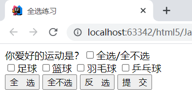

```javascript
<!DOCTYPE html PUBLIC "-//W3C//DTD HTML 4.01 Transitional//EN" "http://www.w3.org/TR/html4/loose.dtd">
<html>
<head>
    <meta http-equiv="Content-Type" content="text/html; charset=UTF-8">
    <title>全选练习</title>
    <script type="text/javascript">
        window.onload=function (ev) {

            //获取四个多选框items
            var items=document.getElementsByName("items")
            /*
             *全选按钮：
             *  -点击按钮以后，四个多选框全都被选中
             */
            var checkedAllBtn=document.getElementById("checkedAllBtn");
            checkedAllBtn.onclick=function (ev1) {
               // alert("全选中了")
                //alert(items.length)
                for(var i=0;i<items.length;i++){
                    //设置四个多选框成为选中状态
                    //通过多选框的checked属性来获取或设置多选框的选中状态
                    items[i].checked=true;
                }
                checkedAllBox.checked=true;
            }

            /*
             *全部选按钮
             */
            var checkedNoBtn=document.getElementById("checkedNoBtn");
            checkedNoBtn.onclick=function (ev1) {
                for(var i=0;i<items.length;i++){
                    items[i].checked=false;
                }
                checkedAllBox.checked=false;
            }

            /*
             *反选按钮：
             *
             */

            var checkedRevBtn=document.getElementById("checkedRevBtn");
            checkedRevBtn.onclick=function (ev1) {
                checkedAllBox.checked=true;
                for(var i=0;i<items.length;i++){
                    /*
                     * if(items[i].checked){
                        items[i].checked=false;
                    }else {
                        items[i].checked=true;
                    }
                     */
                   items[i].checked=!items[i].checked;
                   if(!items[i].checked){
                       checkedAllBox.checked=false;
                   }
                }
                //反选时也需要判断


            }

            /*
             *提交按钮
             */
            var sendBtn=document.getElementById("sendBtn");
            sendBtn.onclick=function (ev1) {
                for (var i = 0; i < items.length; i++) {
                    if(items[i].checked){
                        alert(items[i].value)
                    }
                }
            }
            /*
             *全选全部选多选框
             */
            var checkedAllBox=document.getElementById("checkedAllBox");
            checkedAllBox.onclick=function (ev1) {
                /*
                 * if(checkedAllBox.checked){
                    for(var i=0;i<items.length;i++){
                        items[i].checked=true;
                    }
                }else{
                    for(var i=0;i<items.length;i++){
                        items[i].checked=false;
                    }
                }
                 */
                for(var i=0;i<items.length;i++){
                    items[i].checked=checkedAllBox.checked;
                }

            }

            /*
             *如果四个多选框全选中，全选按钮也应该选中，
             *  如果四个没有都选中，全选按钮不应该选中
             */
            //为四个多选框分别绑定单机响应函数
            for(var i=0;i<items.length;i++){
                items[i].onclick=function () {
                    checkedAllBox.checked=true;
                    for(var j=0;j<items.length;j++){
                        if(!items[j].checked){
                            checkedAllBox.checked=false;
                            break;
                        }
                    }
                }
            }
        }

    </script>
</head>
<body>

<form method="post" action="">
    你爱好的运动是？<input type="checkbox" id="checkedAllBox" />全选/全不选

    <br />
    <input type="checkbox" name="items" value="足球" />足球
    <input type="checkbox" name="items" value="篮球" />篮球
    <input type="checkbox" name="items" value="羽毛球" />羽毛球
    <input type="checkbox" name="items" value="乒乓球" />乒乓球
    <br />
    <input type="button" id="checkedAllBtn" value="全　选" />
    <input type="button" id="checkedNoBtn" value="全不选" />
    <input type="button" id="checkedRevBtn" value="反　选" />
    <input type="button" id="sendBtn" value="提　交" />
</form>
</body>
</html>
```




