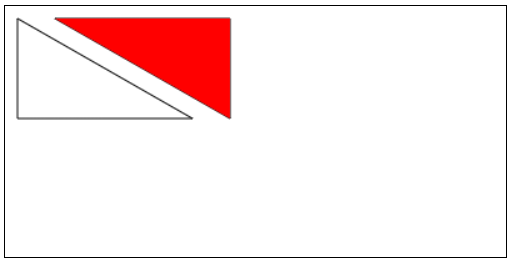
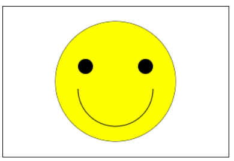

# 1、绘制三角形

```javascript
<!DOCTYPE html>
<html lang="en">
<head>
    <meta charset="UTF-8">
    <title>Title</title>
    <style>
        canvas{

            border:1px solid;
        }
    </style>

    <script>
        window.onload=function (ev) {
            var c=document.getElementById("myCanvas");
            var ctx=c.getContext("2d");
            //绘制空心三角形
            ctx.beginPath();
            ctx.moveTo(10,10);
            ctx.lineTo(10,90);
            ctx.lineTo(150,90);
            ctx.closePath();
            ctx.stroke();

            //绘制实心三角形
            ctx.beginPath();
            ctx.moveTo(40,10);
            ctx.lineTo(180,10);
            ctx.lineTo(180,90);
            ctx.closePath();
            ctx.stroke();
            ctx.fillStyle="red";    //填充颜色为红色（默认黑色）
            ctx.fill();
        }
    </script>
</head>
<body>
    <canvas id="myCanvas" width="400px" height="200px">
        对不起您的浏览器不支持画布
    </canvas>
</body>
</html>
```





---

# 2、绘制弧形

```javascript
<!DOCTYPE html>
<html lang="en">
<head>
    <meta charset="UTF-8">
    <title>Title</title>
    <style>
        canvas{
            border:1px solid ;
        }
    </style>

    <script>
        window.onload=function (ev) {
            var c =document.getElementById("myCanvas");
            var ctx=c.getContext("2d");

            //设置填充颜色
            ctx.fillStyle="yellow";

            //绘制圆脸，并填充为黄色
            ctx.beginPath();
            ctx.arc(150,100,80,0,Math.PI*2,true);
            ctx.stroke();
            ctx.fill();

            ctx.fillStyle="black";
            //绘制左眼
            ctx.beginPath();
            ctx.arc(190,80,10,0,Math.PI*2,true);
            ctx.fill();
            //绘制右眼
            ctx.beginPath();
            ctx.arc(110,80,10,0,Math.PI*2,true);
            ctx.fill();
            //绘制带有弧度的笑容
            ctx.beginPath();
            ctx.arc(150,110,50,0,Math.PI,false);
            ctx.stroke();


        }

    </script>
</head>
<body>
    <canvas id="myCanvas" width="300px" height="200px">
        对不起你的浏览器不支持HTML5画布
    </canvas>
</body>
</html>
```





---

# 3、绘制曲线

```javascript

```

