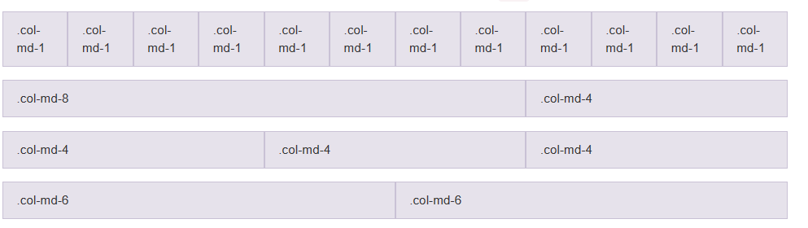
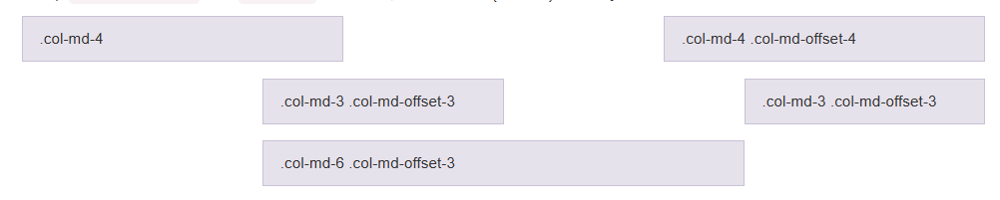
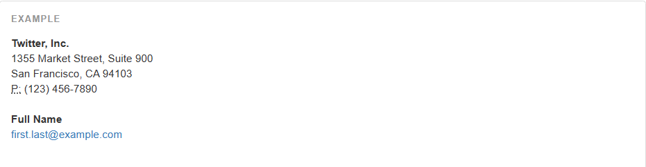
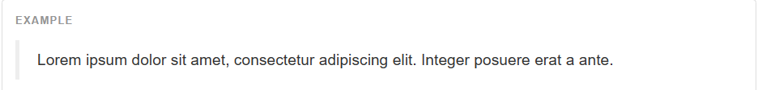
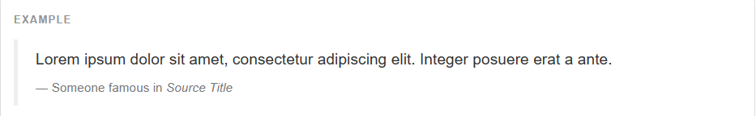
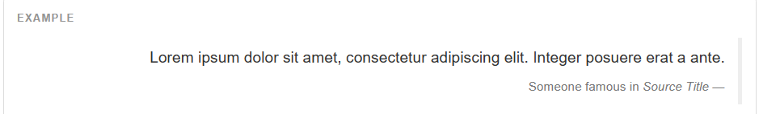
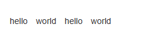
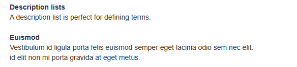

# 1、移动设备优先

在 Bootstrap 2 中，我们对框架中的某些关键部分增加了对移动设备友好的样式。而在 Bootstrap 3 中，我们重写了整个框架，使其一开始就是对移动设备友好的。这次不是简单的增加一些可选的针对移动设备的样式，而是直接融合进了框架的内核中。也就是说，

为了确保适当的绘制和触屏缩放，需要在 

```html
<meta name="viewport" content="width=device-width, initial-scale=1">
```

在移动设备浏览器上，通过为视口（viewport）设置 meta 属性为 

```html
<meta name="viewport" content="width=device-width, initial-scale=1, maximum-scale=1, user-scalable=no">
```

# 2、布局容器

Bootstrap 需要为页面内容和栅格系统包裹一个 

.container

```html
<div class="container">
  ...
</div>
```

.container-fluid

```html
<div class="container-fluid">
  ...
</div>
```

# 3、栅格系统

Bootstrap 提供了一套响应式、移动设备优先的流式栅格系统，随着屏幕或视口（viewport）尺寸的增加，系统会自动分为最多12列。它包含了易于使用的[预定义类](https://v3.bootcss.com/css/#grid-example-basic)，还有强大的[mixin 用于生成更具语义的布局](https://v3.bootcss.com/css/#grid-less)。

> **1、栅格系统，默认分成12 列，如果多出了一列或者几列，会放到下一行当中去。**
> **2、**


## 3.1 栅格参数

通过下表可以详细查看 Bootstrap 的栅格系统是如何在多种屏幕设备上工作的。

|   | 超小屏幕 | 小屏幕 | 中等屏幕、桌面显示器 (≥992px) | 大屏幕 | 
| -- | -- | -- |
| 栅格系统行为 | 总是水平排列 | 开始是堆叠在一起的，当大于这些阈值时将变为水平排列C | 
| .container | None （自动） | 750px | 970px | 1170px | 
| 类前缀 | .col-xs- | .col-sm- | .col-md- | .col-lg- | 
| 列（column）数 | 12 | 
| 最大列（column）宽 | 自动 | ~62px | ~81px | ~97px | 
| 槽（gutter）宽 | 30px （每列左右均有 15px） | 
| 可嵌套 | 是 | 
| 偏移（Offsets） | 是 | 
| 列排序 | 是 | 


## 3.2 实例：从堆叠到水平排列

使用单一的一组 

> md 就是表示用来支持的设备而已，这样显示更加良好，不是代表不能显示。
> md 表示中等设备，一般默认使用这个即可。




```html
<div class="row">
  <div class="col-md-1">.col-md-1</div>
  <div class="col-md-1">.col-md-1</div>
  <div class="col-md-1">.col-md-1</div>
  <div class="col-md-1">.col-md-1</div>
  <div class="col-md-1">.col-md-1</div>
  <div class="col-md-1">.col-md-1</div>
  <div class="col-md-1">.col-md-1</div>
  <div class="col-md-1">.col-md-1</div>
  <div class="col-md-1">.col-md-1</div>
  <div class="col-md-1">.col-md-1</div>
  <div class="col-md-1">.col-md-1</div>
  <div class="col-md-1">.col-md-1</div>
</div>
<div class="row">
  <div class="col-md-8">.col-md-8</div>
  <div class="col-md-4">.col-md-4</div>
</div>
<div class="row">
  <div class="col-md-4">.col-md-4</div>
  <div class="col-md-4">.col-md-4</div>
  <div class="col-md-4">.col-md-4</div>
</div>
<div class="row">
  <div class="col-md-6">.col-md-6</div>
  <div class="col-md-6">.col-md-6</div>
</div>
```

## 3.3 列偏移

> **col-med-offset-4 意思就是向左边偏移4列**


使用 



```
<div class="row">
  <div class="col-md-4">.col-md-4</div>
  <div class="col-md-4 col-md-offset-4">.col-md-4 .col-md-offset-4</div>
</div>
<div class="row">
  <div class="col-md-3 col-md-offset-3">.col-md-3 .col-md-offset-3</div>
  <div class="col-md-3 col-md-offset-3">.col-md-3 .col-md-offset-3</div>
</div>
<div class="row">
  <div class="col-md-6 col-md-offset-3">.col-md-6 .col-md-offset-3</div>
</div>
```

# 4、文本标签和文本类

[](https://v3.bootcss.com/css/#type-headings)HTML 中的所有标题标签，

> **1、标题排版除了除了可以使用<h1> 标签以外，BootStrap 还提供了 .h1 类，进行使用，效果是相同的。**
> **     比如 ****<h1>hello </h1>**** 和 ****<p class="h1" >hello </p>**** 效果相同**
> 
> **2、常用的文本标签：**
> **<mark> hello </mark>	****   #标记文本，背景高亮    **
> **<del>  hello </del>    ****       #带删除线**
> **<u>   hello   </u> 	****	   #带下划线**
> **<small>  hello </small>	****   #小字**
> **<strong> hello </strong>   ****#着重**
> **<em> hello  </em>****    #斜体**
> **3、文本中用于对齐的类：**
> **class="text-left"****		#左对齐**
> **class="text-right"****		#右对齐**
> **class="center"	****	#中间对齐**


# 5、缩略语

当鼠标悬停在缩写和缩写词上时就会显示完整内容，Bootstrap 实现了对 HTML 的 


```html
<abbr title="HyperText Markup Language" class="initialism">HTML</abbr>
```

# 6、地址

让联系信息以最接近日常使用的格式呈现。在每行结尾添加 

> **就是使用<address> 可以较好的呈现文字的格式**




```html
<address>
  <strong>Twitter, Inc.</strong><br>
  1355 Market Street, Suite 900<br>
  San Francisco, CA 94103<br>
  <abbr title="Phone">P:</abbr> (123) 456-7890
</address>
<address>
  <strong>Full Name</strong><br>
  <a href="mailto:#">first.last@example.com</a>
</address>
```

# 7、引用

在你的文档中引用其他来源的内容。

> **1、引用，就和HTML中的引用类似。使用****<blockqutoe>**** 标签，此标签默认左对齐，也就是文字靠左对其**
> **<blockqutoe class="blockquote-reverse">    **** #加入“blockquote-reverse” 就默认靠右对齐**
> **2、在引用中，还可以使用<footer> 标签，标注引用来源，如果引用来源中包含地址，可以再加上<cite> 标签**
> **<blockquote>**
> **<p> xxxx</p>**
> **<footer>xxxx<cite>xx</cite></footer>**
> **</blockquote>**
> 


将任何 



```html
<blockquote>
  <p>Lorem ipsum dolor sit amet, consectetur adipiscing elit. Integer posuere erat a ante.</p>
</blockquote>
```

## 7.2 多种引用样式

对于标准样式的 

- 

添加 



```html
<blockquote>
  <p>Lorem ipsum dolor sit amet, consectetur adipiscing elit. Integer posuere erat a ante.</p>
  <footer>Someone famous in <cite title="Source Title">Source Title</cite></footer>
</blockquote>
```

通过赋予



```html
<blockquote class="blockquote-reverse">
  ...
</blockquote>
```

# 8、内联列表

> **就是将列表的内容平铺**


通过设置 



```
 <ul class="list-inline">
            <li> hello</li>
            <li> world</li>
            <li> hello</li>
            <li> world</li>
</ul>
```

# 9、描述列表

> **1、就是开头一个单词或者一个复合名词，下一行跟一个解释的语句。  默认是以列表的形式呈现**
> **<dl>  	#描述列表**
> **<dt> 关键字词</dt>**
> **<dd> 描述</dd>**
> **<dl>**
> **2、<dl  class="dl-horizontal">  加上class="dl-horizontal" 就可以将描述跟在自此的后面**




```html
 <dl>
        <dt>Description lists</dt>
        <dd>A description list is perfect for defining terms.</dd>
        <dt>Euismod</dt>
        <dd>Vestibulum id ligula porta felis euismod semper eget lacinia odio sem nec elit.<br>
            id elit non mi porta gravida at eget metus.
        </dd>
</dl>
```

- **<dl  class="dl-horizontal">**


```
 <dl  class="dl-horizontal">
        <dt>Description lists</dt>
        <dd>A description list is perfect for defining terms.</dd>
        <dt>Euismod</dt>
        <dd>Vestibulum id ligula porta felis euismod semper eget lacinia odio sem nec elit.<br>
            id elit non mi porta gravida at eget metus.
        </dd>
</dl>
```