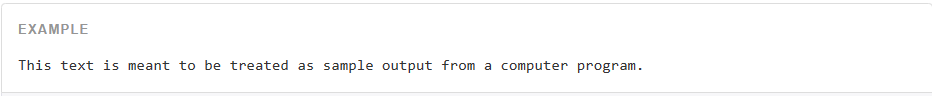

# 代码

通过 


```html
For example, <code>&lt;section&gt;</code> should be wrapped as inline.
```

通过 


```html
To switch directories, type <kbd>cd</kbd> followed by the name of the directory.<br>
To edit settings, press <kbd><kbd>ctrl</kbd> + <kbd>,</kbd></kbd>
```

多行代码可以使用 


```html
<pre>&lt;p&gt;Sample text here...&lt;/p&gt;</pre>
```

还可以使用 

通过 


```html
<var>y</var> = <var>m</var><var>x</var> + <var>b</var>
```

通过 



```html
<samp>This text is meant to be treated as sample output from a computer program.</samp>
```