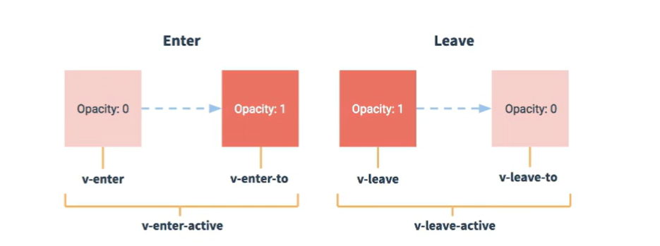

## Vue封装的过度与动画

1. 作用：在插入、更新或移除 DOM元素时，在合适的时候给元素添加样式类名。

1. 图示:



1. 写法：

1. 准备好样式：

- 元素进入的样式：

1. v-enter：进入的起点

1. v-enter-active：进入过程中

1. v-enter-to：进入的终点

- 元素离开的样式：

1. v-leave：离开的起点

1. v-leave-active：离开过程中

1. v-leave-to：离开的终点

1. 使用

<transition>

```html
<transition name="hello"  appear>
    <h1 v-show="isShow">你好啊！</h1> 
</transition>
```

1. 备注：若有多个元素需要过度，则需要使用：<transition-group>，且每个元素都要指定key值。

1. 第三方动画库：animate.css