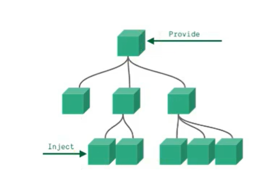

## provide 与 inject

- 作用：实现**祖与后代组件间**通信

- 套路：父组件有一个 provide 选项来提供数据，后代组件有一个 inject 选项来开始使用这些数据

- 具体写法：

1. 祖组件中：

```javascript
setup(){
    ......
    let car = reactive({name:'奔驰',price:'40万'})
    provide('car',car)
    ......
}
```

1. 后代组件中：

```javascript
setup(props,context){
    ......
    const car = inject('car')
    return {car}
    ......
}
```