# 1.人力资源项目介绍

### 1.1 项目架构和解决方案

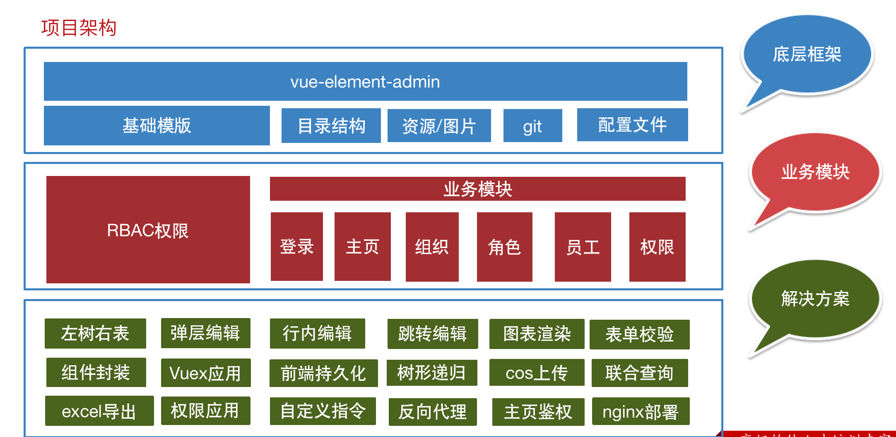

### 1.2 课程安排

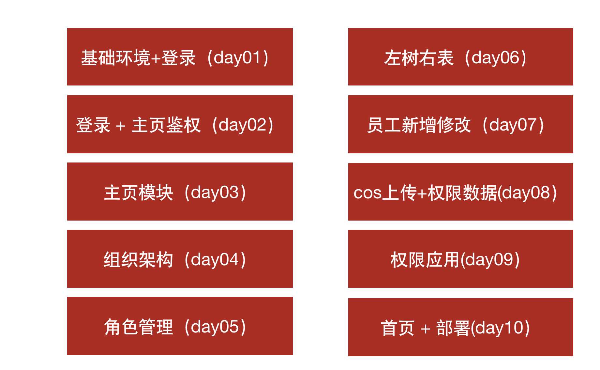

### 1.3 课程具备能力

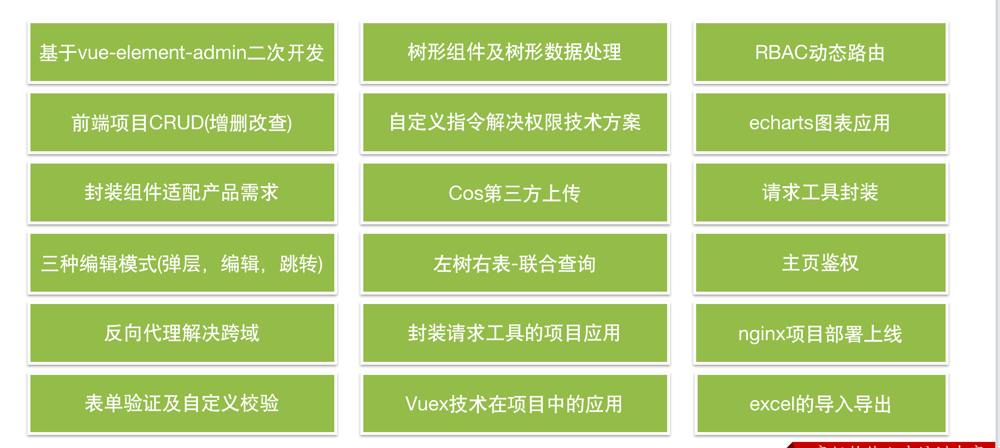

### 1.4 课程地址

 

- vue-element-admin文档地址：链接

- 演示地址：  

链接

- 人力资源项目演示地址：  

链接

# 2. 拉取项目基础代码

- 拉取命令

```shell
$ git clone  https://github.com/PanJiaChen/vue-admin-template.git  heimahr
```

- 升级core-js版本到

**3.25.5**

```shell
$ npm i core-js@3.25.5 # npm
$ yarn add core-js@3.25.5 # yarn
```

- 安装完整依赖

```
$ npm i # npm
$ yarn  # yarn
```

- 启动命令在package.json中查看

```
$ yarn dev
```

- 需要检查VsCode本身的插件ESLint 和 Vutur

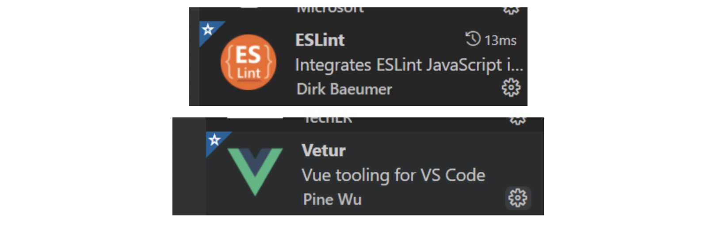

# 3.项目目录和入口文件介绍

- 项目目录

```
├── src                        # 源代码目录
│   ├── api                    # 所有请求
│   ├── assets                 # 主题 字体等静态资源
│   ├── components             # 全局公用组件
│   ├── icons                  # 项目所有 svg icons
│   ├── layout                 # 全局 layout
│   ├── router                 # 路由
│   ├── store                  # 全局 store管理
│   ├── styles                 # 全局样式
│   ├── utils                  # 全局公用方法
│   ├── views                  # views 所有页面
│   ├── App.vue                # 入口页面
│   ├── main.js                # 入口文件 加载组件 初始化等
│   └── permission.js          # 权限管理
│   └── settings.js            # 配置文件
​
```

- 入口文件

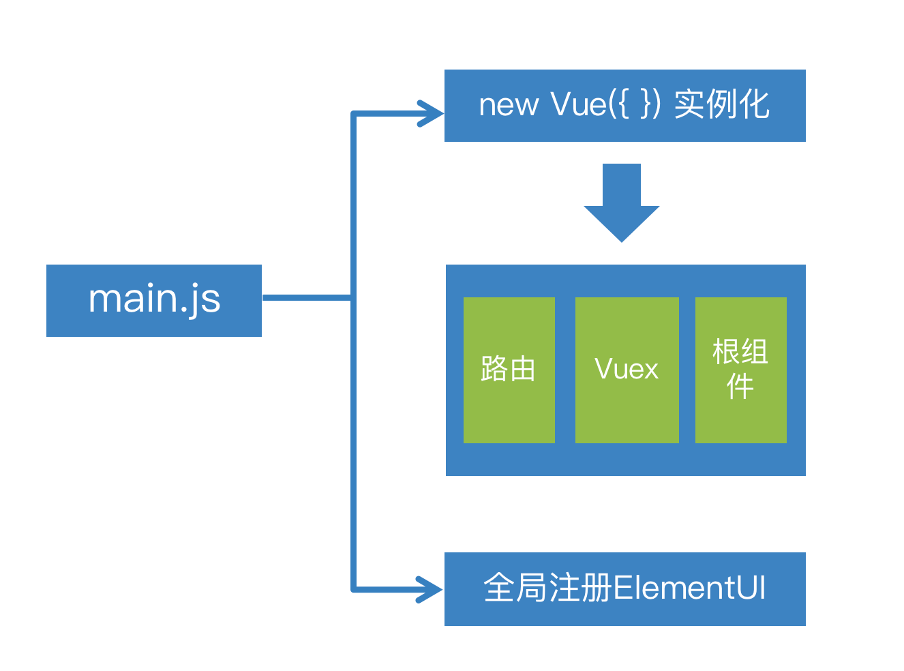

# 4.App.vue根组件解析

- App.vue组件

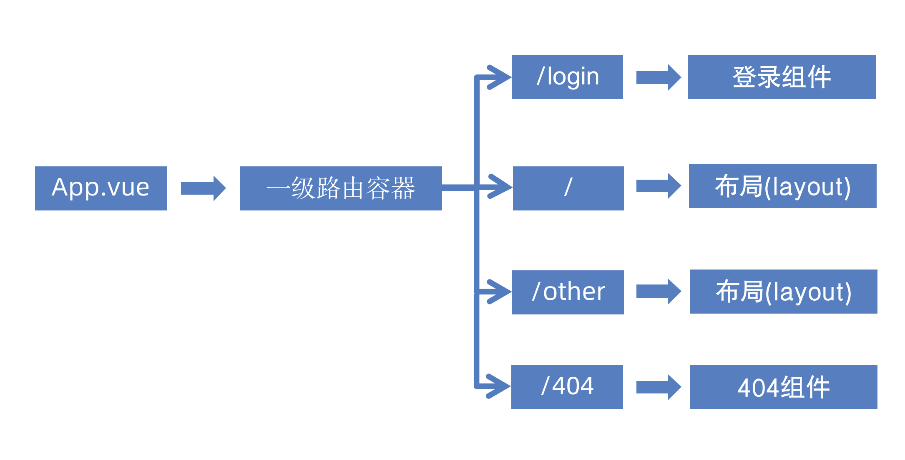

- layout布局

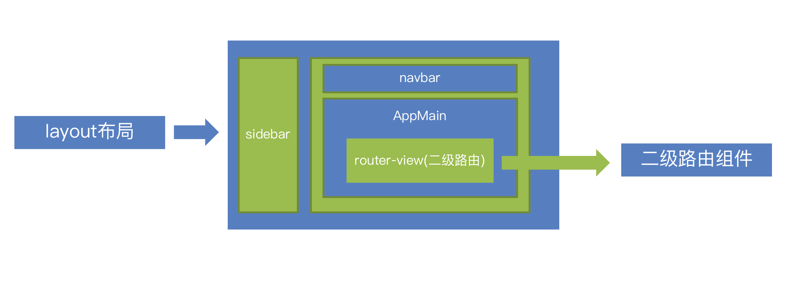

# 5.基础设置settings.js和导航守卫permission.js

settings.js导出网站基础配置，包括：网站标题、固定header、显示logopermission.js(权限)，主要负责路由导航守卫

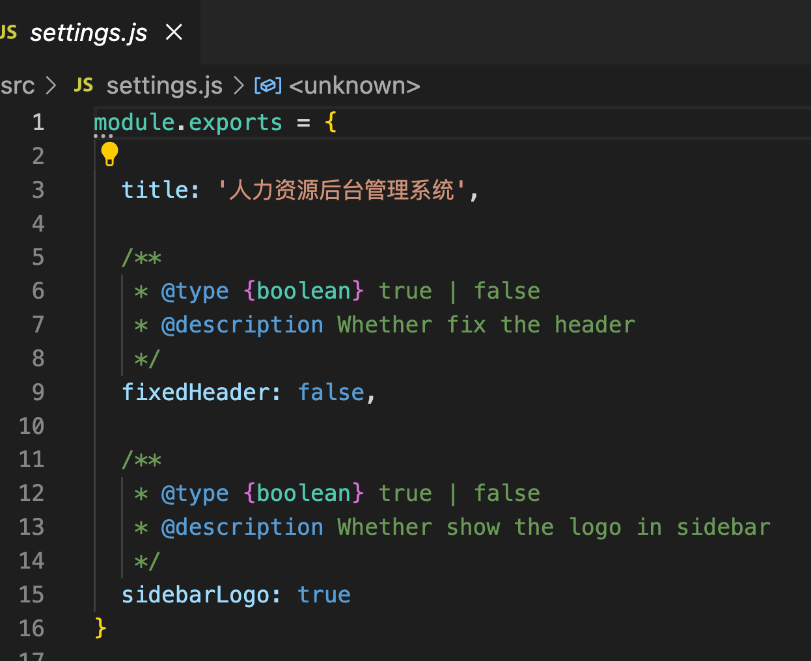

# 6.Vuex的结构

- 模板中的结构

注意：人资资源项目主要针对

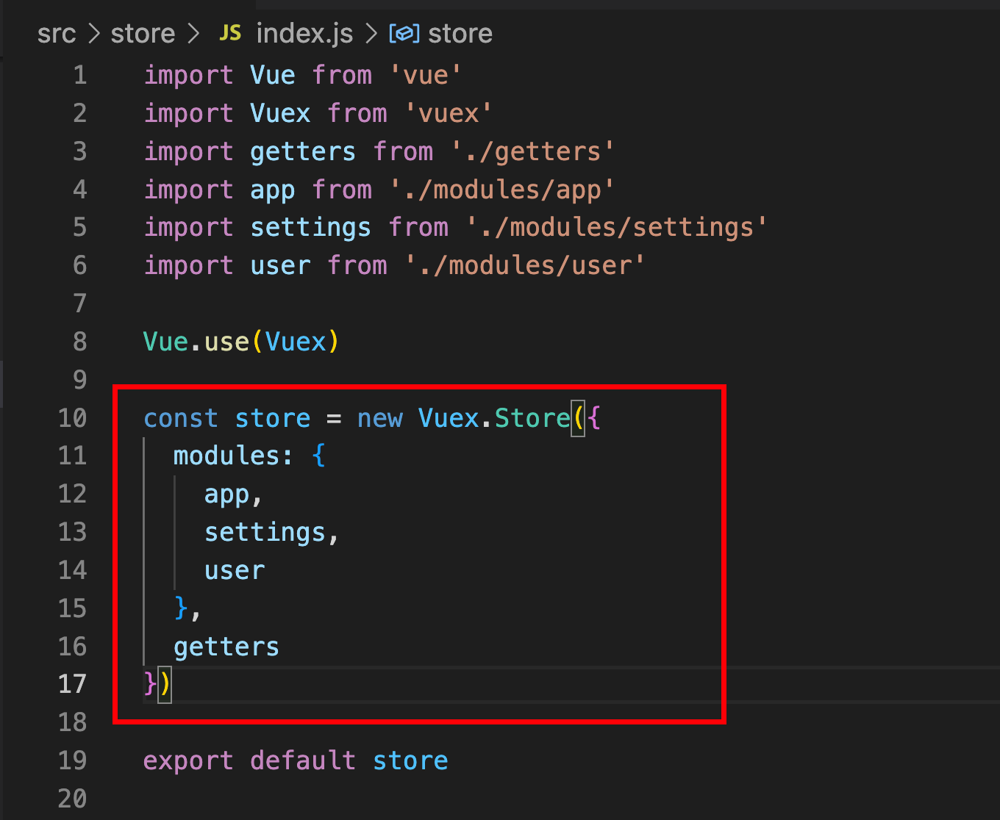

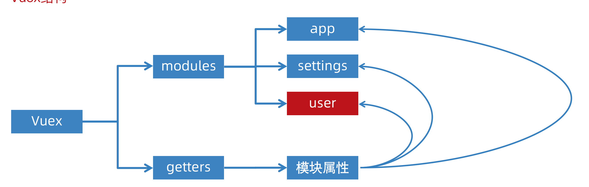

- Vuex的设计思想

1.页面交互状态（折叠侧边栏-固定头部）2.使用全局状态Vuex根据功能拆分成不同的模块（modules）3.进行状态管理通过getters建立对于模块中属性的快捷访问

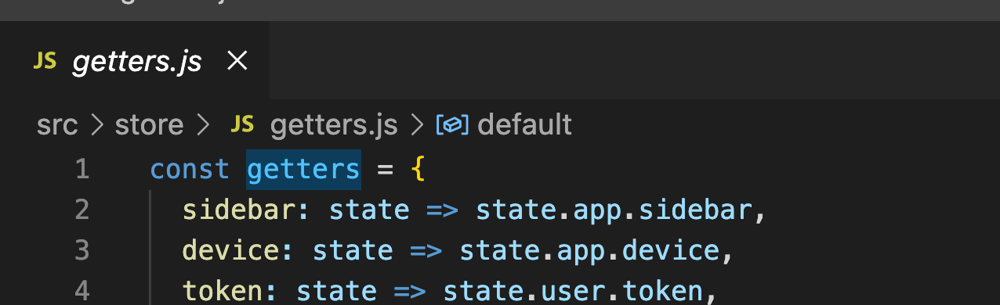

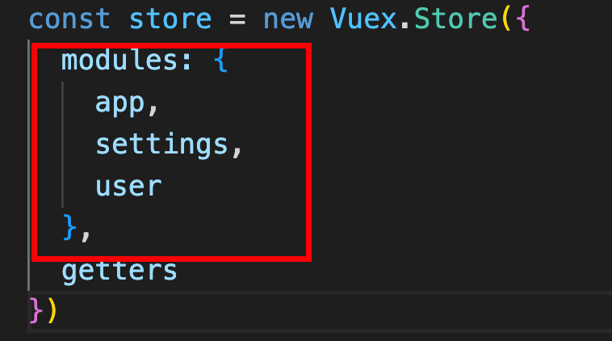

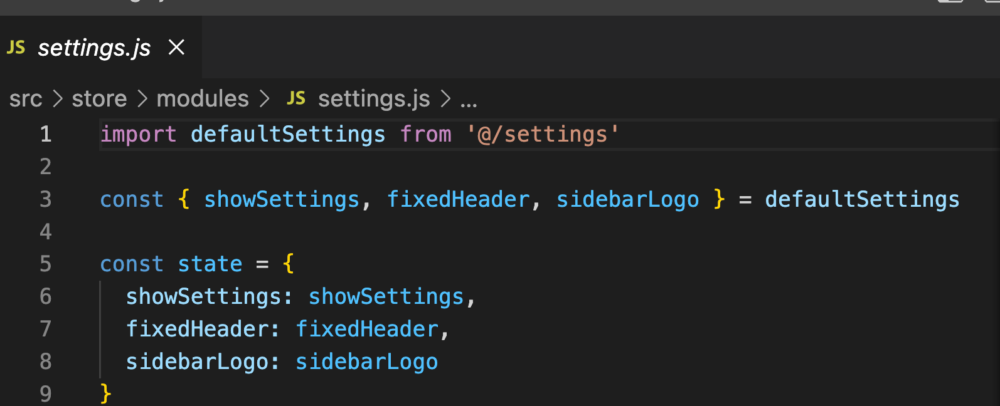

# 7.使用模板中的Icon图标

- src/icons/svg目录下的图标都可以使用

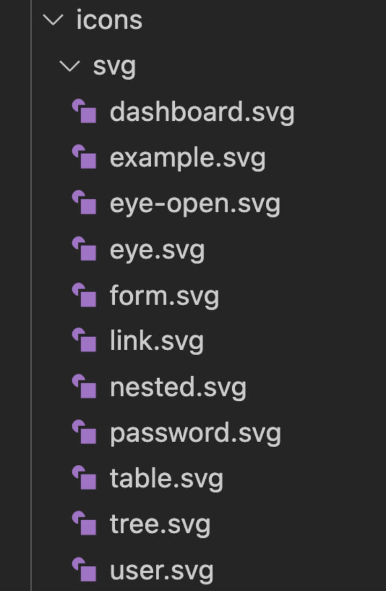

- 图标文件名直接设置为svg-icon组件的iconClass属性

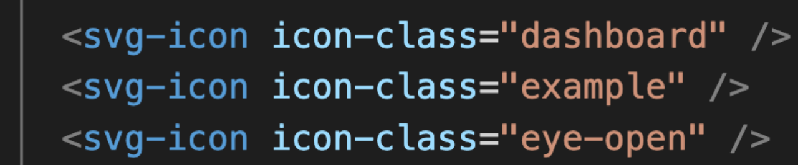

# 8.扩展-解析Icon图标的实现思路

- 引入目录所有的svg

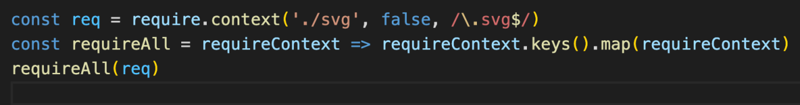

- 全局注册svg-icon组件

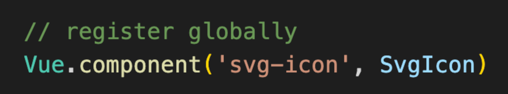

- loader插件打包svg

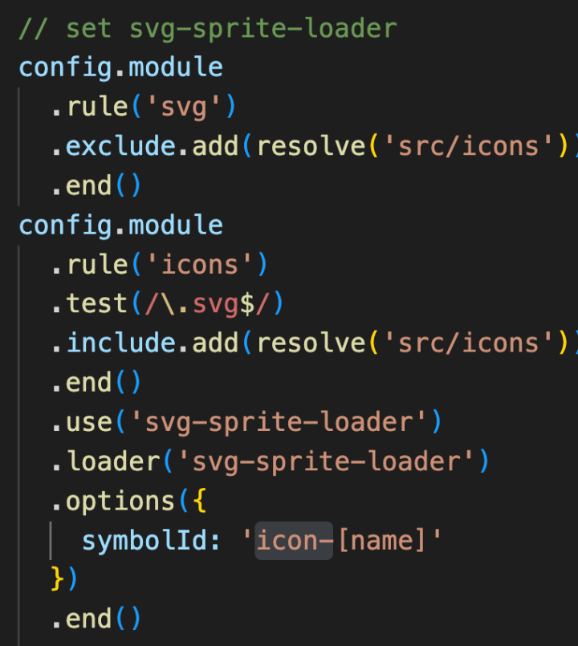

- svg-icon引用svg的链接

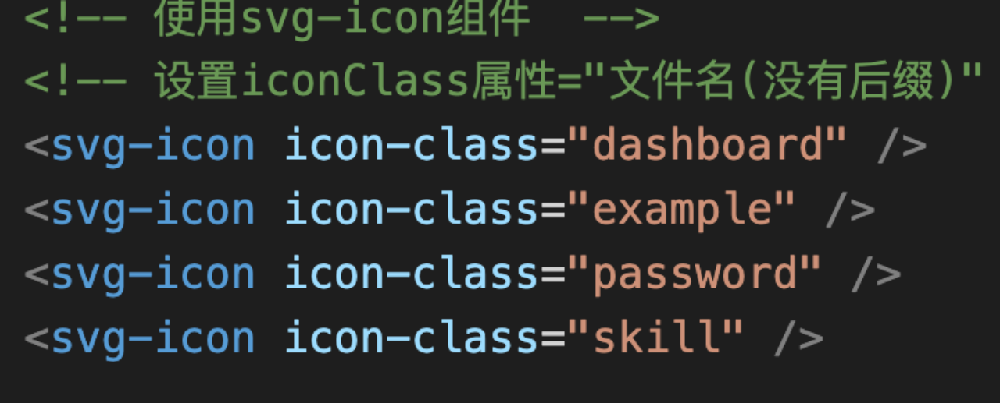

- 知识扩展

1.了解：require.context(路径，是否扫描子目录， 正则匹配) 可以引入某个目录下的内容2.了解：svg-sprite-loader打包了所有svg到一个svg标签上，将svg名称作为symbol标签的id属性3.了解：svg-icon使用iconClass属性引用了symbol的id

# 9.导入样式资源并使用git管理

- 将教学资源中的初始化

**图片-样式-svg **

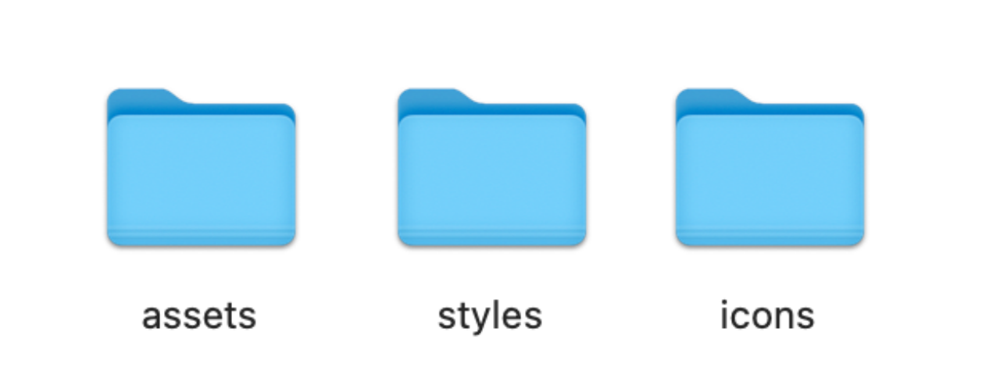

> 因为项目是从github上拉取下来的，所以git记录了之前模版的信息，所以删除需要建立git


- 删除原有的.git文件

- 初始化仓库

```
$ git init # 初始化仓库
```

- 添加到暂存区

```
$ git add . # 添加到暂存区
```

- 提交本地仓库

```
$ git commit -m "初始化人力资源项目" # 提交本地仓库
```

> 接下来，同学们需要在gitee上新建一个自己的远程仓库，然后将本地的仓库推送到远程仓库托管


- 本地仓库配置远程仓库地址

```
$ git remote add origin <你的远程仓库地址>  # 本地仓库配置远程仓库地址
```

- 推送到远程仓库

```
$ git push -u origin master # 推送到远程仓库
```

# 10.登录页的结构和表单

> 接下来需要实现登录页的表单结构和表单内容


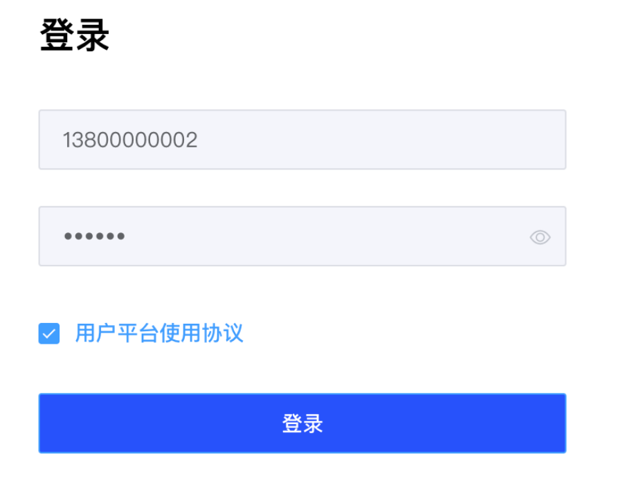

- 拷贝登录页的基本结构布局-代码位置(

**src/views/login/index.vue)**

```
<template>
  <div class="login-container">
    <div class="logo" />
    <div class="form">
      <h1>登录</h1>
      <el-card shadow="never" class="login-card">
        <!--登录表单-->
      </el-card>
    </div>
  </div>
</template>
<script>
export default {
  name : "Login"
}
</script>
<style lang="scss">
.login-container {
  display: flex;
  align-items: stretch;
  height: 100vh;
  .logo {
    flex: 3;
    background: rgba(38, 72, 176) url(../../assets/common/login_back.png)
      no-repeat center / cover;
    border-top-right-radius: 60px;
    display: flex;
    flex-direction: column;
    align-items: flex-end;
    justify-content: center;
    padding: 0 100px;
    .icon {
      background: url(../../assets/common/logo.png) no-repeat 70px center /
        contain;
      width: 300px;
      height: 50px;
      margin-bottom: 50px;
    }
    p {
      color: #fff;
      font-size: 18px;
      margin-top: 20px;
      width: 300px;
      text-align: center;
    }
  }
  .form {
    flex: 2;
    display: flex;
    flex-direction: column;
    justify-content: center;
    padding-left: 176px;
    .el-card {
      border: none;
      padding: 0;
    }
    h1 {
      padding-left: 20px;
      font-size: 24px;
    }
    .el-input {
      width: 350px;
      height: 44px;
      .el-input__inner {
        background: #f4f5fb;
      }
    }
    .el-checkbox {
      color:#606266;
    }
  }
}
</style>
```

- 实现登录表单的结构

```
<div class="form">
  <h1>登录</h1>
  <el-card shadow="never" class="login-card">
    <!--登录表单-->
    <!-- el-form > el-form-item > el-input -->
    <el-form>
      <el-form-item>
        <el-input placeholder="请输入手机号" />
      </el-form-item>
      <el-form-item>
        <el-input placeholder="请输入密码" />
      </el-form-item>
      <el-form-item>
        <el-checkbox>
          用户平台使用协议
        </el-checkbox>
      </el-form-item>
      <el-form-item>
        <el-button style="width:350px" type="primary">登录</el-button>
   </el-form-item>
</el-form>
```

- 提交代码

# 11.登录表单校验-实现

1. 定义数据和校验规则

```javascript
export default {
  name: 'Login'
  name: 'Login',
  data() {
    return {
      loginForm: {
        mobile: '',
        password: '',
        isAgree: false
      },
      loginRules: {
        mobile: [{
          required: true,
          message: '请输入手机号',
          trigger: 'blur'
        }, {
          pattern: /^1[3-9]\d{9}$/,
          message: '手机号格式不正确',
          trigger: 'blur'
        }],
        password: [{
          required: true,
          message: '请输入密码',
          trigger: 'blur'
        }, {
          min: 6,
          max: 16,
          message: '密码长度应该为6-16位之间',
          trigger: 'blur'
        }],
        // required只能检查 null "" undefined
        isAgree: [{
          validator: (rule, value, callback) => {
            // rule规则
            // value检查的数据 true/false
            // callback 函数 执行这个函数
            // 成功执行callback 失败也执行callback(错误对象 new Error(错误信息))
            value ? callback() : callback(new Error('没有勾选用户平台协议'))
          }
        }]
      }
    }
  },
  methods: {
    login() {
      this.$refs.form.validate((isOK) => {
        if (isOK) {
          alert('校验通过')
        }
      })
    }
  }
}
</script>
```

1. 绑定组件的对应属性

```html
 <el-form ref="form" :model="loginForm" :rules="loginRules">
      <el-form-item prop="mobile">
            <el-input v-model="loginForm.mobile" placeholder="请输入手机号" />
      </el-form-item>
      <el-form-item prop="password">
          <el-input v-model="loginForm.password" show-password placeholder="请输入密码" />
      </el-form-item>
      <el-form-item prop="isAgree">
          <el-checkbox v-model="loginForm.isAgree">
              用户平台使用协议
          </el-checkbox>
      </el-form-item>
      <el-form-item>
          <el-button style="width:350px" type="primary" @click="login">登录</el-button>
      </el-form-item>
</el-form>
```