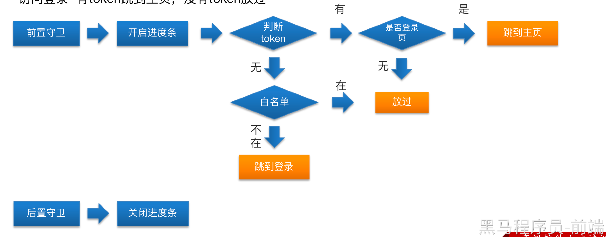

# 1. 分析登录流程


传统思路都是登录校验通过之后，直接调用接口，获取token之后，跳转到主页。

- vue-element-admin的登录思路：

1. 登录表单校验通过

1. 调用Vuex提供的登录的action

1. 登录的Action中会调用接口

1. 登录接口如果成功执行，会返回token

1. 利用Vuex的特性，将token共享的到Vuex中，这样Vuex就统一管理了token,别的地方想要使用，直接通过Vuex就可以

1. 登录接口会调用单独封装的请求模块(api)

1. 请求模块中又会使用用到axios封装的请求工具

1. 而请求工具又要考虑区分 开发环境和生产环境的问题

1. 请求时还要考虑前后分离项目产生的跨域问题，要使用代理解决跨域

# 2. Vuex中用户模块的实现

登录流程中最核心的是用户模块，所以这部分我们单独拿出来进行重写。

代码位置(

- 删除原有模板中用户模块中的内容

- 导出Vuex子模块-声明一个状态token

```
const state = {
  token: null
}
const mutations = {}
const actions = {}
export default {
   namespaced: true,
   state,
   mutations,
   actions
}
```

- 实现token的Vue数据持久化

```
import { getToken, setToken, removeToken } from '@/utils/auth'
const state = {
  token: getToken(), // 从缓存中读取初始值
}
const mutations = {
  setToken(state, token) {
    state.token = token
    // 同步到缓存
    setToken(token)
  },
  removeToken(state) {
    // 删除Vuex的token
    state.token = null
    removeToken()
  }
}
export default {
  namespaced: true, // 开启命名空间
  state,
  mutations,
  actions
}
```

- 实现登录的action方法

```
const actions = {
  // context上下文，传入参数
  async login(context, data) {
    console.log(data)
    // todo: 调用登录接口
    const token = await login(data)
    // 返回一个token 123456
    context.commit('setToken', token)
  },
}
```

- 在登录组件中调用该action方法-代码位置(**src/views/login/index.vue**)

```
export default {
  methods: {
    login() {
      this.$refs.form.validate((isOK) => {
        if (isOK) {
          this.$store.dispatch("user/login", this.loginForm)
        }
      })
    }
  }
}
```

注意： 因为user模块导出的时候

# 3.Vue-cli代理解决跨域

上个小节，完成了Vuex用户模块的创建和持久化管理，现在已经调通了 

**请求模块-axios封装-跨域-区分环境**


我们要先把跨域问题解决才能考虑其他内容的开发

- 首先为什么会有跨域？


在后端没有开启cors的情况下，浏览器的同源策略会直接限制后端返回的数据给到前端。这是因为我们目前所有的项目都是前后分离，前端一个服务， 后端一个服务，后端不开cors只能前端自己想办法。

- 代理是怎么解决跨域的？


既然前端不能直接请求后端服务，那就搞个中间服务，中间服务刚好和我们的前端服务同源，前端和中间服务可以通信，而中间服务是node, node后台向后端发请求是不受同源策略影响的，因为

- 具体怎么做呢？

跨域有开发环境跨域和生产环境跨域，我们最后上线的时候要考虑生产环境跨域，目前只需要考虑开发环境。

- 配置文件可以直接配置代理 vue.config.js

```javascript
  devServer: {
    port: port,
    open: true,
    overlay: {
      warnings: false,
      errors: true
    },
    proxy: {
      '/api': {
        target: '
      }
    }
    // before: require('./mock/mock-server.js')
  },
```

> **注意： 要去掉before这个选项，这个是mock数据，会影响到我们的请求，并且修改完成之后要重启服务。**


# 4.axios封装

完成了代理跨域，就可以考虑axios的封装了。


axios封装主要封装做哪些呢？

- 基础地址，超时时间

- 请求拦截器-统一注入token

- 响应拦截器-解构数据-处理异常


- axios的基础功能


代码位置(src/utils/request.js)

```javascript
import axios from 'axios'
import { MessageBox, Message } from 'element-ui'
import store from '@/store'
const service = axios.create({
  baseURL: '/api',
  timeout: 10000,
})
//类似于Django中的中间件
service.interceptors.request.use((config) => {
  // 注入token
//  this.$store.getters
  // store.getters.token => 请求头里面
  if (store.getters.token) {
    config.headers.Authorization = `Bearer ${store.getters.token}`
  }
  return config
}, (error) => {
  // 失败执行promise
  return Promise.reject(error)
})
// 响应拦截器，可以主要用于解构或者处理异常 
service.interceptors.response.use((response) => {
  const { data, message, success } = response.data // 默认json格式
  if (success) {
    return data
  } else {
    Message({ type: 'error', message })
    return Promise.reject(new Error(message))
  }
}, async(error) => {
  // error.message
  Message({ type: 'error', message: error.message })
  return Promise.reject(error)
})
export default service
```

# 5.环境区分


- 将.env.development中的值改为 /api 作为请求工具的基础地址

- **process.env.VUE_APP_BASE_API** 的表示读取该变量，npm run dev时该变量为 /api,  npm run build:prod时 该变量为 /prod-api

> **process 这个对象不用单独导入，直接使用即可。**


```javascript
// create an axios instance
const service = axios.create({
  baseURL: process.env.VUE_APP_BASE_API, 
  // withCredentials: true, // send cookies when cross-domain requests
  timeout: 5000 // request timeout
})
```

# 6. 登录联调

目前登录功能只剩下红色的部分还需要


- 首先封装登录的API请求-代码位置(**src/api/user.js**)

```javascript
import request from '@/utils/request'
export function login(data) {
  return request({
    url: '/sys/login',
    method: 'post',
    data
  })
}
```

- Vuex中的用户模块调用登录接口-代码位置(**src/store/modules/user.js**)

```javascript
const actions = {
  // context上下文，传入参数
  async login(context, data) {
    console.log(data)
    // todo: 调用登录接口
    const token = await login(data)
    // 返回一个token 123456
    context.commit('setToken', token)
  }
}
```

- 登录成功后，跳转到主页-代码位置(**src/views/login/index.vue**)

```javascript
  methods: {
    login() {
      this.$refs.form.validate(async(isOK) => {
        if (isOK) {
          await this.$store.dispatch('user/login', this.loginForm)
          // Vuex 中的action 返回的promise
          // 跳转主页
          this.$router.push('/')
        }
      })
    }
  }
```

- 区分不同环境的数据-代码位置(**src/views/login/index.vue**)

因为开发环境为了便利，我们将用户的账户信息和密码都默认写在了页面上，但是真正的项目我们不可能将数据进行暴露出去，所以在生产环境时应该将 用户的手机号和密码抹去

```javascript
export default {
  name: 'Login',
  data() {
    return {
      loginForm: {
        mobile: process.env.NODE_ENV === 'development' ? '13800000002' : '',
        password: process.env.NODE_ENV === 'development' ? '123456' : '',
        isAgree: process.env.NODE_ENV === 'development'
      }
    }
  }
}
```

# 7.主页权限验证-鉴权

当前项目用户是否有权限访问主页，要考虑当前有没有token,  如果有token, 用户还想去登录页，我们可以直接去主页-这个就是免登录功能。有token的情况下，直接到主页。



- 访问主页-有token放过，没有token跳到登录页

- 访问登录-有token跳到主页，没有token放过

代码实现-代码位置(

```javascript
import router from '@/router'
import nprogress from 'nprogress'
import 'nprogress/nprogress.css'
import store from '@/store'
/**
 *前置守卫
 *
*/
const whiteList = ['/login', '/404']  //白名单
router.beforeEach(async(to, from, next) => {
  nprogress.start()    //开启进度条
  if (store.getters.token) {
    // 存在token
    if (to.path === '/login') {
      // 跳转到主页
      next('/') // 中转到主页
      // next（地址）并没有执行后置守卫
      nprogress.done()
    } else {
       next() // 放行
    }
  } else {
    // 没有token
    if (whiteList.includes(to.path)) {
      next()
    } else {
      next('/login') // 中转到登录页
      nprogress.done()
    }
  }
})
/** *
 * 后置守卫
 * **/
router.afterEach(() => {
  nprogress.done()  //关闭进度条
})
```