# 1.获取用户资料在Vuex中共享

> 登录成功跳转到主页之后，可以获取用户资料，获取的资料在Vuex中共享，这样用户就可以很方便的获取该信息


- 获取流程

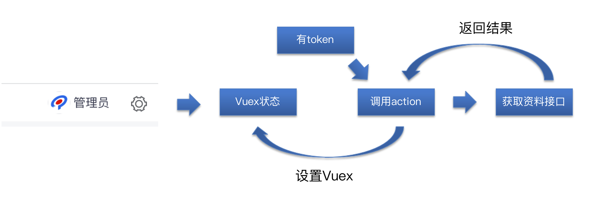

- 在什么位置获取？

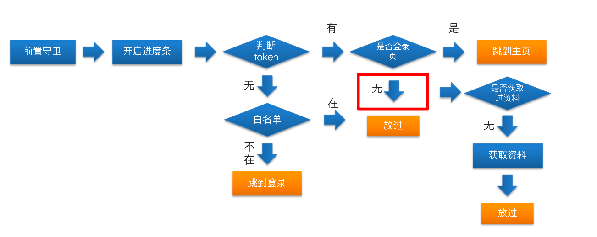

> 之前在导航守卫的位置，可以确定已经有了token，这个位置获取资料更佳，因为导航守卫在页面发生跳转时出发，这时不论你从何时何地进来，如果发现你没获取资料，都可以非常清楚直观的获取资料。判断条件也使得不会发生重复的加载。


- 封装获取用户资料的API-代码位置(

**src/api/user.js**

```javascript
export function getUserInfo() {
  return request({
    url: '/sys/profile'
  })
}
```

- Vuex中声明用户信息状态，修改用户信息的mutations， 和获取用户信息的action-代码位置(**src/store/modules/user.js**)

```javascript
const state = {
  token: getToken(),
  userInfo: {} // 这里有一个空对象，为了放置后面取数据报错
}
​
const mutations = {
  setUserInfo(state, userInfo) {
    state.userInfo = userInfo
  }
}
const actions = {
  async getUserInfo (context) {
    const result = await getUserInfo()
    context.commit("setUserInfo", result)
  }
}
```

- 通过getters声明userId(快捷访问)-代码位置(**src/store/getters.js**)

```javascript
const getters = {
  userId: state => state.user.userInfo.userId,
}
export default getters
​
```

- 在权限拦截处调用action-代码位置(**src/pemission.js**)

```javascript
import router from '@/router'
import nprogress from 'nprogress'
import 'nprogress/nprogress.css'
import store from '@/store'
​
/**
 *前置守卫
 *
*/
​
const whiteList = ['/login', '/404']
router.beforeEach(async(to, from, next) => {
  nprogress.start()
  if (store.getters.token) {
    // 存在token
    if (to.path === '/login') {
      // 跳转到主页
      next('/') // 中转到主页
      // next（地址）并没有执行后置守卫
      nprogress.done()
    } else {
       if(!store.getters.userId) {
         await store.diapatch("user/getUserInfo")
       }
       next() // 放行
    }
  } else {
    // 没有token
    if (whiteList.includes(to.path)) {
      next()
    } else {
      next('/login') // 中转到登录页
      nprogress.done()
    }
  }
})
​
​
```

> 有同学会问，为什么用户信息不做持久化管理呢？ 不需要缓存吗？ 用户信息不同于token，token是当前用户的唯一标识，在几个小时内都是有效的，但是用户信息可能会进行修改或者发生变化，所以用户信息在一般的项目或者业务中不进行缓存。


# 2.显示用户头像和用户名

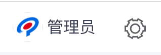

> 首先解析一下顶部组件的内部位置


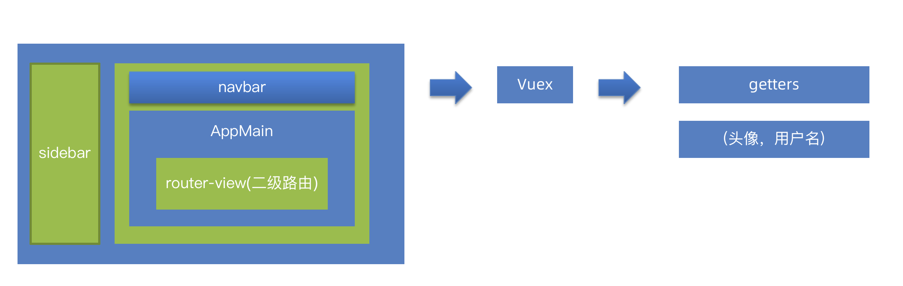

> 因为上个小节，将资料已经放到了Vuex中，可以通过getters开放属性，直接在组件中引用即可


- Vuex中使用getters暴露属性-代码位置(**src/store/getters.js**)

```javascript
const getters = {
  token: state => state.user.token,
  userId: state => state.user.userInfo.userId,
  avatar: state => state.user.userInfo.staffPhoto, // 头像
  name: state => state.user.userInfo.username, // 用户名称
}
export default getters
​
```

- 在Navbar组件引入getters-代码位置(**src/layout/components/NavBar.vue**)

```javascript
export default {
  computed: {
    // 引入头像和用户名称
    ...mapGetters([
      'sidebar',
      'avatar',
      'name'
    ])
  },
}
```

- NavBar组件显示用户名和头像-代码位置(**src/layout/components/NavBar.vue**)

```html
<div class="avatar-wrapper">
          <!-- 头像 -->
          
          <!-- 用户名称 -->
          <span class="name">{{ name }}</span>
          <!-- 图标 -->
          <i class="el-icon-setting" />
</div>
```

- 设置头像和用户名的样式-代码位置(**src/layout/components/NavBar.vue**)

```css
​
      .avatar-wrapper {
        margin-top: 5px;
        position: relative;
        display: flex;
        align-items: center;
        .name {
          //  用户名称距离右侧距离
          margin-right: 10px;
          font-size: 16px;
        }
        .el-icon-setting {
          font-size: 20px;
        }
        .user-avatar {
          cursor: pointer;
          width: 30px;
          height: 30px;
          border-radius: 50%;
        }
      }
  
```

# 3.处理头像为空的场景

> 不是所有用户都有头像的，当用户没有头像时要显示对应的内容


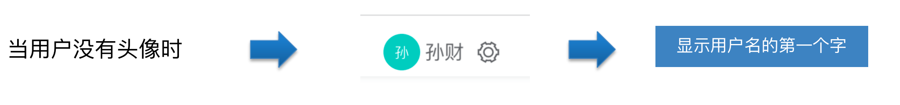

- 条件判断-代码位置(

**src/layout/components/NavBar.vue**

```html
<div class="avatar-wrapper">
          <!-- 头像 -->
          
          <span v-else class="username">{{ name?.charAt(0) }}</span>
          <!-- 用户名称 -->
          <span class="name">{{ name }}</span>
          <!-- 图标 -->
          <i class="el-icon-setting" />
        </div>
```

- 样式

```css
 .username {
          width: 30px;
          height: 30px;
          text-align: center;
          line-height: 30px;
          border-radius: 50%;
          background: #04c9be;
          color: #fff;
          margin-right: 4px;
        }
```

> 这里我们使用了可选链操作符 ？， 它的意思是当？前面的变量为空时，它不会继续往下执行，防止报错，如null?.name，但是我们当前的版本不支持？的编译，所以需要升级一下对应的版本


```
$ npm i vue@2.7.0  vue-template-compiler@2.7.0   # 升级vue版本️
```

> 升级完成后，重启服务就可以了。


# 4.处理token失效的问题

> token是有时效性的，当token超时，我们需要做一下处理


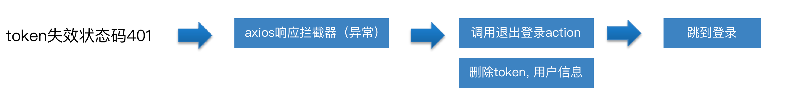

- 请求拦截器处理-代码位置(

**src/utils/request.js**

```javascript
// 响应拦截器
service.interceptors.response.use(..., async(error) => {
  if (error.response.status === 401) {
    Message({ type: 'warning', message: 'token超时了' })
    // 说明token超时了
    await store.dispatch('user/logout') // 调用action 退出登录
    //  主动跳到登录页
    router.push('/login') // 跳转到登录页
    return Promise.reject(error)
  }
  // error.message
  Message.error(error.message)
  return Promise.reject(error)
})
```

- 实现Vuex的登出action-代码位置(

**src/store/modules/user.js**

```javascript
const actions = {
  // 退出登录的action
  logout(context) {
    context.commit('removeToken') // 删除token
    context.commit('setUserInfo', {}) // 设置用户信息为空对象
  }
}
```

# 5.调整下拉菜单，实现退出登录

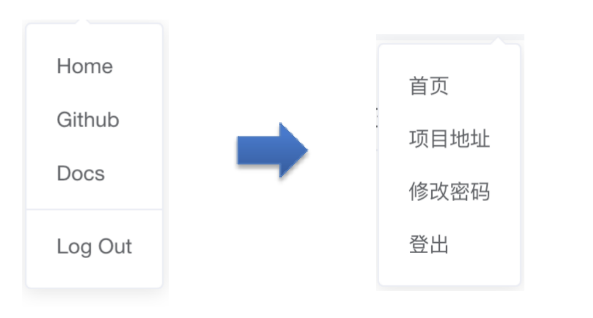

> 退出登录流程


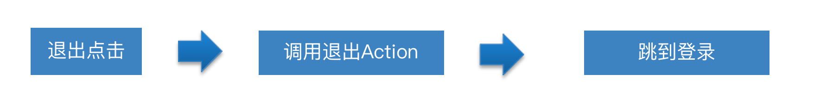

- Navbar中点击退出登录-代码位置(

**src/layout/components/NavBar.vue**

```html
  <el-dropdown-item @click.native="logout">
          <span style="display:block;">登出</span>
  </el-dropdown-item>
```

- 退出方法-代码位置(

**src/layout/components/NavBar.vue**

```javascript
export default  {
  methods: {
     async logout() {
      // 调用退出登录的action
      await this.$store.dispatch('user/logout')
      this.$router.push('/login')
    },
  }
}
```

注意：native修饰符表示给组件的根元素注册事件️

# 6.修改密码功能实现

- 整体流程

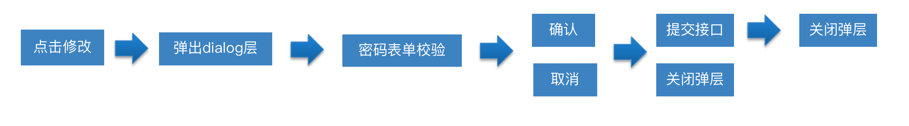

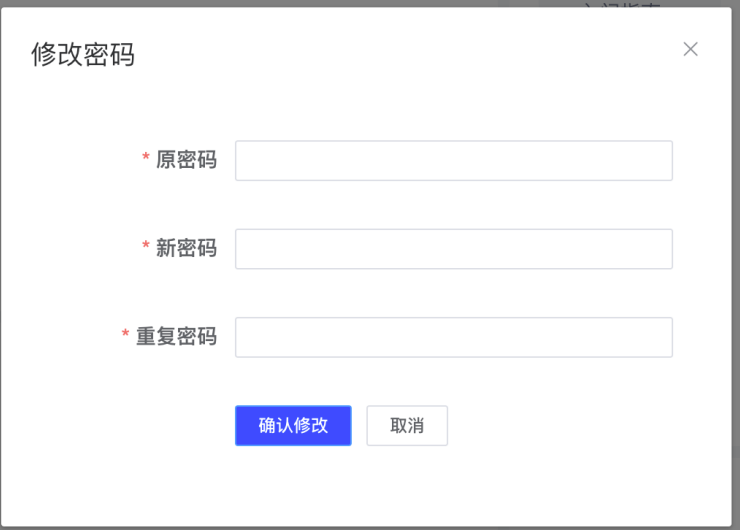

## 6.1-修改密码-弹出层

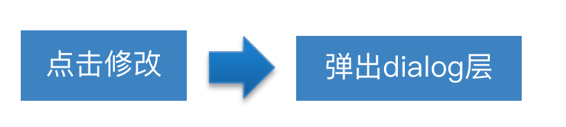

- 注册修改密码点击事件-代码位置(

**src/layout/components/NavBar.vue**

```html
<!-- prevent阻止默认事件 -->
 <a target="_blank" @click.prevent="updatePassword">
    <el-dropdown-item>修改密码</el-dropdown-item>
 </a>
```

- 声明变量和方法控制弹层显示-代码位置(

**src/layout/components/NavBar.vue**

```javascript
export default {
  data() {
    return  {
      showDialog: false
    }
  },
  methods: {
    updatePassword() {
      this.showDialog = true
    }
  }
}
```

- 放置弹层组件-代码位置(

**src/layout/components/NavBar.vue**

```html
<el-dialog width="500px" title="修改密码" :visible.sync="showDialog" >
</el-dialog>
```

## 6.2-修改密码-表单结构

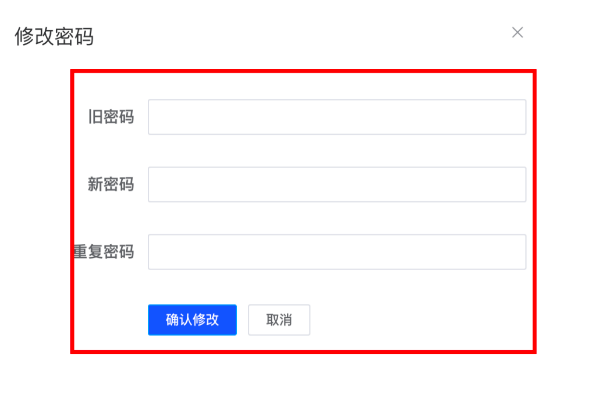

- 表单结构-代码位置(

**src/layout/components/NavBar.vue**

```html
  <el-form  label-width="120px" >
        <el-form-item label="旧密码" >
          <el-input  show-password size="small" />
        </el-form-item>
        <el-form-item label="新密码" >
          <el-input  show-password size="small" />
        </el-form-item>
        <el-form-item label="重复密码" >
          <el-input  show-password size="small" />
        </el-form-item>
        <el-form-item>
          <el-button size="mini" type="primary" >确认修改</el-button>
          <el-button size="mini" >取消</el-button>
        </el-form-item>
      </el-form>
```

## 6.3-修改密码-表单校验

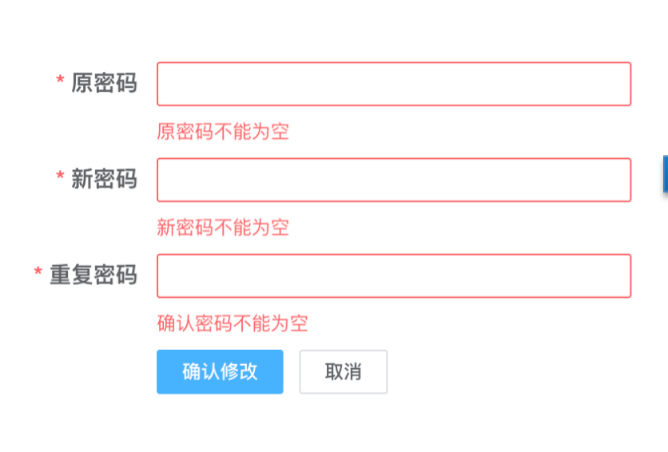

- 声明数据和规则-代码位置(

**src/layout/components/NavBar.vue**

```javascript
export default {
  data () {
    return  {
     passForm: {
        oldPassword: '', // 旧密码
        newPassword: '', // 新密码
        confirmPassword: '' // 确认密码字段
      },
     rules: {
        oldPassword: [{ required: true, message: '旧密码不能为空', trigger: 'blur' }], // 旧密码
        newPassword: [{ required: true, message: '新密码不能为空', trigger: 'blur' }, {
          trigger: 'blur',
          min: 6,
          max: 16,
          message: '新密码的长度为6-16位之间'
        }], // 新密码
        confirmPassword: [{ required: true, message: '重复密码不能为空', trigger: 'blur' }, {
          trigger: 'blur',
          validator: (rule, value, callback) => {
            // value
            if (this.passForm.newPassword === value) {
              callback()
            } else {
              callback(new Error('重复密码和新密码输入不一致'))
            }
          }
        }] // 确认密码字段
      }
    }
  }
}
```

- 绑定属性-代码位置(

**src/layout/components/NavBar.vue**

```html
      <el-form ref="passForm" label-width="120px" :model="passForm" :rules="rules">
        <el-form-item label="旧密码" prop="oldPassword">
          <el-input v-model="passForm.oldPassword" show-password size="small" />
        </el-form-item>
        <el-form-item label="新密码" prop="newPassword">
          <el-input v-model="passForm.newPassword" show-password size="small" />
        </el-form-item>
        <el-form-item label="重复密码" prop="confirmPassword">
          <el-input v-model="passForm.confirmPassword" show-password size="small" />
        </el-form-item>
        <el-form-item>
          <el-button size="mini" type="primary" >确认修改</el-button>
          <el-button size="mini" >取消</el-button>
        </el-form-item>
      </el-form>
```

## 6.4-修改密码-确定和取消

- 确定和取消流程

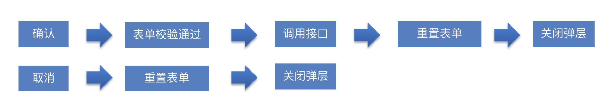

- 封装修改密码方法-代码位置(

**src/api/user.js**

```javascript
/**
 * 更新密码
 * **/
export function updatePassword(data) {
  return request({
    url: '/sys/user/updatePass',
    method: 'put',
    data
  })
}
```

- 确定方法-代码位置(

**src/layout/components/NavBar.vue**

```javascript
// 确定
    btnOK() {
      this.$refs.passForm.validate(async isOK => {
        if (isOK) {
          // 调用接口
          await updatePassword(this.passForm)
          this.$message.success('修改密码成功')
          this.btnCancel()
        }
      })
    },
```

- 取消方法-代码位置(

**src/layout/components/NavBar.vue**

```javascript
btnCancel() {
      this.$refs.passForm.resetFields() // 重置表单
      // 关闭弹层
      this.showDialog = false
}
```

- 监听弹层关闭事件

```html
    <el-dialog @close="btnCancel" width="500px" title="修改密码" :visible.sync="showDialog" >
```

> 有同学有疑惑，不是用了.sync修饰符吗？可以直接关闭弹层，为何还要监听close事件，这是因为sync修饰符只能关闭弹层，我们还需要将表单进行重置，因为你之前打开弹层可能修改了一半或者残留一些校验信息，再打开的时候这些信息应该都被重置，所以这里用监听事件的方式再重置一下表单，保证功能的体验和完整性。


# 7. 清理组件和路由

> 主页功能开发完了，我们要清理一下模板中残余文件


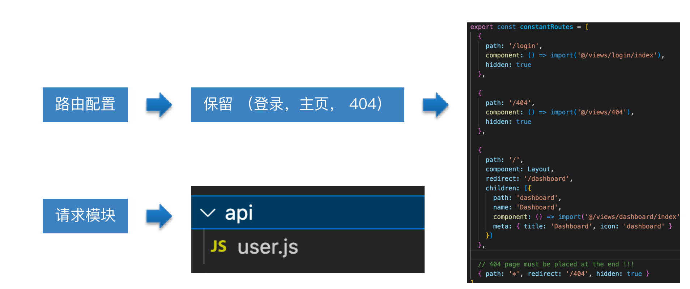

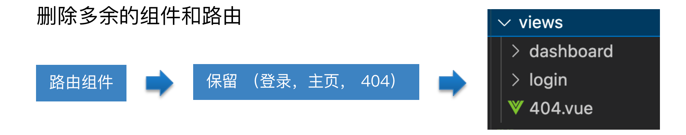

- 路由只保留登录-主页-404

- 请求模块只保留user.js模块

# 8.创建项目所需要的组件和路由

> 人力资源项目需要这些模块


```
  ├── approval            # 审批管理
  ├── attendance          # 考勤管理
  ├── department          # 组织架构
  ├── employee            # 员工管理
  ├── permission          # 权限管理
  ├── role                # 角色管理
  ├── salary              # 工资管理
  ├── social              # 社保管理
```

- 创建模块

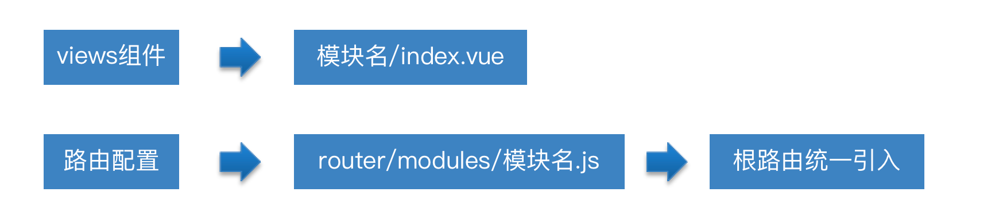

> 大家可以直接从当天课程的素材中拷贝已经准备好的路由/组件


组件结构样例路由模块样例路由的统一导入在src/router/index.js中集成到当前路由中

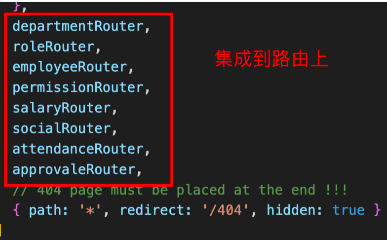

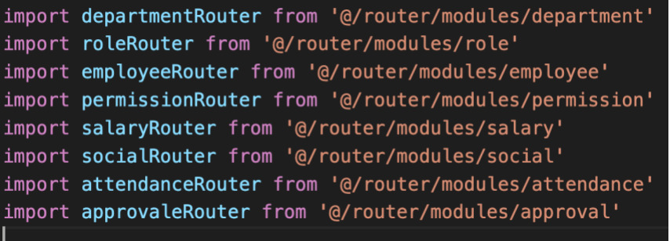

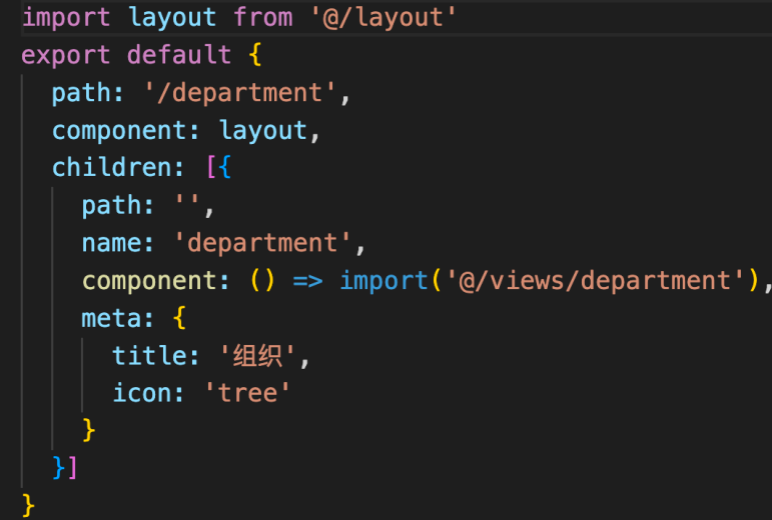

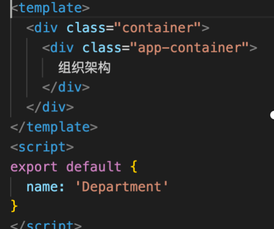

# 9.扩展-解析左侧菜单原理

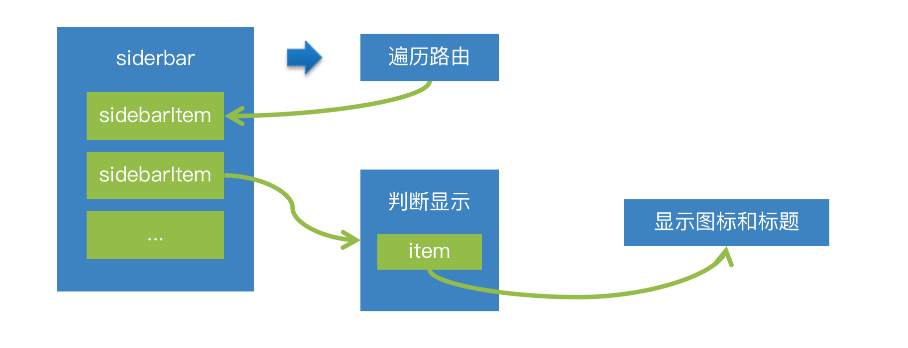

> 左侧菜单的数据来源于路由模块的信息， 会根据路由信息的hidden属性来判断是否显示该路由信息到菜单，菜单属性中的图表和标题来源于路由meta中的icon和title属性


- 分析过程

sidebar组件引入路由信息循环渲染路由信息sidebarItem组件根据条件渲染-传递icon和title属性给item组件item组件接收icon和title属性，使用函数型组件完成渲染

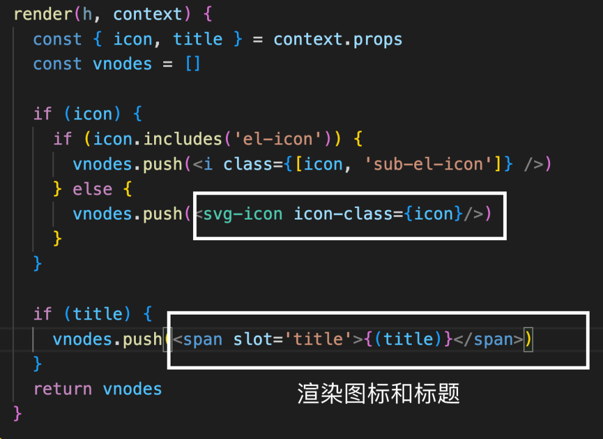

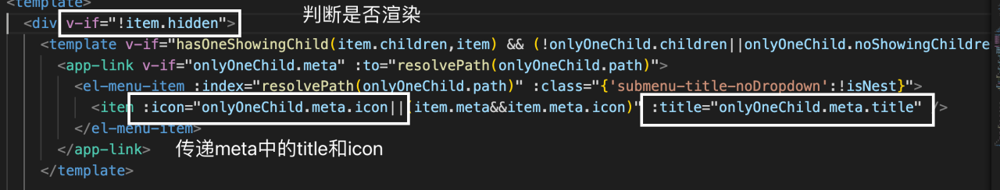

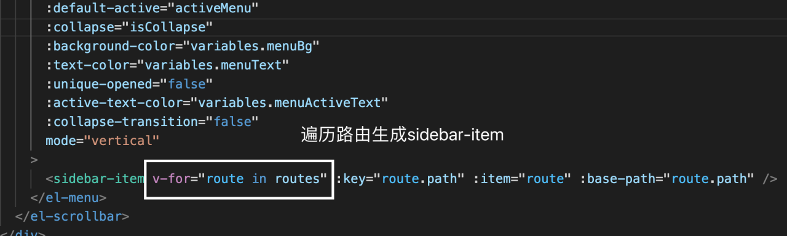

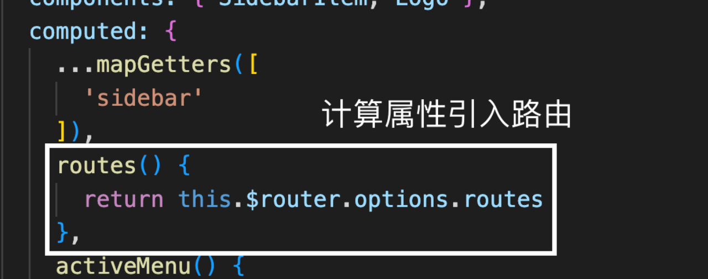

# 10. 左侧菜单显示项目logo

> logo有两种展示形态，当菜单展开时，显示大图，当菜单折叠时，显示小图


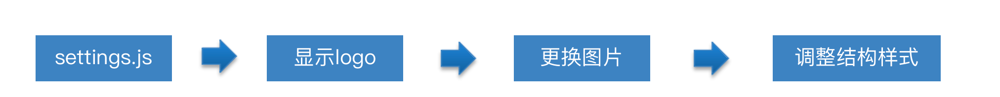

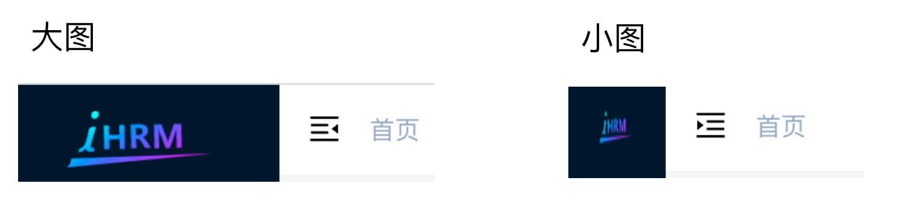

- 通过settings.js的设置，将logo显示出来-代码位置(

**src/settings.js**

```
module.exports = {
  title: '人力资源后台管理系统',
  /**
   * @type {boolean} true | false
   * @description Whether fix the header
   */
  fixedHeader: false,
  /**
   * @type {boolean} true | false
   * @description Whether show the logo in sidebar
   */
  sidebarLogo: true
}
```

- 调整logo的页面结构-代码位置(

**src/layout/components/Sidebar/Logo.vue**

```html
<template>
  <div class="sidebar-logo-container" :class="{'collapse':collapse}">
    <transition name="sidebarLogoFade">
      <router-link key="collapse" class="sidebar-logo-link" to="/">
        
      </router-link>
    </transition>
  </div>
</template>
```

- 调整logo样式-代码位置(

**src/layout/components/Sidebar/Logo.vue**

```javascript
<style lang="scss" scoped>
.sidebarLogoFade-enter-active {
  transition: opacity 1.5s;
}
​
.sidebarLogoFade-enter,
.sidebarLogoFade-leave-to {
  opacity: 0;
}
​
.sidebar-logo-container {
  position: relative;
  width: 100%;
  height: 50px;
  line-height: 50px;
  text-align: center;
  overflow: hidden;
​
  & .sidebar-logo-link {
    height: 100%;
    width: 100%;
​
    & .sidebar-logo {
      width: 140px;
      vertical-align: middle;
      margin-right: 12px;
    }
​
    & .sidebar-title {
      display: inline-block;
      margin: 0;
      color: #fff;
      font-weight: 600;
      line-height: 50px;
      font-size: 14px;
      font-family: Avenir, Helvetica Neue, Arial, Helvetica, sans-serif;
      vertical-align: middle;
    }
  }
​
  &.collapse {
    .sidebar-logo {
      margin-right: 0px;
      width: 32px;
      height: 32px;
    }
  }
}
</style>
​
```