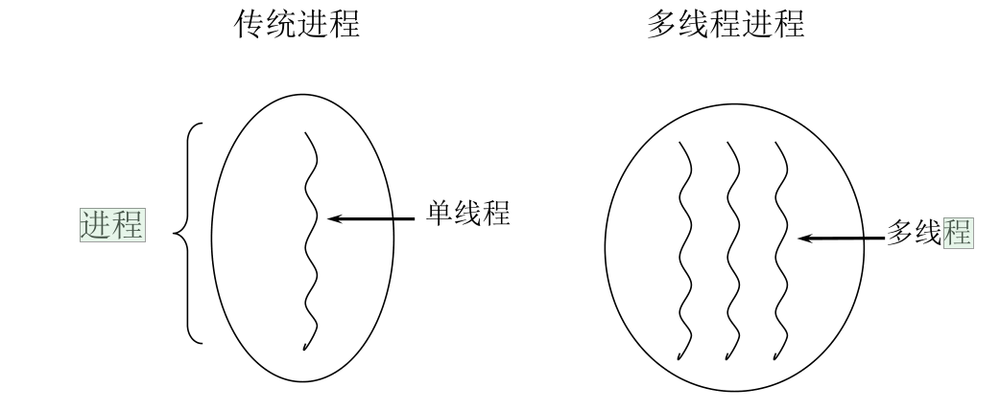
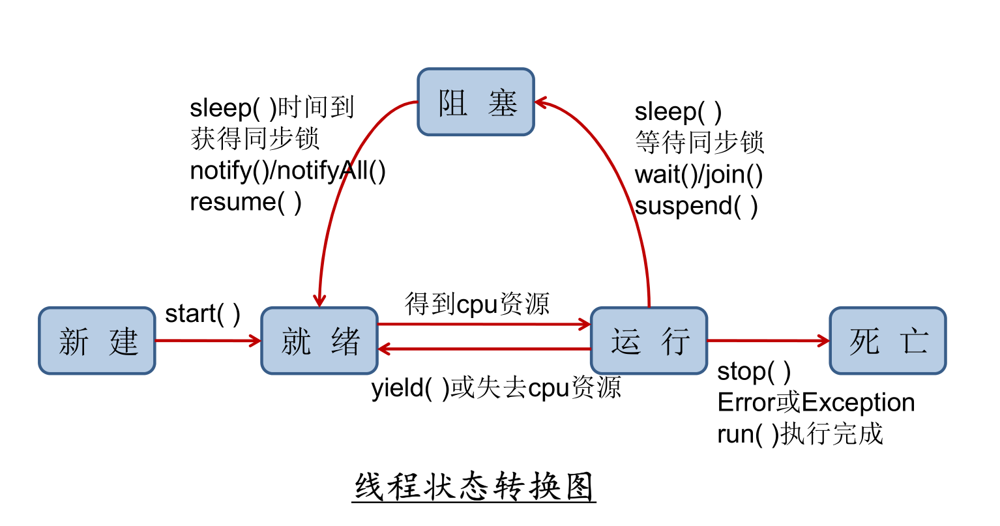

一、基本概念：程序 - 进程 - 线程

二、进程与多线程

三、何时需要多线程

四、使用多线程的优点

多线程程序的优点：

五、线程的分类

# 一、基本概念：程序 - 进程 - 线程

 程序 (program) 是为完成特定任务、用某种语言编写
的一组指令的集合。即指一段静态的代码，静态对
象。

 进程 (process) 是程序的一次执行过程，或是正在运
行的一个程序。动态过程：有它自身的产生、存在
和消亡的过程。

 如：运行中的 QQ ，运行中的 MP3 播放器

 程序是静态的，进程是动态的

 线程 (thread) ，进程可进一步细化为线程，是一个程
序内部的一条执行路径。

 若一个程序可同一时间执行多个线程，就是支持多线程的

---

# 二、进程与多线程

# 

每个 Java 程序都有一个隐含的主线程： main 方法

---

# 三、何时需要多线程

 程序需要同时执行两个或多个任务。

 程序需要实现一些需要等待的任务时，如用户输
入、文件读写操作、网络操作、搜索等。

 需要一些后台运行的程序时。

---

# 四、使用多线程的优点

背景： 只使用单个线程完成多个任务（调用多个方法），肯
定比用多个线程来完成用的时间更短，为何仍需多线程呢？

## 多线程程序的优点：

1. 提高应用程序的响应。对图形化界面更有意义，
可增强用户体验。

2. 提高计算机系统 CPU 的利用率

3. 改善程序结构。将既长又复杂的进程分为多个线
程，独立运行，利于理解和修改

---

# 五、线程的分类

Java 中的线程分为两类：一种是 守护线程，一种是 用
户线程。

 它们在几乎每个方面都是相同的，唯一的区别是判
断 JVM 何时离开。

 守护线程是用来服务用户线程的，通过在 start() 方
法前调用 thread.setDaemon(true) 可以把一个用户
线程变成一个守护线程。

 Java 垃圾回收就是一个典型的守护线程。

 若 JVM 中都是守护线程，当前 JVM 将退出。

---

# 六、线程生命周期

