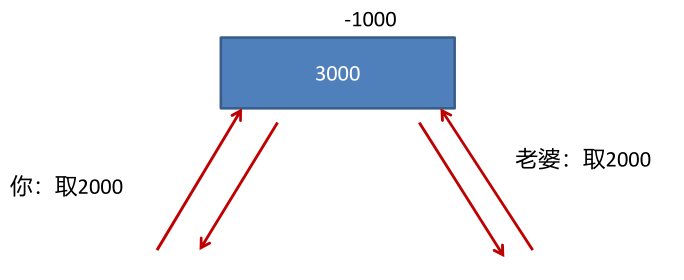
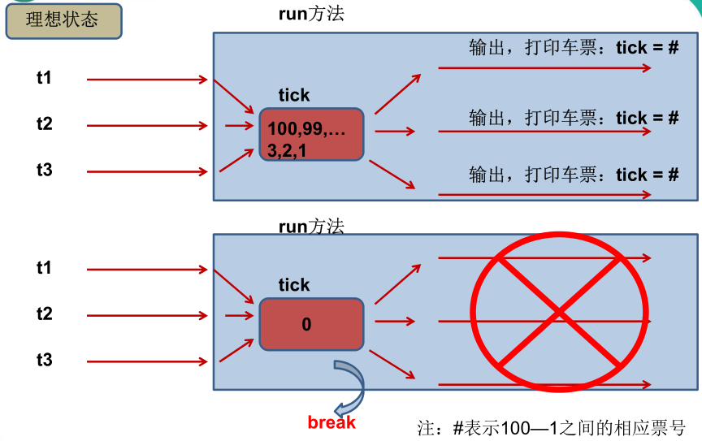
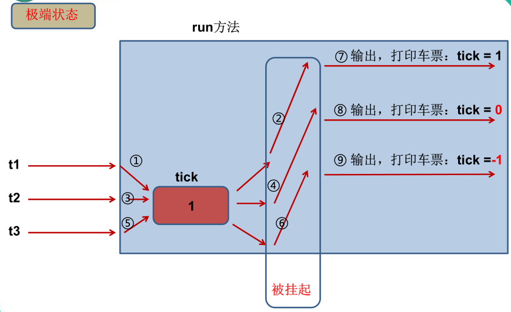
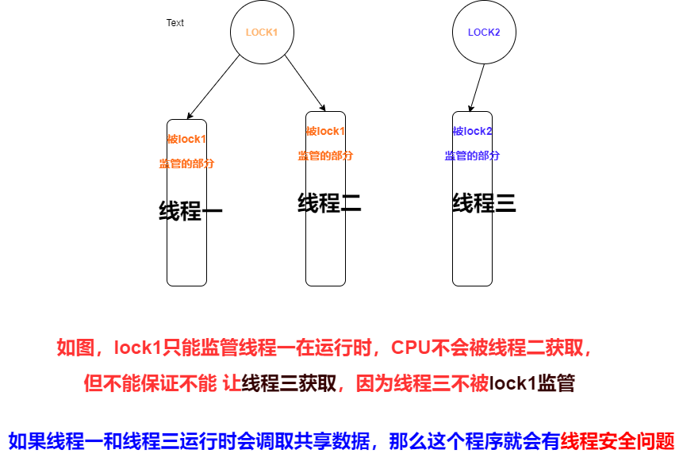
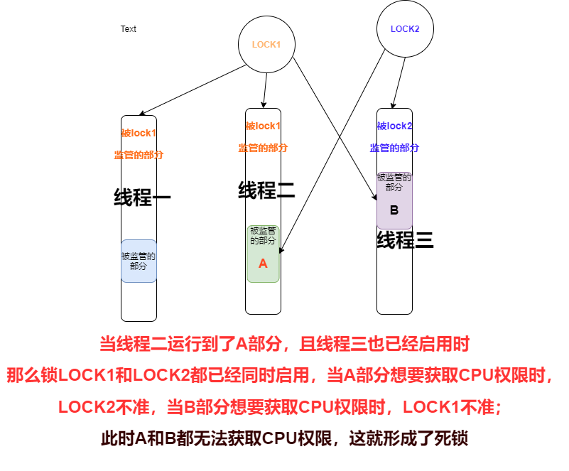

 1、问题的提出


2、例 题
：拟火车站售票程序，开启三个窗口售票

1）（有明显的的线程安全）：

运行结果：

1）方法一：同步代码块

2）方法二：同步方法

3）注意：锁 使用不当依然会产生线程安全问题！

4）线程的死锁问题


4、单例设计模式之懒汉式


5、小结：

1）释放锁的操作


2）不会释放锁的操作


#  1、问题的提出


 多个线程执行的不确定性引起执行结果的不稳定


 多个线程对账本的共享，会造成操作的不完整性，
会破坏数据。





---

# 2、例 题
：拟火车站售票程序，开启三个窗口售票


## 1）（有明显的的线程安全）：

```javascript
class window2 implements Runnable{
     int ticket=100;        //共享数据
    @Override
    public void run() {
        while(true) {
                if (ticket > 0) {
                    try {
                        Thread.currentThread().sleep(15);
                    } catch (InterruptedException e) {
                        e.printStackTrace();
                    }
                    System.out.println(Thread.currentThread().getName()
                            + "售票，票号为：" + ticket--);
                } else break;
        }
    }
}

public class TestWindow2{
      public static void main(String args[]){
            window2 w2=new window2();
            Thread t1=new Thread(w2);
            Thread t2=new Thread(w2);
            t1.setName("窗口1");
            t2.setName("窗口two");
            t1.start();
            t2.start();
        }
}

```


### 运行结果：

```javascript
窗口1售票，票号为：10
窗口two售票，票号为：11
窗口1售票，票号为：9	
窗口two售票，票号为：9	//重票
窗口two售票，票号为：8
窗口1售票，票号为：8	//重票
窗口1售票，票号为：6
窗口two售票，票号为：7
窗口two售票，票号为：4
窗口1售票，票号为：5
窗口1售票，票号为：3
窗口two售票，票号为：2
窗口1售票，票号为：1
窗口two售票，票号为：0	//出现了0票

//出现了明显的线程安全问题
```


结果分析：







1） 多线程出现了安全问题

2） 问题的原因： 问题的原因：


当多条语句在操作同一个线程共享数据时，一个线程对多条语句只执行了
一部分，还没有执行完，另一个线程参与进来执行。导致共享数据的错误。

```javascript
  if (ticket>0){				//此时已经获取到了tricket的状态
                try {
                    Thread.currentThread().sleep(15);	
                    /*在保持tricket原状态的同时，让线程进行短暂的休眠15毫秒，在这期间他会释放对CPU的使用权限，
 			  *使得其他线程可能会在这期间获取到CPU的使用权限,那么当此线程在此获取CPU使用权限时，输出的ticket的值依然是原来状态的值，
      		  *但实际情况是，真实的tricket的值或者是状态很可能已经发生了改变，导致此执行结果出现错误！
      		  */          		 	    		   	
                } catch (InterruptedException e) {
                    e.printStackTrace();
                }
                System.out.println(Thread.currentThread().getName()
                +"售票，票号为："+ticket--);
```


3.）解决办法:


对多条操作共享数据的语句，只能让一个线程都执行完，在执行过程中，
其他线程不可以参与执r行。（这就是线程同步）


---

3、线程同步：synchronized的使用方法


```javascript
/*
 *  1、线程安全问题的原因？
 *         由于一个线程在操作共享数据的过程中，在未完成的状态下，另外的线程
 *         参与进来，导致共享数据存在了安全问题；
 *
 *   2、如何解决线程的安全问题？
 *          必须让一个线程操作共享数据完毕以后，其他线程才有机会参与共享数据的操作。
 *
 *   3、java如何实现线程的安全：   线程的同步机制
 *          方式一：同步代码块
 *                  synchronized(同步监视器）{
 *                      //需要被同步的代码块（操作共享数据的代码）
 *                   }
 *                  1、同步监视器：由一个类的对象来充当。
 *                      哪个线程获取此监视器，谁就执行大括号里的被同步的代码块。俗称：锁
 *                      要求：所有的线程必须共用一把锁（锁必须是全局变量）,因为锁在在这里可以看成是上帝视角，
 *                      总管全局，这样才能有效实现线程同步；
 *
 *          方式二：同步方法
 *              将操作共享数据的方法声明为synchronized.即此方法为同步方法，能够保证当其中一个线程执行此
 *              方法时，其他线程在外等待，直到这个线程执行完此方法；
 *              同步方法的锁：this；
 *
 *    4、锁具有CPU使用权限的分配权，只有被运行到相应的被监管的代码块时锁所才会被启用；
 *        
 *    5、线程同步的弊端：由于同一个时间只能有一个线程访问共享数据，效率变低了；
 *
 *    6、注意:先启动的线程，不一定就优先获取到CPU使用权限，它也有肯能最后一个在获取到，
 *
 */
```

## 1）方法一：同步代码块

```javascript
package com.exer;

/*
 *模拟火车站，开启三个售票窗口，总票数100张
 */

class window2 implements Runnable{
     int ticket=100;        //共享数据
     Object obj=new Object();
    @Override
    public void run() {
        while(true) {
            synchronized (obj) {
                if (ticket > 0) {
                    try {
                        Thread.currentThread().sleep(10);
                    } catch (InterruptedException e) {
                        e.printStackTrace();
                    }
                    System.out.println(Thread.currentThread().getName()
                            + "售票，票号为：" + ticket--);
                } else break;
            }
        }
    }
}

public class TestWindow2{
      public static void main(String args[]){
            window2 w2=new window2();
            Thread t1=new Thread(w2);
            Thread t2=new Thread(w2);
            t1.setName("窗口1");
            t2.setName("窗口two");
            t1.start();
            t2.start();
        }
}

```

运行结果:

```javascript
窗口1售票，票号为：12
窗口1售票，票号为：11
窗口1售票，票号为：10
窗口1售票，票号为：9
窗口1售票，票号为：8
窗口two售票，票号为：7
窗口two售票，票号为：6
窗口two售票，票号为：5
窗口two售票，票号为：4
窗口two售票，票号为：3
窗口two售票，票号为：2
窗口two售票，票号为：1

Process finished with exit code 0
//运行结果正常；
```

# 2）方法二：同步方法

```javascript
class window2s implements Runnable{
     int ticket=100;        //共享数据
    @Override
    public void run() {
        while (true){
            show();
            if(ticket<=0) break;
        }
    }

    public synchronized void show() {
        if (ticket > 0) {
            try {
                Thread.currentThread().sleep(10);
            } catch (InterruptedException e) {
                e.printStackTrace();
            }
            System.out.println(Thread.currentThread().getName()
                    + "售票，票号为：" + ticket--);
        }
    }
}

public class TestWindow4{
      public static void main(String args[]){
            window2s w2=new window2s();
            Thread t1=new Thread(w2);
            Thread t2=new Thread(w2);
            t1.setName("窗口1");
            t2.setName("窗口two");
            t1.start();
            t2.start();
        }
}

```

显示结果：

```javascript
窗口1售票，票号为：15
窗口1售票，票号为：14
窗口1售票，票号为：13
窗口1售票，票号为：12
窗口1售票，票号为：11
窗口1售票，票号为：10
窗口two售票，票号为：9
窗口two售票，票号为：8
窗口two售票，票号为：7
窗口two售票，票号为：6
窗口two售票，票号为：5
窗口two售票，票号为：4
窗口two售票，票号为：3
窗口two售票，票号为：2
窗口two售票，票号为：1

Process finished with exit code 0
```

## 3）注意：锁 使用不当依然会产生线程安全问题！





## 4）线程的死锁问题


-  死锁


-  不同的线程分别占用对方需要的同步资源不放弃，都
在等待对方放弃自己需要的同步资源，就形成了线程
的死锁


-  解决方法


-  专门的算法、原则


-  尽量减少同步资源的定义





---

# 4、单例设计模式之懒汉式


```javascript
package com.java1;
/*
 *关于懒汉式的线程安全问题：使用同步机制
 * 对于一般的方法内，使用同步代码块，可以考虑this；
 * 对于静态方法而言，使用当前类本身充当锁；
 */
class Singletion{
    private Singletion(){

    }
    private static Singletion instance=null;
    public static Singletion getInstance(){
        synchronized (Singletion.class) {
            if (instance == null) {
                instance = new Singletion();
            }
        }
        return instance;
    }
}
public class TestSingletion {
      public static void main(String args[]){
              Singletion s1= Singletion.getInstance();
              Singletion s2=Singletion.getInstance();
                 System.out.println(s1==s2);
        }
}

```


---

# 5、小结：


## 1）释放锁的操作


 当前线程的同步方法、同步代码块执行结束


 当前线程在同步代码块、同步方法中遇到 break 、
return 终止了该代码块、该方法的继续执行。


 当前线程在同步代码块、同步方法中出现了未处
理的 Error 或 Exception ，导致异常结束


 当前线程在同步代码块、同步方法中执行了线程
对象的 wait() 方法，当前线程暂停，并释放锁。


## 2）不会释放锁的操作


 线程执行同步代码块或同步方法时，程序调用
Thread.sleep() 、 Thread.yield() 方法暂停当前线程的


执行


 线程执行同步代码块时，其他线程调用了该线程
的 suspend() 方法将该线程挂起，该线程不会释放
锁（同步监视器）。


 应尽量避免使用 suspend() 和 resume() 来控制线程


