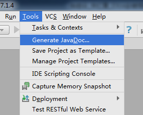

# 1. 生成 javadoc



# 


输入：


```javascript
Locale：输入语言类型：zh_CN
Other command line arguments：-encoding UTF-8 -charset UTF-8
```


---

# 2. 缓存 和索引的 清理


IntelliJ IDEA 首次加载项目的时候，都会创建索引，而创建索引的时间跟项目的
文件多少成正比。在 IntelliJ IDEA 创建索引过程中即使你编辑了代码也是编译
不了、运行不起来的，所以还是安安静静等 IntelliJ IDEA 创建索引完成。


IntelliJ IDEA 的缓存和索引主要是用来加快文件查询，从而加快各种查找、代码
提示等操作的速度，所以 IntelliJ IDEA 的索引的重要性再强调一次也不为过。
但是，IntelliJ IDEA 的索引和缓存并不是一直会良好地支持 IntelliJ IDEA 的，
某些特殊条件下，IntelliJ IDEA 的缓存和索引文件也是会损坏的，比如：断电、
蓝屏引起的强制关机，当你重新打开 IntelliJ IDEA，很可能 IntelliJ IDEA 会报
各种莫名其妙错误，甚至项目打不开，IntelliJ IDEA 主题还原成默认状态。即使
没有断电、蓝屏，也会有莫名奇怪的问题的时候，也很有可能是 IntelliJ IDEA 缓
存和索引出现了问题，这种情况还不少。遇到此类问题也不用过多担心。我们可
以清理缓存和索引。如下：


 一般建议点击 Invalidate and Restart，这样会比较干净。


 上图警告：清除索引和缓存会使得 IntelliJ IDEA 的 Local History 丢失。所以如果你项目没
有加入到版本控制，而你又需要你项目文件的历史更改记录，那你最好备份下你的
LocalHistory 目 录 。 目 录 地 址 在 ： C:\Users\ 当 前 登 录 的 系 统 用 户 名


\.IntelliJIdea14\system\LocalHistory 建议使用硬盘的全文搜索，这样效率更高。


 通过上面方式清除缓存、索引本质也就是去删除 C 盘下的 system 目录下的对应的文件
而已，所以如果你不用上述方法也可以删除整个 system。当 IntelliJ IDEA 再次启动项目的
时候会重新创建新的 system 目录以及对应项目缓存和索引。


---

# 3. 取消更新


# 


取消勾选：即可取消更新


---

# 4. 插件 的使用


在 IntelliJ IDEA 的安装讲解中我们其实已经知道，IntelliJ IDEA 本身很多功能也都


是通过插件的方式来实现的。


官网插件库：https://plugins.jetbrains.com/


```javascript
 Install JetBrains plugin：	弹出 IntelliJ IDEA 公司自行开发的插件仓库列表，供下载安装。
 Browse repositories：		弹出插件仓库中所有插件列表供下载安装。
 Install plugin from disk：	浏览本地的插件文件进行安装，而不是从服务器上下载并安装。
```

需要特别注意的是：在国内的网络下，经常出现显示不了插件列表，或是显示了


插件列表，无法下载完成安装。这时候请自行打开 VPN，一般都可以得到解决。


如上图演示，在线安装 IntelliJ IDEA 插件库中的插件。安装完以后会提示重启，


才可以使用插件。


常用插件推荐：


```javascript
Key promoter 	快捷键提示 			https://plugins.jetbrains.com/plugin/4455?pr=idea

CamelCase
		驼峰式命名和下划线命名
交替变化
	https://plugins.jetbrains.com/plugin/7160?pr=idea

CheckStyle-IDEA 	代码样式检查 			https://plugins.jetbrains.com/plugin/1065?pr=idea

FindBugs-IDEA 	代码 Bug 检查 			https://plugins.jetbrains.com/plugin/3847?pr=idea

Statistic 		代码统计 			https://plugins.jetbrains.com/plugin/4509?pr=idea

JRebel Plugin 	热部署 				https://plugins.jetbrains.com/plugin/?id=4441

CodeGlance
		在编辑代码最右侧，显示一
块代码小地图
	https://plugins.jetbrains.com/plugin/7275?pr=idea

Eclipse Code
 Formatter
	使用 Eclipse 的代码格式
化风格，在一个团队中如果
公司有规定格式化风格，这
个可以使用。
	
    			https://plugins.jetbrains.com/plugin/6546?pr=idea

GsonFormat
		把 JSON 字符串直接实例
化成类
	https://plugins.jetbrains.com/plugin/7654?pr=idea
```

