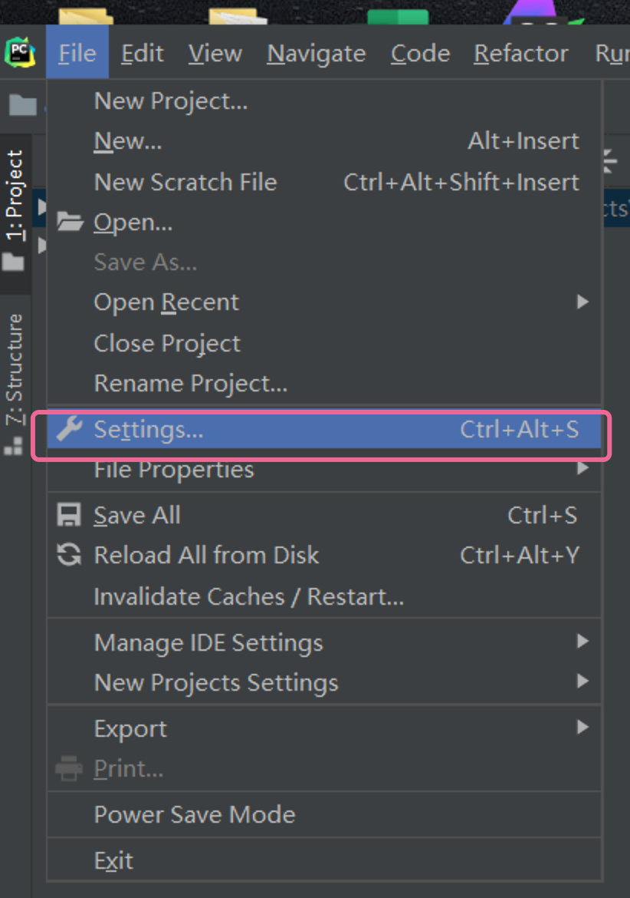
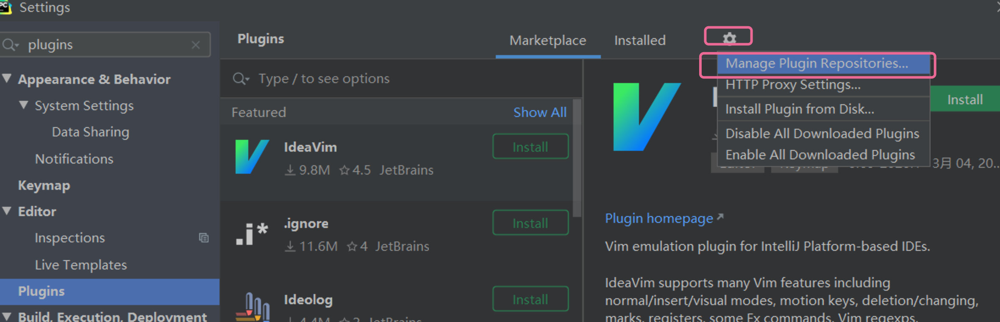
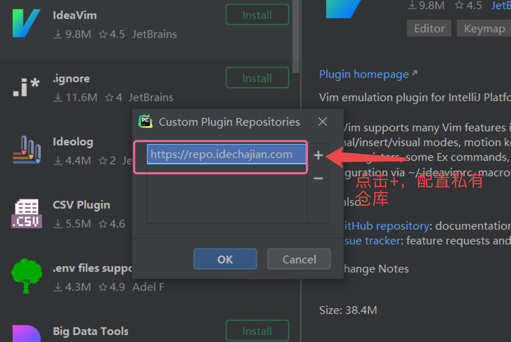
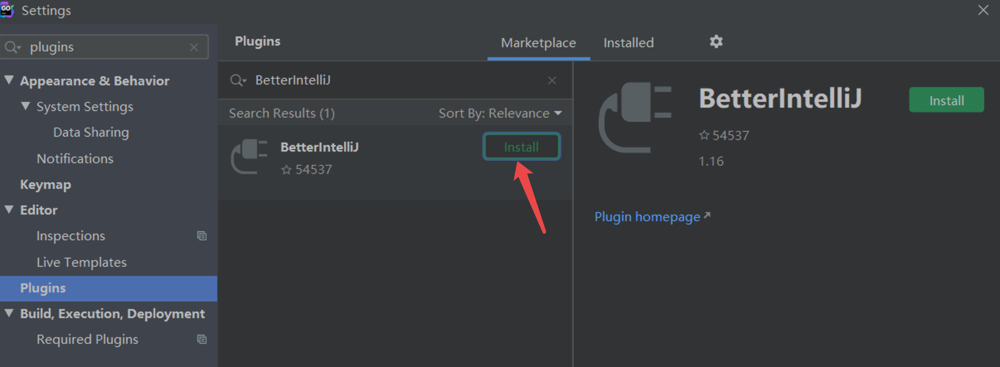
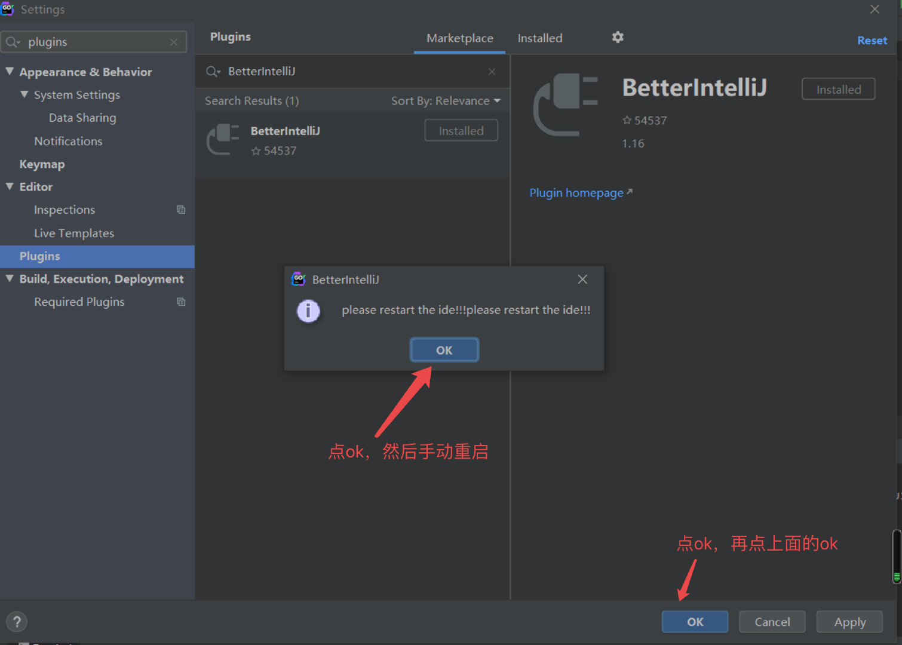
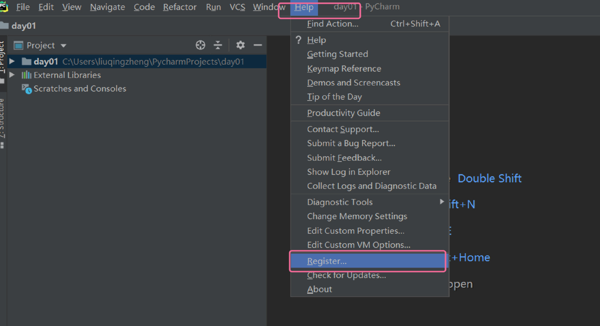
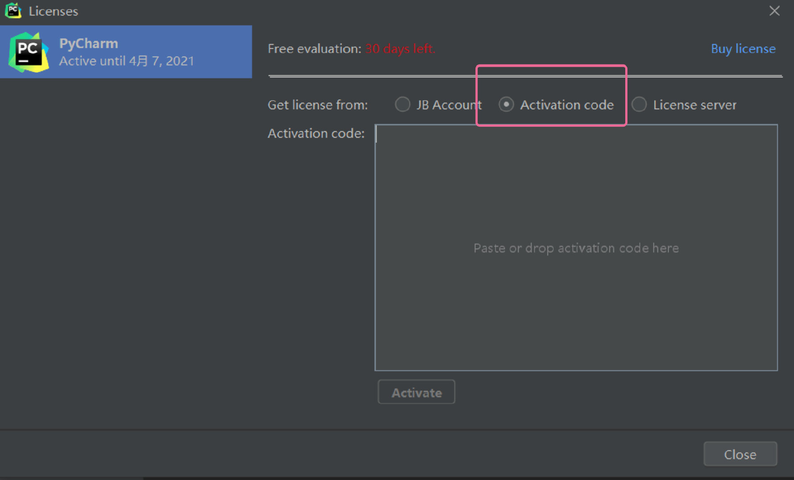
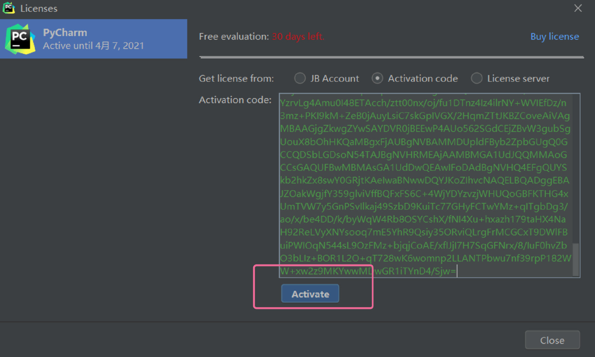
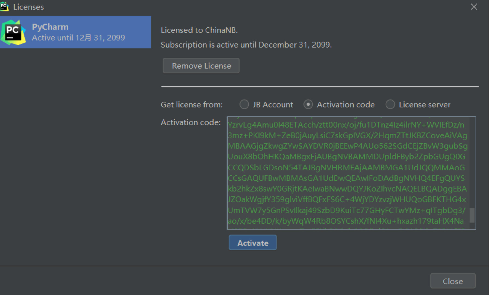

**JetBrains全家桶破解-Golang-Pycharm-IDEA等-不分平台**

**原文地址：**[JetBrains全家桶破解-Golang-Pycharm-IDEA等-不分平台](https://www.cnblogs.com/liuqingzheng/p/14505771.html)

# 1、前言

该方法可以破解JetBrains家族所有编辑器，以下以Pycharm为例，不分平台（windows，Mac等）

## 第一步打开配置信息，搜索plugins




## 第二步点击配置，修改成私有仓库

私有仓库地址为：[https://repo.idechajian.com](https://repo.idechajian.com)





## 第三步 搜索插件BetterIntelliJ，并安装






## 第四步：手动重启Pycharm，打开注册页面



## 第五步：输入如下注册码

**不要换行处理，这样可能会失效**

```
BISACXYELK-eyJsaWNlbnNlSWQiOiJCSVNBQ1hZRUxLIiwibGljZW5zZWVOYW1lIjoiQ2hpbmFOQiIsImFzc2lnbmVlTmFtZSI6IiIsImFzc2lnbmVlRW1haWwiOiIiLCJsaWNlbnNlUmVzdHJpY3Rpb24iOiIiLCJjaGVja0NvbmN1cnJlbnRVc2UiOmZhbHNlLCJwcm9kdWN0cyI6W3siY29kZSI6IklJIiwicGFpZFVwVG8iOiIyMDk5LTEyLTMxIiwiZXh0ZW5kZWQiOmZhbHNlfSx7ImNvZGUiOiJBQyIsInBhaWRVcFRvIjoiMjA5OS0xMi0zMSIsImV4dGVuZGVkIjpmYWxzZX0seyJjb2RlIjoiRFBOIiwicGFpZFVwVG8iOiIyMDk5LTEyLTMxIiwiZXh0ZW5kZWQiOnRydWV9LHsiY29kZSI6IlJTQyIsInBhaWRVcFRvIjoiMjA5OS0xMi0zMSIsImV4dGVuZGVkIjp0cnVlfSx7ImNvZGUiOiJQUyIsInBhaWRVcFRvIjoiMjA5OS0xMi0zMSIsImV4dGVuZGVkIjpmYWxzZX0seyJjb2RlIjoiUlNGIiwicGFpZFVwVG8iOiIyMDk5LTEyLTMxIiwiZXh0ZW5kZWQiOnRydWV9LHsiY29kZSI6IkdPIiwicGFpZFVwVG8iOiIyMDk5LTEyLTMxIiwiZXh0ZW5kZWQiOmZhbHNlfSx7ImNvZGUiOiJETSIsInBhaWRVcFRvIjoiMjA5OS0xMi0zMSIsImV4dGVuZGVkIjp0cnVlfSx7ImNvZGUiOiJDTCIsInBhaWRVcFRvIjoiMjA5OS0xMi0zMSIsImV4dGVuZGVkIjpmYWxzZX0seyJjb2RlIjoiUlMwIiwicGFpZFVwVG8iOiIyMDk5LTEyLTMxIiwiZXh0ZW5kZWQiOnRydWV9LHsiY29kZSI6IlJDIiwicGFpZFVwVG8iOiIyMDk5LTEyLTMxIiwiZXh0ZW5kZWQiOnRydWV9LHsiY29kZSI6IlJEIiwicGFpZFVwVG8iOiIyMDk5LTEyLTMxIiwiZXh0ZW5kZWQiOmZhbHNlfSx7ImNvZGUiOiJQQyIsInBhaWRVcFRvIjoiMjA5OS0xMi0zMSIsImV4dGVuZGVkIjpmYWxzZX0seyJjb2RlIjoiUlNWIiwicGFpZFVwVG8iOiIyMDk5LTEyLTMxIiwiZXh0ZW5kZWQiOnRydWV9LHsiY29kZSI6IlJTVSIsInBhaWRVcFRvIjoiMjA5OS0xMi0zMSIsImV4dGVuZGVkIjpmYWxzZX0seyJjb2RlIjoiUk0iLCJwYWlkVXBUbyI6IjIwOTktMTItMzEiLCJleHRlbmRlZCI6ZmFsc2V9LHsiY29kZSI6IldTIiwicGFpZFVwVG8iOiIyMDk5LTEyLTMxIiwiZXh0ZW5kZWQiOmZhbHNlfSx7ImNvZGUiOiJEQiIsInBhaWRVcFRvIjoiMjA5OS0xMi0zMSIsImV4dGVuZGVkIjpmYWxzZX0seyJjb2RlIjoiREMiLCJwYWlkVXBUbyI6IjIwOTktMTItMzEiLCJleHRlbmRlZCI6dHJ1ZX0seyJjb2RlIjoiUERCIiwicGFpZFVwVG8iOiIyMDk5LTEyLTMxIiwiZXh0ZW5kZWQiOnRydWV9LHsiY29kZSI6IlBXUyIsInBhaWRVcFRvIjoiMjA5OS0xMi0zMSIsImV4dGVuZGVkIjp0cnVlfSx7ImNvZGUiOiJQR08iLCJwYWlkVXBUbyI6IjIwOTktMTItMzEiLCJleHRlbmRlZCI6dHJ1ZX0seyJjb2RlIjoiUFBTIiwicGFpZFVwVG8iOiIyMDk5LTEyLTMxIiwiZXh0ZW5kZWQiOnRydWV9LHsiY29kZSI6IlBQQyIsInBhaWRVcFRvIjoiMjA5OS0xMi0zMSIsImV4dGVuZGVkIjp0cnVlfSx7ImNvZGUiOiJQUkIiLCJwYWlkVXBUbyI6IjIwOTktMTItMzEiLCJleHRlbmRlZCI6dHJ1ZX0seyJjb2RlIjoiUFNXIiwicGFpZFVwVG8iOiIyMDk5LTEyLTMxIiwiZXh0ZW5kZWQiOnRydWV9LHsiY29kZSI6IkRQIiwicGFpZFVwVG8iOiIyMDk5LTEyLTMxIiwiZXh0ZW5kZWQiOnRydWV9LHsiY29kZSI6IlJTIiwicGFpZFVwVG8iOiIyMDk5LTEyLTMxIiwiZXh0ZW5kZWQiOnRydWV9XSwibWV0YWRhdGEiOiIwMTIwMjAwNzI4RVBKQTAwODAwNiIsImhhc2giOiIxNTAyMTM1NC8wOi0xMjUxMTE0NzE3IiwiZ3JhY2VQZXJpb2REYXlzIjowLCJhdXRvUHJvbG9uZ2F0ZWQiOmZhbHNlLCJpc0F1dG9Qcm9sb25nYXRlZCI6ZmFsc2V9-H7NUmWcLyUNV1ctnlzc4P79j15qL56G0jeIYWPk/HViNdMg1MqPM7BR+aHR28yyuxK7Odb2bFDS8CeHNUtv7nT+4fUs85JJiqc3wc1psRpZq5R77apXLOmvmossWpbAw8T1hOGV9IPUm1f2O1+kLBxrOkdqPpv9+JanbdL7bvchAid2v4/dyQMBYJme/feZ0Dy2l7Jjpwno1TeblEAu0KZmarEo15or5RUNwtaGBL5+396TLhnw1qL904/uPnGftjxWYluLjabO/uRu/+5td8UA/39a1nvGU2nORNLk2IdRGIheiwIiuirAZrII9+OxB+p52i3TIv7ugtkw0E3Jpkw==-MIIDlzCCAn+gAwIBAgIBCTANBgkqhkiG9w0BAQsFADAYMRYwFAYDVQQDEw1KZXRQcm9maWxlIENBMCAXDTE4MTEwMTEyMjk0NloYDzIwOTkwODA5MDIyNjA3WjBoMQswCQYDVQQGEwJDWjEOMAwGA1UECBMFTnVzbGUxDzANBgNVBAcTBlByYWd1ZTEZMBcGA1UEChMQSmV0QnJhaW5zIHMuci5vLjEdMBsGA1UEAxMUcHJvZDN5LWZyb20tMjAxODExMDEwggEiMA0GCSqGSIb3DQEBAQUAA4IBDwAwggEKAoIBAQCdXyaNhhRySH1a8d7c8SlLLFdNcQP8M3gNnq7gudcpHC651qxRrN7Qks8gdXlIkA4u3/lp9ylp95GiIIDo4ydYje8vlTWDq02bkyWW/G7gZ3hkbBhRUK/WnNyr2vwWoOgwx5CfTRMjKkPkfD/+jffkfNfdGmGcg9yfnqPP9/AizKzWTsXSeS+0jZ8Nw5tiYFW+lpceqlzwzKdTHug7Vs0QomUPccRtZB/TBBEuiC7YzrvLg4Amu0I48ETAcch/ztt00nx/oj/fu1DTnz4Iz4ilrNY+WVIEfDz/n3mz+PKI9kM+ZeB0jAuyLsiC7skGpIVGX/2HqmZTtJKBZCoveAiVAgMBAAGjgZkwgZYwSAYDVR0jBEEwP4AUo562SGdCEjZBvW3gubSgUouX8bOhHKQaMBgxFjAUBgNVBAMMDUpldFByb2ZpbGUgQ0GCCQDSbLGDsoN54TAJBgNVHRMEAjAAMBMGA1UdJQQMMAoGCCsGAQUFBwMBMAsGA1UdDwQEAwIFoDAdBgNVHQ4EFgQUYSkb2hkZx8swY0GRjtKAeIwaBNwwDQYJKoZIhvcNAQELBQADggEBAJZOakWgjfY359glviVffBQFxFS6C+4WjYDYzvzjWHUQoGBFKTHG4xUmTVW7y5GnPSvIlkaj49SzbD9KuiTc77GHyFCTwYMz+qITgbDg3/ao/x/be4DD/k/byWqW4Rb8OSYCshX/fNI4Xu+hxazh179taHX4NaH92ReLVyXNYsooq7mE5YhR9Qsiy35ORviQLrgFrMCGCxT9DWlFBuiPWIOqN544sL9OzFMz+bjqjCoAE/xfIJjI7H7SqGFNrx/8/IuF0hvZbO3bLIz+BOR1L2O+qT728wK6womnp2LLANTPbwu7nf39rpP182WW+xw2z9MKYwwMDwGR1iTYnD4/Sjw=
```





## 第六步：大功告成，破解到2099年

