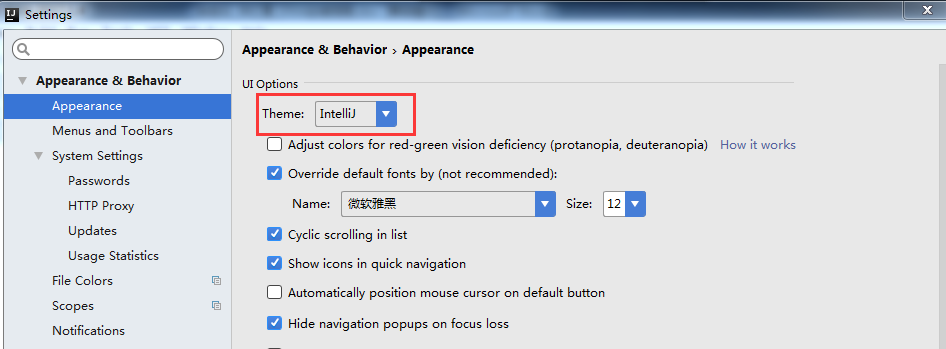
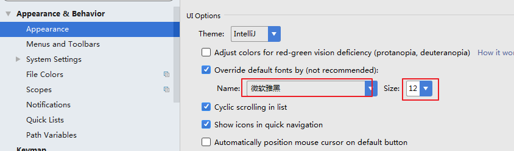
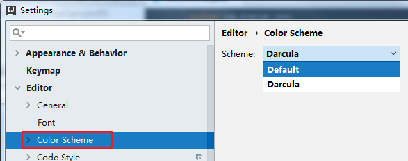
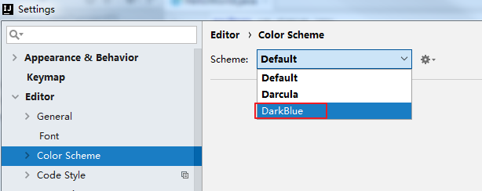
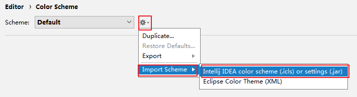
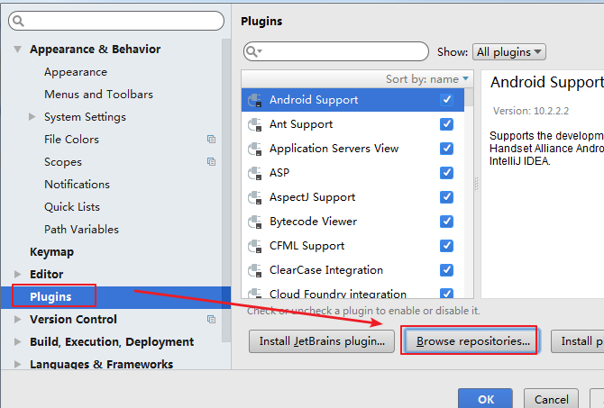

1.1 设置主题

1.2 设置窗体及菜单的字体及字体大小 ( 可忽略)

1.3 补充: 设置编辑区主题 ( 可忽略)

1.4 补充: 通过插件(plugins) 更换主题

# 1.1 设置主题

# 

这里默认提供了三套主题：IntelliJ，Darcula，Windows。这里可以根据自己的喜

好进行选择。

---

# 1.2 设置窗体及菜单的字体及字体大小 ( 可忽略)

# 

---

# 1.3 补充: 设置编辑区主题 ( 可忽略)

IDEA 默认提供了两个编辑区主题，可以通过如下的方式进行选择。

 如果想要更多的主题效果的话，可以到如下的网站下载：

http://www.riaway.com/

 下载以后，导入主题：（方式一）

file –> import setttings –> 选中下载的主题 jar 文件 –> 一路确认 –> 重启。

重启以后，新主题会自动启用。如果没有启用，可以如下方式选择：

 下载以后，导入主题：（方式二）

---

# 1.4 补充: 通过插件(plugins) 更换主题

喜欢黑色主题的话，还可以下载插件：Material Theme UI

点击按钮以后，在联网环境下搜索如下的插件-安装-重启 IDEA 即可：

如果对安装的主题插件不满意，还可以找到此插件，进行卸载 – 重启 IDEA 即

可。