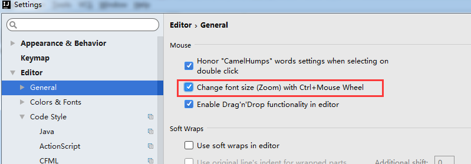
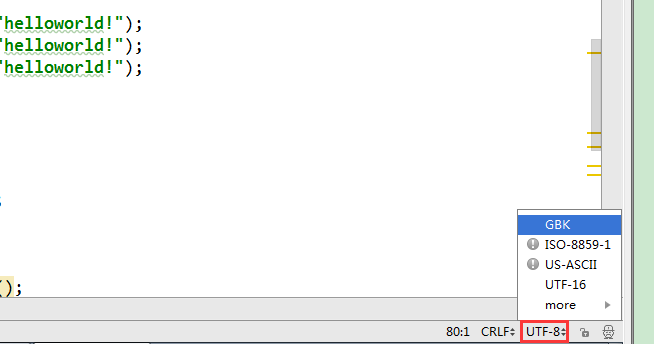

2.1 设置鼠标滚轮修改字体大小( 可忽略)

2.2

 设置鼠标悬浮提示

2.3 设置自动导包功能

2.4 设置显示行号和方法间的分隔符

2.5 忽略大小写提示

2.6 设置取消单行显示 tabs 的操作

3.1 设置默认 的 字体、字体大小、字体行间距

4.1 修改当前 主题的字体、字体大小、字体行间距( 可忽略)


4.2 修改当前 主题的 控制台输出的字体及字体大小( 可忽略)

4.3 修改代码 中 注释的字体颜色

5.1 设置超过指定 import 个数，改为* ( 可忽略)

6.1 修改类头的文档注释信息

7.1 设置项目文件编码

7.2 设置当前源文件的编码( 可忽略)

# 2.1 设置鼠标滚轮修改字体大小( 可忽略)




# 


我们可以勾选此设置后，增加 Ctrl + 鼠标滚轮 快捷键来控制代码字体大小显
示。


---

# 2.2


#  设置鼠标悬浮提示

---

# 2.3 设置自动导包功能


# 


 Add unambiguous imports on the fly：自动导入不明确的结构


 Optimize imports on the fly：自动帮我们优化导入的包


---

# 2.4 设置显示行号和方法间的分隔符


# 


 如上图红圈所示，可以勾选 Show line numbers：显示行数。我建议一般这个
要勾选上。


 如上图红圈所示，可以勾选 Show method separators： 显示方法分隔线。这
种线有助于我们区分开方法，所以建议勾选上。


---

# 2.5 忽略大小写提示


# 


 IntelliJ IDEA 的代码提示和补充功能有一个特性：区分大小写。如上图标注所
示，默认就是 First letter 区分大小写的。


 区分大小写的情况是这样的：比如我们在 Java 代码文件中输入 stringBuffer，
IntelliJ IDEA 默认是不会帮我们提示或是代码		补充的，但是如果我们输入
StringBuffer 就可以进行代码提示和补充。


 如果想不区分大小写的话，改为 None 选项即可。


---

# 2.6 设置取消单行显示 tabs 的操作


# 


如上图标注所示，在打开很多文件的时候，IntelliJ IDEA 默认是把所有打开的文


件名 Tab 单行显示的。但是我个人现在的习惯是使用多行，多行效率比单行高，


因为单行会隐藏超过界面部分 Tab，这样找文件不方便。


---

# 3.1 设置默认 的 字体、字体大小、字体行间距


# 


---

# 4.1 修改当前 主题的字体、字体大小、字体行间距( 可忽略)


如果当前主题不希望使用默认字体、字体大小、字体行间距，还可以单独设置：


---

## 4.2 修改当前 主题的 控制台输出的字体及字体大小( 可忽略)


## 


 


---

# 4.3 修改代码 中 注释的字体颜色


# 


 Doc Comment – Text：修改文档注释的字体颜色


 Block comment：修改多行注释的字体颜色


 Line comment：修改当行注释的字体颜色


---

# 5.1 设置超过指定 import 个数，改为* ( 可忽略)


---

# 6.1 修改类头的文档注释信息


# 


```javascript
/**
@author shkstart
@create ${YEAR}-${MONTH}-${DAY} ${TIME}
*/
```

常用的预设的变量，这里直接贴出官网给的：


```javascript
${PACKAGE_NAME} - the name of the target package where the new class or interface will be created.
${PROJECT_NAME} - the name of the current project.
${FILE_NAME} - the name of the PHP file that will be created.
${NAME} - the name of the new file which you specify in the New File dialog box during the file creation.
${USER} - the login name of the current user.
${DATE} - the current system date.
${TIME} - the current system time.
${YEAR} - the current year.
${MONTH} - the current month.
${DAY} - the current day of the month.
${HOUR} - the current hour.
${MINUTE} - the current minute.
${PRODUCT_NAME} - the name of the IDE in which the file will be created.
${MONTH_NAME_SHORT} - the first 3 letters of the month name. Example: Jan, Feb, etc.
${MONTH_NAME_FULL} - full name of a month. Example: January, February, etc.
```


---

# 7.1 设置项目文件编码


# 


说明：Transparent native-to-ascii conversion 主要用于转换 ascii，一般都要勾选，
不然 Properties 文件中的注释显示的都不会是中文。


---

# 7.2 设置当前源文件的编码( 可忽略)




# 


对单独文件的编码修改还可以点击右下角的编码设置区。如果代码内容中包含中


文，则会弹出如上的操作选择。其中：


①Reload 表示使用新编码重新加载，新编码不会保存到文件中，重新打开此文
件，旧编码是什么依旧还是什么。


②Convert 表示使用新编码进行转换，新编码会保存到文件中，重新打开此文件，
新编码是什么则是什么。


③含有中文的代码文件，Convert 之后可能会使中文变成乱码，所以在转换成请
做好备份，不然可能出现转换过程变成乱码，无法还原。

