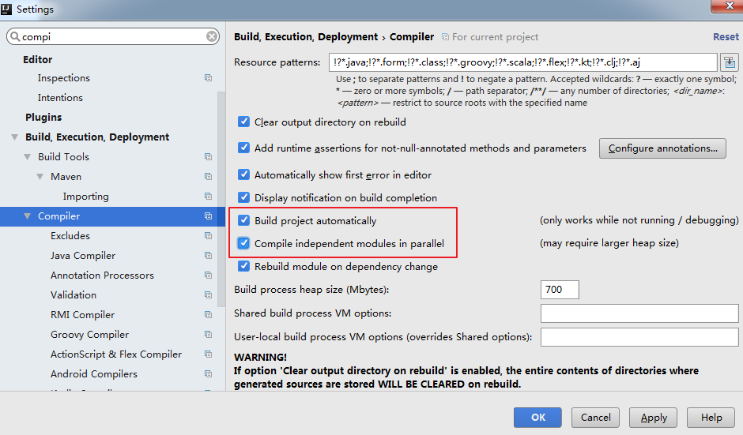
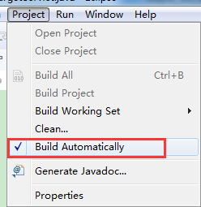
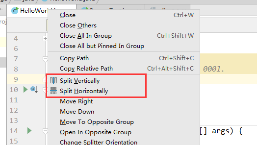

8.1 设置自动编译

9. 设置为省电模式 ( 可忽略)

10. 设置代码水平

# 8.1 设置自动编译

# 

 构建就是以我们编写的 java 代码、框架配置文件、国际化等其他资源文件、
JSP 页面和图片等资源作为“原材料”，去“生产”出一个可以运行的项目的
过程。

 Intellij Idea 默认状态为不自动编译状态，Eclipse 默认为自动编译：

很多朋友都是从 Eclipse 转到 Intellij 的，这常常

导致我们在需要操作 class 文件时忘记对修改后

的 java 类文件进行重新编译，从而对旧文件进

行了操作。

 

---

# 9. 设置为省电模式 ( 可忽略)

如上图所示，IntelliJ IDEA 有一种叫做 省电模式 的状态，开启这种模式之后
IntelliJ IDEA 会关掉代码检查和代码提示等功能。所以一般也可认为这是一种 阅
读模式，如果你在开发过程中遇到突然代码文件不能进行检查和提示，可以来看
看这里是否有开启该功能。

---

# 10. 设置代码水平

