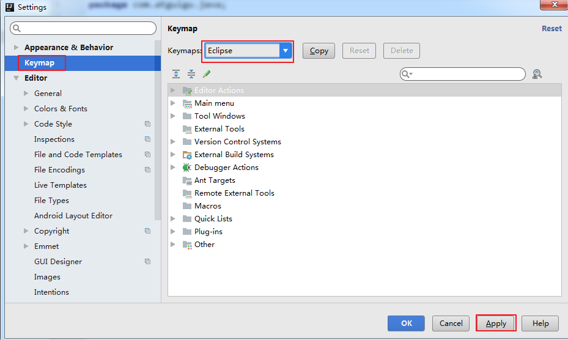
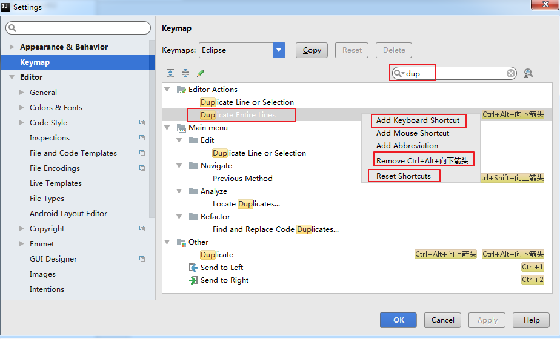
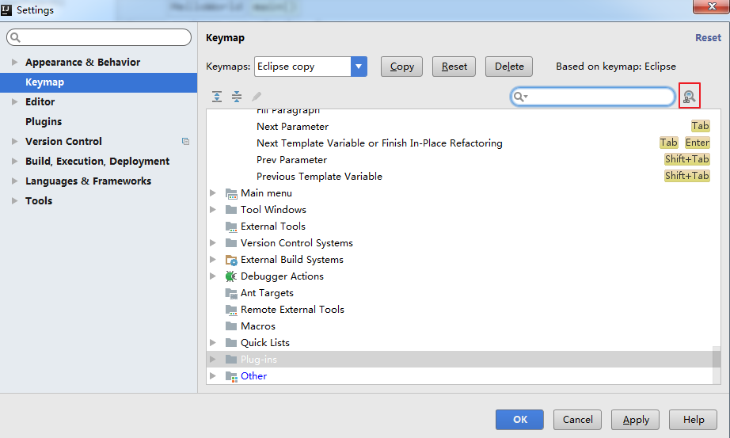
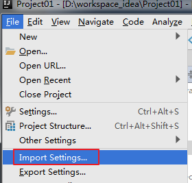
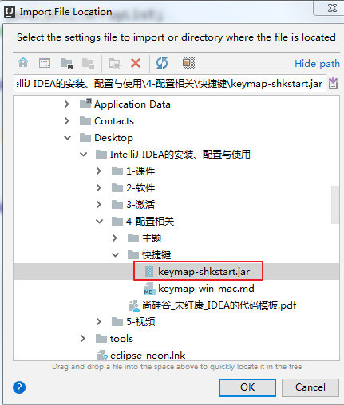
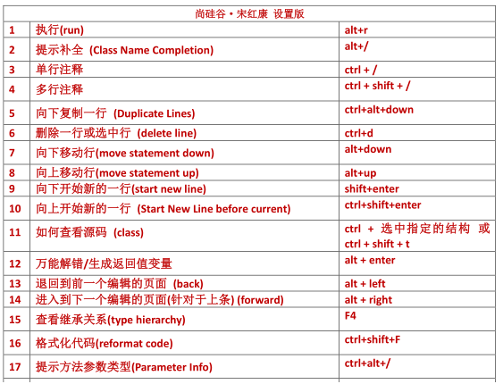
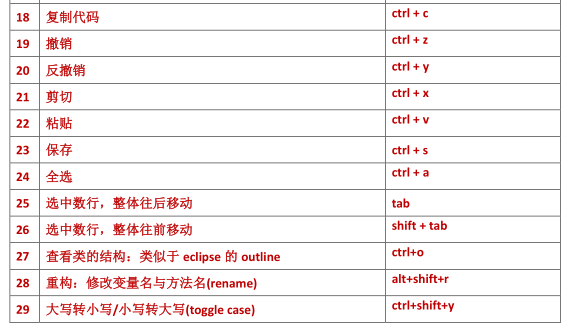
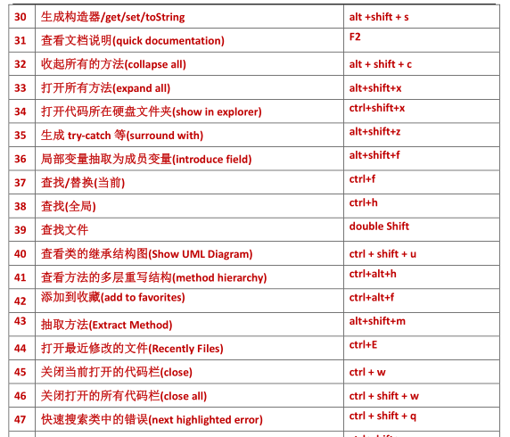

1、 设置快捷为 Eclipse 的快捷键

2. 通过 快捷键功能 修改快捷键设置

3. 通过指定快捷键， 查看或修改 其 功能

4. 导入已有的设置

# 1、 设置快捷为 Eclipse 的快捷键

# 

# 2. 通过 快捷键功能 修改快捷键设置

# 

# 3. 通过指定快捷键， 查看或修改 其 功能

# 

# 4. 导入已有的设置

# 

点击 0K 之后，重启 IDEA 即可。

5. 

