1.Live Templates( 实时 代码模板) 功能 介绍


2. 已有 的常用模板


2.1 psvm : 可生成 main 方法


2.2 sout : System.out.println() 快捷输出


2.3 fori : 可生成 for 循环


2.4 list.for : 可生成集合 list 的 的 for 循环


2.5 ifn ：可生成 if(xxx = null)


2.6 prsf ：可生成 private static final


3.修改现有模板 修改现有模板:Live Templates


4.自定义模板 自定义模板


# 1.Live Templates( 实时 代码模板) 功能 介绍


它的原理就是配置一些常用代码字母缩写，在输入简写时可以出现你预定义的固


定模式的代码，使得开发效率大大提高，同时也可以增加个性化。最简单的例子


就是在 Java 中输入 sout 会出现 System.out.println();


官方介绍 Live Templates：


https://www.jetbrains.com/help/idea/using-live-templates.html


---

# 2. 已有 的常用模板


Postfix Completion 默认如下：

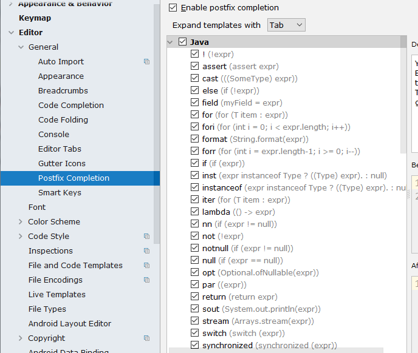


Live Templates 默认 如 下 ：

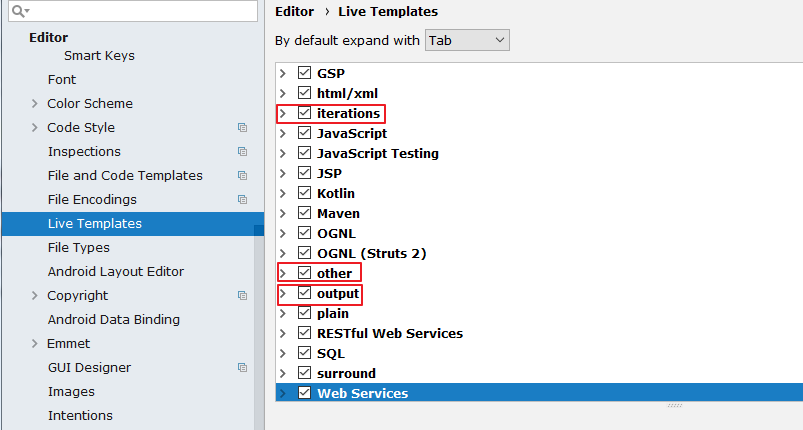


 


二者的区别：Live Templates 可以自定义，而 Postfix Completion 不可以。同时，


有些操作二者都提供了模板，Postfix Templates 较 Live Templates 能快 0.01 秒


举例 ：


## 2.1 psvm : 可生成 main 方法


## 2.2 sout : System.out.println() 快捷输出


类似的：


```javascript
soutp=System.out.println("方法形参名 = " + 形参名);
soutv=System.out.println("变量名 = " + 变量);
soutm=System.out.println("当前类名.当前方法");
“abc”.sout => System.out.println("abc");
```

## 2.3 fori : 可生成 for 循环


类似的：


```javascript
iter：可生成增强 for 循环
itar：可生成普通 for 循环
```

## 2.4 list.for : 可生成集合 list 的 的 for 循环


```javascript
List<String> list = new ArrayList<String>();
输入: list.for 即可输出
for(String s:list){
}
又如：list.fori 或 list.forr
```

## 2.5 ifn ：可生成 if(xxx = null)


类似的：


```javascript
inn：可生成 if(xxx != null) 或 xxx.nn 或 xxx.null
```

## 2.6 prsf ：可生成 private static final


类似的：


```javascript
psf：可生成 public static final
psfi：可生成 public static final int
psfs：可生成 public static final String
```


---

# 3.修改现有模板 修改现有模板:Live Templates


如果对于现有的模板，感觉不习惯、不适应的，可以修改：


修改 1 ：


通过调用 psvm 调用 main 方法不习惯，可以改为跟 Eclipse 一样，使用 main 调取。

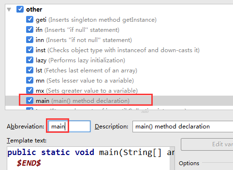


修改 2 ：

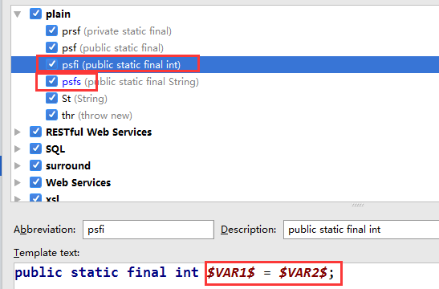


类似的还可以修改 psfs。


---

# 4.自定义模板 自定义模板


IDEA 提供了很多现成的 Templates。但你也可以根据自己的需要创建新的


Template。

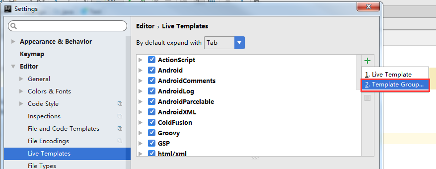


先定义一个模板的组：

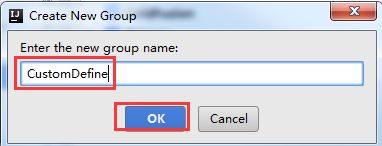


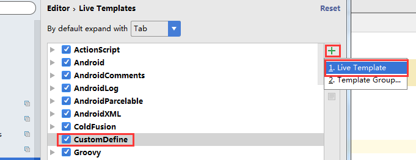

选中自定义的模板组，点击”+”来定义模板。

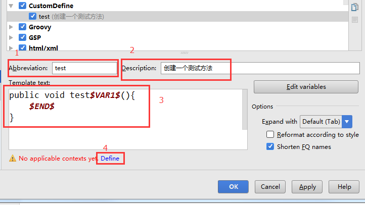


1. Abbreviation:模板的缩略名称


2. Description:模板的描述


3. Template text:模板的代码片段


4. 应用范围。比如点击 Define。选择如下：

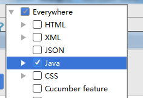


可以如上的方式定义个测试方法，然后在 java 类文件中测试即可。


类似的可以再配置如下的几个 Template:

1.

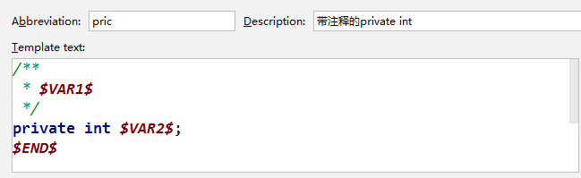

2.

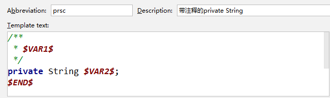

