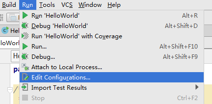
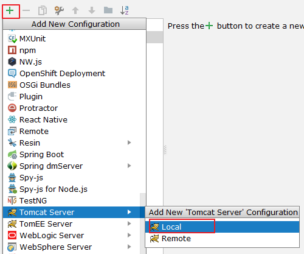
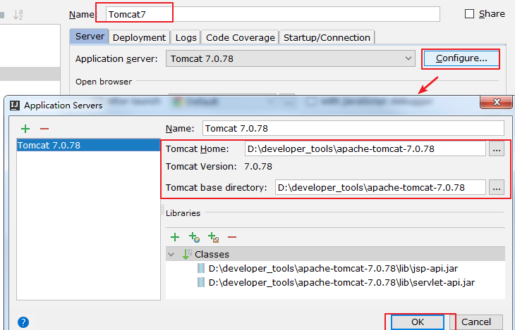
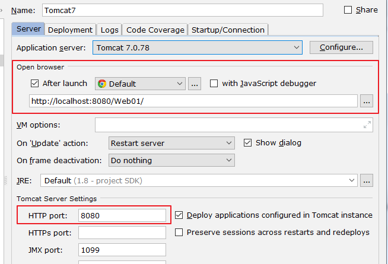
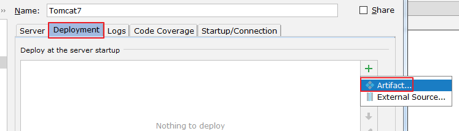
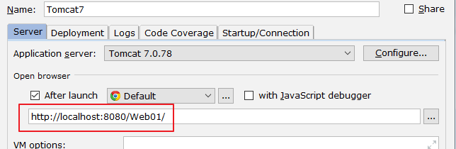
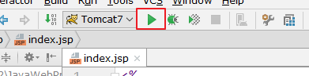
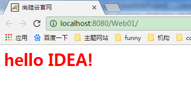
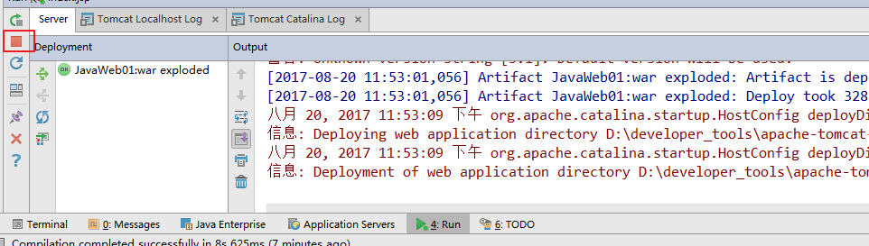

2.2 配置 Tomcat

# 2.2 配置 Tomcat

在 IDEA 中配置 Tomcat 之前，需要保证已经安装并配置了 Tomcat 的环境变量。

如果没有安装并配置，可以参考《尚硅谷_宋红康_Tomcat 快速部署.pdf》,配置完

成以后，在命令行输入：catalina run 。能够启动 tomcat，则证明安装配置成功。

下面看如何在 IDEA 中配置：

点击 Edit Configurations：

这里选择 TomEE Server 或者 Tomcat Server 都可以。接着选择 Local。

这里配置 Tomcat 的名称以及配置应用服务器的位置。根据自己 Tomcat 的安装位

置决定。

其它位置使用默认值(设置要启动的浏览器以及端口号)，如上。

接着部署：

点击 OK 即可。此时：

执行刚才创建的 index.jsp 即可：

效果如下：

注意事项：

显示运行以后的 Tomcat 的信息：

可以点击红框，刚点击完毕并不能马上关闭服务器，只是断开了与服务器的连接，

稍后当停止按钮显示为灰色，才表示关闭。