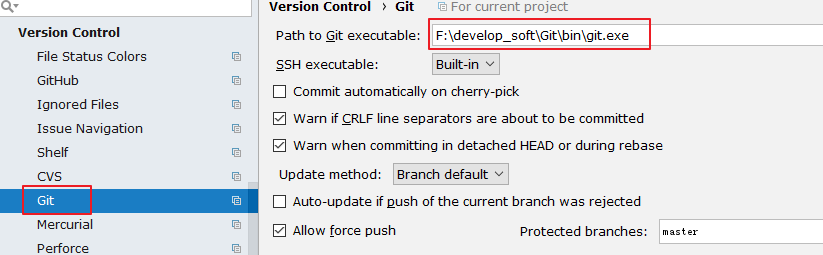

不管是个人开发还是团队开发，版本控制都会被使用。而 IDEA 也很好的集成了


版本控制的相关结构。


 很多人认为 IntelliJ IDEA 自带了 SVN 或是 Git 等版本控制工具，认为只
要安装了 IntelliJ IDEA 就可以完全使用版本控制应有的功能。这完全是一种
错误的解读，IntelliJ IDEA 是自带对这些版本控制工具的插件支持，但是该
装什么版本控制客户端还是要照样装的。


 IntelliJ IDEA 对版本控制的支持是以插件化的方式来实现的。旗舰版默认支
持目前主流的版本控制软件：CVS、Subversion（SVN）、Git、Mercurial、
 IntelliJ IDEA 的安装 、 配置 与使用
Perforce、TFS。又因为目前太多人使用 Github 进行协同或是项目版本管理，
所以 IntelliJ IDEA 同时自带了 Github 插件，方便 Checkout 和管理你的
Github 项目。


 在实际开发中，发现在 IDEA 中使用 SVN 的经历不算愉快，经常会遇到很多
问题，比如紧急情况下 IDEA 无法更新、提交等。所以这里，谈下在 IDEA
中使用 Git。


---

# 1. 提前好 安装好 Git 的客户端


Git 的 msysGit 官网下载：https://git-scm.com/


Git 客户端 TortoiseGit 官网下载：http://download.tortoisegit.org/tgit/


---

# 2. 关联 git.exe



# 


---

# 3. 关联 GitHub 上 的 账户 ，并测试 连接


# 


---

# 4.在 在 GitHub 上 创建 账户 下的一个新的仓库作为测试：


# 


---

# 5. 支持从当前的 登录的 Github 账号接 上直接 Checkout 项目


# 


# 6.在 在 IDEA 中 中 clone GitHub 上 的仓库：


# 


这里需要在 GitHub 的自己的账户下，复制项目仓库路径，填写到上图 Git


Repository URL 中。如下：


# 7. 连接成功以后载 ，会下载 github 上 的项目


# 


根据自己的需要，选择本窗口，还是开启一个新的窗口。


---

# 8. 除此 之外，还可以通过 如下接 的方式连接 GitHub


# 


# 9. 本地到 代码分享到 GitHub


此时会在 GitHub 上创建一个新的仓库，而非更新已经存在的仓库。


---

# 10.Git 的 常用操作


# 


```javascript
clone：拷贝远程仓库
commit：本地提交
push：远程提交
pull：更新到本地
```


---

# 11. 没有用 使用 Git 时本地历史记录的查看


# 


即使我们项目没有使用版本控制功能，IntelliJ IDEA 也给我们提供了本地文件历


史记录。