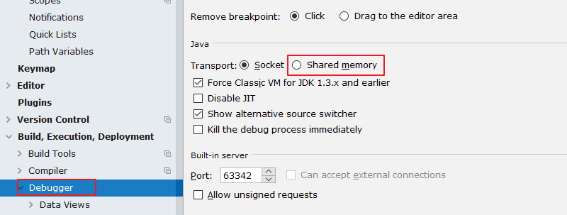
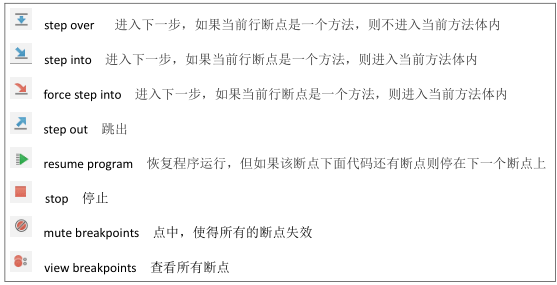
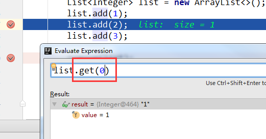

# 1. Debug 的设置

# 

设置 Debug 连接方式，默认是 Socket。Shared memory 是 Windows 特有的一
个属性，一般在 Windows 系统下建议使用此设置，内存占用相对较少。

---

# 2. 常用断点 调试 快捷键

对于常用的 Debug 的快捷键，需要大家熟练掌握。

---

# 3. 条件断点

说明 ：

调试的时候，在循环里增加条件判断，可以极大的提高效率，心情也能愉悦。

具体操作 ：

在断点处右击调出条件断点。可以在满足某个条件下，实施断点。

查看表达式的值(Ctrl + u) ：

选择行，ctrl + u。还可以在查看框中输入编写代码时的其他方法：

