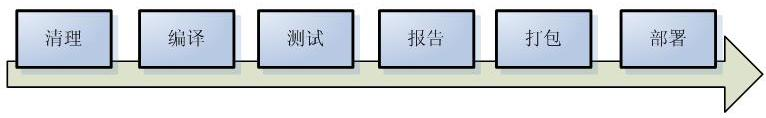
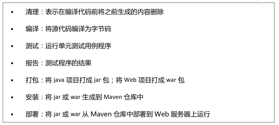
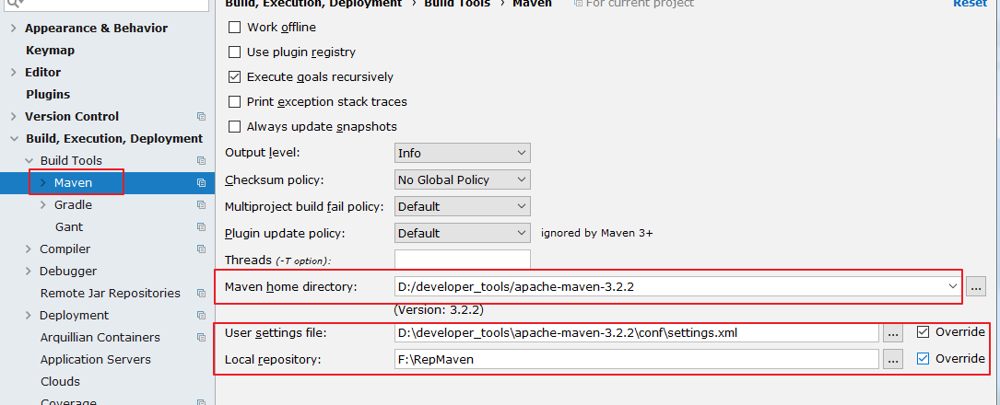
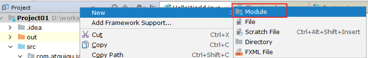
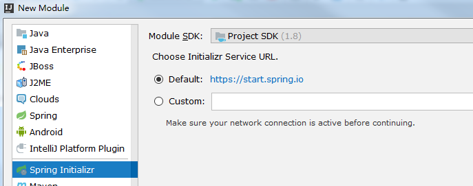
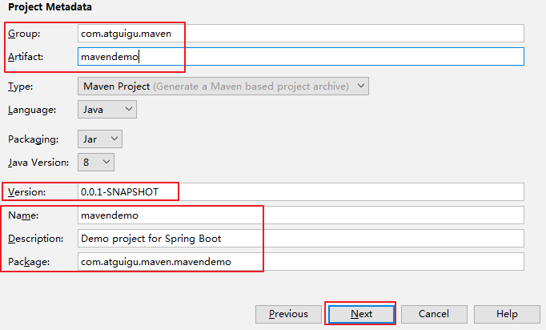
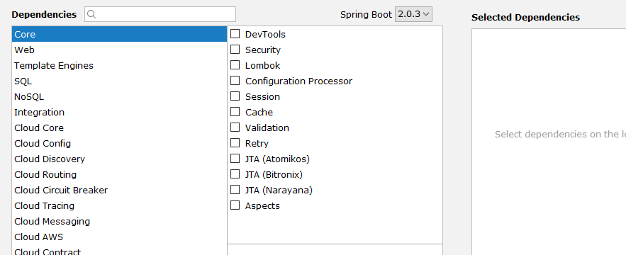
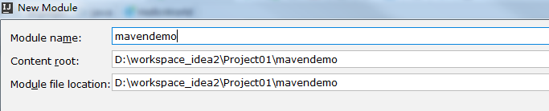
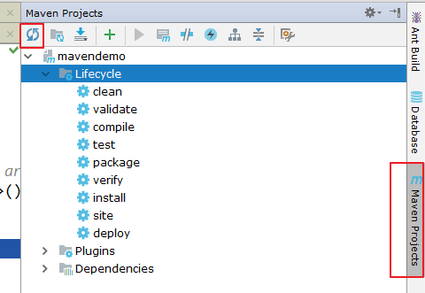
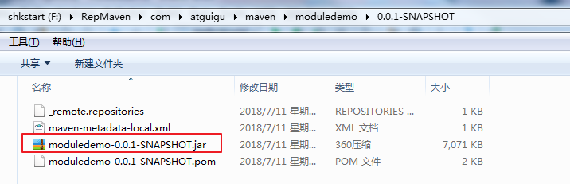

# 1. Maven 的 介绍

# 

Make -> Ant -> Maven -> Gradle

Maven 是 Apache 提供的一款自动化构建工具，用于自动化构建和依赖管理。

开发团队基本不用花多少时间就能自动完成工程的基础构建配置，因为 Maven

 IntelliJ IDEA 的安装 、 配置 与使用

使用了一个标准的目录结构和一个默认的构建生命周期。在如下环节中，Maven

使得开发者工作变得更简单。

构建环节：

---

# 2. Maven 的配置

maven 的下载 – 解压 – 环境变量的配置这里就赘述了，需要的参考 1-课件
中的《Maven 的配置》。下面直接整合 Maven。选择自己 Maven 的目录，和 settings
文件，然后配置自己的仓库 reposiroty。

 Maven home directory：可以指定本地 Maven 的安装目录所在，因为我已经配置了
M2_HOME 系统参数，所以直接这样配置 IntelliJ IDEA 是可以找到的。但是假如你没有配
置的话，这里可以选择你的 Maven 安装目录。此外，这里不建议使用 IDEA 默认的。

 User settings file / Local repository：我们还可以指定 Maven 的 settings.xml 位置和本地仓
库位置。

 Import Maven projects automatically：表示 IntelliJ IDEA 会实时监控项目的 pom.xml 文件，
进行项目变动设置。

 Automatically download：在 Maven 导入依赖包的时候是否自动下载源码和文档。默认是
没有勾选的，也不建议勾选，原因是这样可以加快项目从外网导入依赖包的速度，如果我
们需要源码和文档的时候我们到时候再针对某个依赖包进行联网下载即可。IntelliJ IDEA
支持直接从公网下载源码和文档的。

 VM options for importer：可以设置导入的 VM 参数。一般这个都不需要主动改，除非项
目真的导入太慢了我们再增大此参数。

---

# 3. 创建对应的 的 Module

# 

举例：此时 Spring Initalizr 是 springboot 工程的模板。

Group：组织或公司域名，倒序

Artifact：项目模块名称

Version：默认 maven 生成版本：0.0.1-SNAPSHOT

这里可以暂时先不选，后面开发需要了再进行设置。

点击 finish 即可完成创建。

创建完成以后，可以在 IDEA 右边看到创建的 Module。如果没有，可以刷新一下。
目录下也会有对应的生命周期。其中常用的是：clean、compile、package、install。

比如这里install，如果其他项目需要将这里的模块作为依赖使用，那就可以install。
安装到本地仓库的位置。

其他操作这里不再赘述。