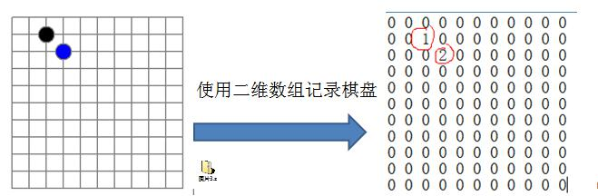
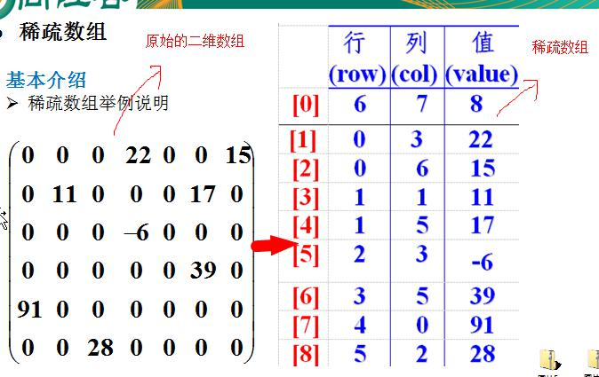
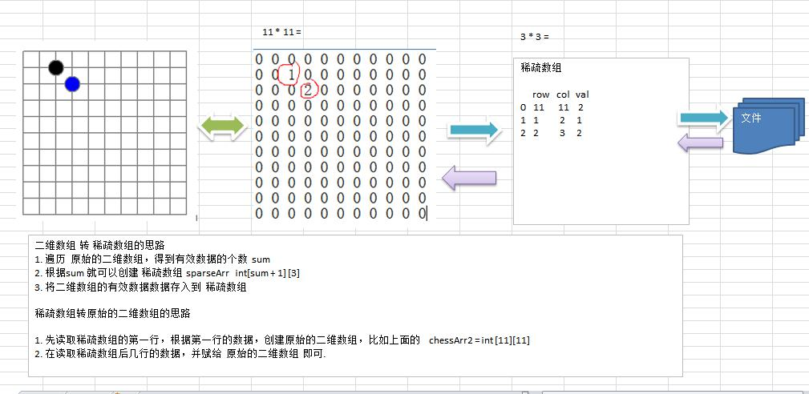

# 3.1 稀疏 sparsearray 数组


## 3.1.1先看一个实际的需求


 编写的五子棋程序中，有存盘退出和续上盘的功能。




 分析问题:


因为该二维数组的很多值是默认值 0, 因此记录了 很多没有意义的数据.-> 稀疏数组。


## 3.1.2基本介绍


当一个数组中大部分元素为０，或者为同一个值的数组时，可以使用稀疏数组来保存该数组。


- 稀疏数组的处理方法是:


1) 记录数组 一共有几行几列，有多少个不同的值


2) 把具有不同值的元素的行列及值记录在一个小规模的数组中，从而 缩小程序的规模


 稀疏数组举例说明




## 3.1.3应用实例


1) 使用稀疏数组，来保留类似前面的二维数组(棋盘、地图等等)


2) 把稀疏数组存盘，并且可以从新恢复原来的二维数组数


3) 整体思路分析




## 代码实现：

```javascript
package com.sparsearray;

public class SparseArray {
    public static  void main(String args[]){
        int chessArr1[][]=new int[11][11];
        chessArr1[1][2]=1;
        chessArr1[2][3]=2;
        System.out.println("原始二维数组");
        for(int[] row:chessArr1){
            for(int item:row){
                System.out.printf("%d\t",item);
            }
            System.out.println();
        }
        //将二维数据转化为稀疏数组
        int sum=0;
        for(int i=0;i<11;i++){
            for (int j=0;j<11;j++){
                if(chessArr1[i][j]!=0){
                    sum++;
                }
            }
        }
        //创建对应的二维数组
        int sparseArr[][]=new int[sum+1][3];
        sparseArr[0][0]=11;
        sparseArr[0][1]=11;
        sparseArr[0][2]=sum;

        //遍历二维数组
        int count=0;
        for(int i=0;i<11;i++){
            for (int j=0;j<11;j++){
                if(chessArr1[i][j]!=0){
                  count++;
                  sparseArr[count][0]=i;
                  sparseArr[count][1]=j;
                  sparseArr[count][2]=chessArr1[i][j];
                }
            }
        }

        //输出稀疏数组的形式
        System.out.println();
        System.out.println("得到的稀疏数组");
        for(int i=0;i<sparseArr.length;i++){
            System.out.printf("%d\t%d\t%d\t\n",sparseArr[i][0],sparseArr[i][1],sparseArr[i][2]);
        }
        System.out.println();

        //将稀疏数组恢复成原始的二维素组；
        int chessArr2[][]=new int[sparseArr[0][0]][sparseArr[0][1]];

        for(int i=1;i<sparseArr.length;i++){
            chessArr2[sparseArr[i][0]][sparseArr[i][1]]=sparseArr[i][2];
        }

        System.out.println();
        System.out.println("输出恢复的二维数组");
        for(int [] row:chessArr2 ){
            for(int item:row){
                System.out.printf("%d\t",item);
            }
            System.out.println();
        }
    }
}

```


## 运行结果：

```javascript
原始二维数组
0	0	0	0	0	0	0	0	0	0	0	
0	0	1	0	0	0	0	0	0	0	0	
0	0	0	2	0	0	0	0	0	0	0	
0	0	0	0	0	0	0	0	0	0	0	
0	0	0	0	0	0	0	0	0	0	0	
0	0	0	0	0	0	0	0	0	0	0	
0	0	0	0	0	0	0	0	0	0	0	
0	0	0	0	0	0	0	0	0	0	0	
0	0	0	0	0	0	0	0	0	0	0	
0	0	0	0	0	0	0	0	0	0	0	
0	0	0	0	0	0	0	0	0	0	0	

得到的稀疏数组
11	11	2	
1	2	1	
2	3	2	


输出恢复的二维数组
0	0	0	0	0	0	0	0	0	0	0	
0	0	1	0	0	0	0	0	0	0	0	
0	0	0	2	0	0	0	0	0	0	0	
0	0	0	0	0	0	0	0	0	0	0	
0	0	0	0	0	0	0	0	0	0	0	
0	0	0	0	0	0	0	0	0	0	0	
0	0	0	0	0	0	0	0	0	0	0	
0	0	0	0	0	0	0	0	0	0	0	
0	0	0	0	0	0	0	0	0	0	0	
0	0	0	0	0	0	0	0	0	0	0	
0	0	0	0	0	0	0	0	0	0	0	

Process finished with exit code 0

```

