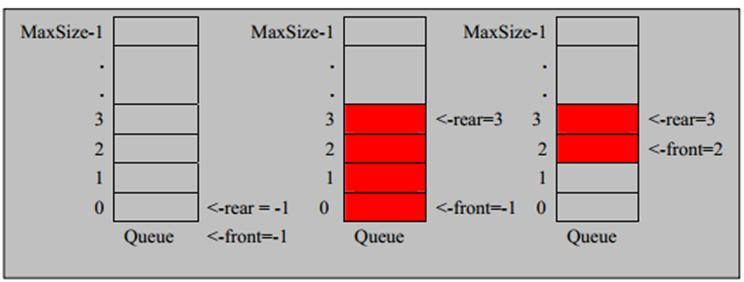

# 1、队列介绍


1) 队列是一个 有序列表，可以用 数组或是 链表来实现。


2) 遵循 先入先出的原则。即： 先存入队列的数据，要先取出。后存入的要后取出


3) 示意图：(使用数组模拟队列示意图)




数组模拟队列思路


 队列本身是有序列表，若使用数组的结构来存储队列的数据，则队列数组的声明如下图, 其中 maxSize 是该队
列的最大容量。


 因为队列的输出、输入是分别从前后端来处理，因此需要两个变量 front 及 rear 分别记录队列前后端的下标，
front 会随着数据输出而改变，而 rear 则是随着数据输入而改变，如图所示:


 当我们将数据存入队列时称为”addQueue”，addQueue 的处理需要有两个步骤：思路分析


1) 将尾指针往后移：rear+1 , 当 front == rear 【空】


2) 若尾指针 rear 小于队列的最大下标 maxSize-1，则将数据存入 rear 所指的数组元素中，否则无法存入数据。
rear == maxSize - 1[队列满]


代码实现：

```javascript
package com.queue;

import java.util.Scanner;

/*
 *使用数组模拟队列
 */
class ArrayQueue{
    private int maxSize;    //数组的最大容量
    private int front;      //队头
    private int rear;       //队尾
    private int[] arr;      //该数组用于存放数据

    public ArrayQueue(int arrmaxSize){
        maxSize=arrmaxSize;
        arr=new int[maxSize];
        front=-1;       //指向队头的前一个位置
        rear=-1;        //指向队尾
    }

    public boolean isFull(){
        return rear==maxSize-1;     //判断是否队满；
    }
    public boolean isEmpty(){
        return rear==front;         //判断是否队空
    }
    //入队
    public void addQueue(int n){
        if(isFull()){
            System.out.println("队满，入队失败");
        }
        rear++;
        arr[rear]=n;
    }
    //出队
    public int getQueue(){
        if(isEmpty()){
           throw new RuntimeException("队列空，出队失败");
        }

        front++;
        return  arr[front];
    }

    //显示数据的所有数据
    public void showQueue(){
        //便利数组
        if(isEmpty()){
            System.out.println("对空，没有数据");
        }
        for(int i=front+1;i<=rear;i++){
            System.out.printf("arr[%d]=%d\n",i,arr[i]);
        }
    }
    //显示队头的数据，注意不是取出数据
    public int headQueue(){
        if(isEmpty()){
            throw  new RuntimeException("对空，没有数据");
        }
        return arr[front+1];
    }
}

public class ArrayQueueDemo {
      public static void main(String args[]){
             ArrayQueue aq=new ArrayQueue(10);
             char key;  //接收用户输入
          Scanner scanner=new Scanner(System.in);
          boolean loop=true;
          //输出菜单
          while(loop){
              System.out.println("s(show):显示队列");
              System.out.println("e(exit):退出程序");
              System.out.println("a(add):添加数据");
              System.out.println("g(get):获取数据");
              System.out.println("h(head):查看队头数据");
              key=scanner.next().charAt(0); //接收一个字符
              switch (key){
                  case  's':
                      aq.showQueue();   break;
                  case 'a':
                      System.out.println("请输入一个数据");
                      int value=scanner.nextInt();
                      aq.addQueue(value);
                      break;
                  case 'g':
                      try{
                          int res=aq.getQueue();
                          System.out.printf("取出的数据是%d\n",res);
                      }catch (Exception e){
                          System.out.println(e.getMessage());
                      }
                      break;
                  case 'h':     //查看队头的数据
                      try{
                          int res=aq.headQueue();
                          System.out.printf("队头的数据是%d\n",res);
                      }catch (Exception e){
                          System.out.println(e.getMessage());
                      }
                      break;
                  case 'e': //退出
                      scanner.close();
                      loop=false;
                      break;
                   default:break;
              }
          }
          System.out.println("程序退出");
        }
}

```


