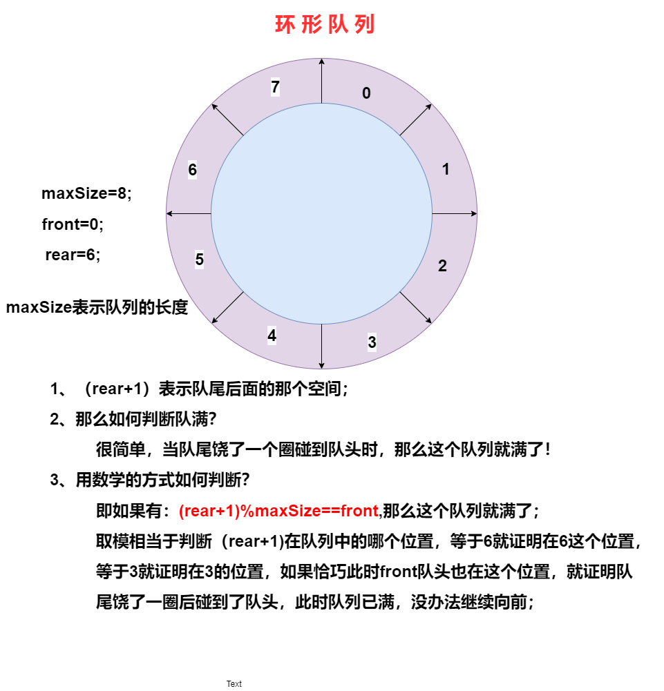

---

代码实现：

```javascript
package com.queue;

import java.util.Scanner;

/*
 *使用数组模拟队列
 */
class ArrayQueue1{
    private int maxSize;    //数组的最大容量
    private int front;      //队头
    private int rear;       //队尾
    private int[] arr;      //该数组用于存放数据

    public ArrayQueue1(int arrmaxSize){
        maxSize=arrmaxSize;
        arr=new int[maxSize];
        front=0;       //指向队头的前一个位置
        rear=0;        //指向队尾
    }

    public boolean isFull(){
        return (rear+1)%maxSize==front;    //判断是否队满；
    }
    public boolean isEmpty(){
        return rear==front;         //判断是否队空
    }
    //入队
    public void addQueue(int n){
        if(isFull()){
            System.out.println("队满，入队失败");
        }else {
            arr[rear] = n;
            rear = (rear + 1) % maxSize;
        }
    }
    //出队
    public void getQueue(){
        if(isEmpty()){
            throw new RuntimeException("队列空，出队失败");
        }else{
        System.out.printf("取出的数据是%d\n",arr[front]);
        front=(front+1)%maxSize;
        }

    }

    //显示数据的所有数据
    public void showQueue(){
        //便利数组
        if(isEmpty()){
            System.out.println("对空，没有数据");
        }else {
            for (int i = front; i <front+size(); i++) {
                System.out.printf("arr[%d]=%d\n", i % maxSize, arr[i % maxSize]);
            }
        }

    }

    //求出当前队列的有效个数
    public int size(){
        return (rear+maxSize-front)%maxSize;
    }
    //显示队头的数据，注意不是取出数据
    public int headQueue(){
        if(isEmpty()){
            throw  new RuntimeException("对空，没有数据");
        }
        return arr[front];
    }
}

public class CircleArrayQueue{
    public static void main(String args[]){
        ArrayQueue1 aq=new ArrayQueue1(4);
        char key;  //接收用户输入
        Scanner scanner=new Scanner(System.in);
        boolean loop=true;
        //输出菜单
        while(loop){
            System.out.println("s(show):显示队列");
            System.out.println("e(exit):退出程序");
            System.out.println("a(add):添加数据");
            System.out.println("g(get):获取数据");
            System.out.println("h(head):查看队头数据");
            key=scanner.next().charAt(0); //接收一个字符
            switch (key){
                case  's':
                    aq.showQueue();   break;
                case 'a':
                    System.out.println("请输入一个数据");
                    int value=scanner.nextInt();
                    aq.addQueue(value);
                    break;
                case 'g':
                    try{
                        aq.getQueue();

                    }catch (Exception e){
                        System.out.println(e.getMessage());
                    }
                    break;
                case 'h':     //查看队头的数据
                    try{
                        int res=aq.headQueue();
                        System.out.printf("队头的数据是%d\n",res);
                    }catch (Exception e){
                        System.out.println(e.getMessage());
                    }
                    break;
                case 'e': //退出
                    scanner.close();
                    loop=false;
                    break;
                default:break;
            }
        }
        System.out.println("程序退出");
    }
}


```

