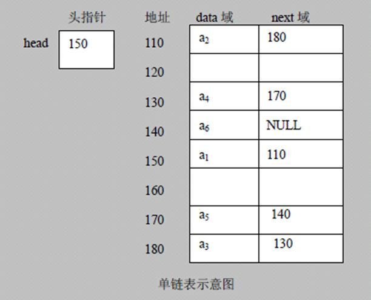
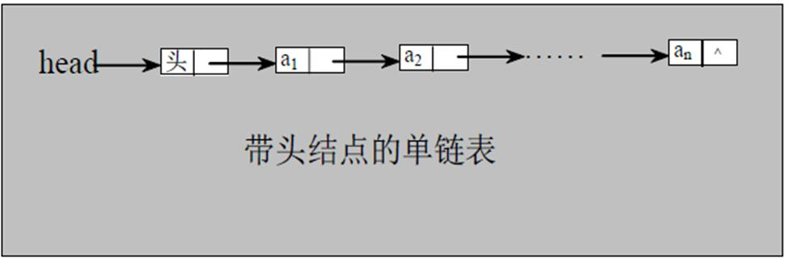
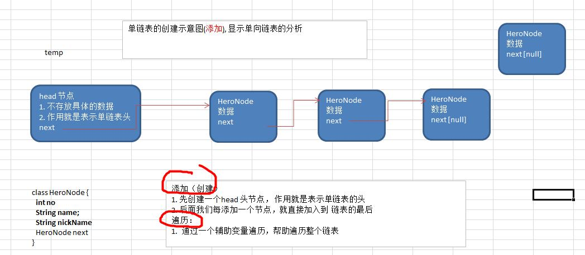
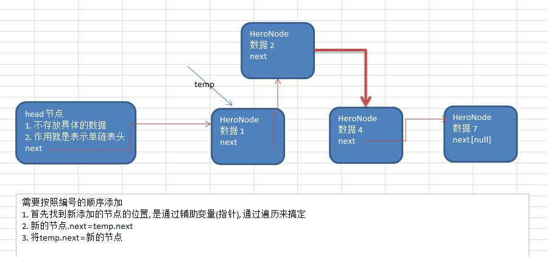
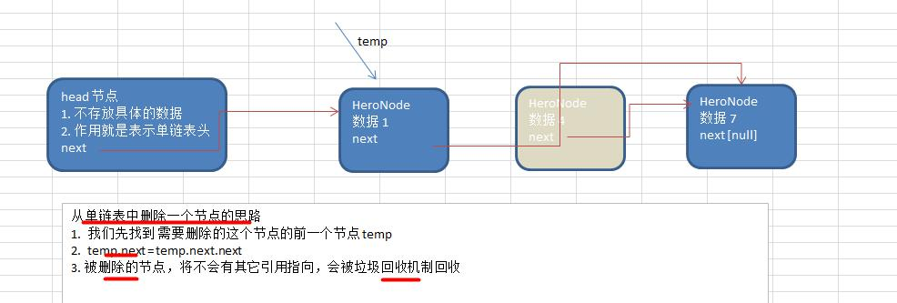

# 4.1 链表(Linked List)介绍


链表是有序的列表，但是它在内存中是存储如下




小结上图:


1) 链表是以节点的方式来存储, 是链式存储


2) 每个节点包含 data 域， next 域：指向下一个节点.


3) 如图：发现 链表的各个节点不一定是连续存储.


4) 链表分 带头节点的链表和 没有头节点的链表，根据实际的需求来确定


 单链表(带头结点) 逻辑结构示意图如下




---

# 4.2 单链表的应用实例


使用带 head 头的单向链表实现 –水浒英雄排行榜管理完成对英雄人物的增删改查操作， 注: 删除和修改,查找
可以考虑学员独立完成，也可带学员完成


## 1) 第一种方法在添加英雄时，直接添加到链表的尾部


思路分析示意图:




## 2) 第二种方式在添加英雄时， 根据排名将英雄插入到指定位置(如果有这个排名，则添加失败，并给出提示)


思路的分析示意图:




## 3) 修改节点功能


思路(1) 先找到该节点，通过遍历，(2) temp.name = newHeroNode.name ; temp.nickname= newHeroNode.nickname


## 4) 删除节点


思路分析的示意图:




5) 完成的代码演示:

```javascript
package com.linkedlist;


/*
 *定义一个heroNode
 */

class SingleLinkedList{
    //初始化头结点，有节点不能动；
    private HeroNode head=new HeroNode(0,"","");
    /*
     *添加节点到单项链表
     * 思路，当不考虑编号顺序时
     * 1、找到当前链表的最后节点
     * 2、将最后这个节点的next指向新的节点
     */
    public void add(HeroNode node){
        //因为head节点不能动，所以我们需要一个辅助便利temp
        HeroNode temp=head;
        while(true){
            if(temp.next==null){
                break;
            }
            temp=temp.next;
        }
        //当退出while循环时，temp就指向了链表的最后
        temp.next=node;
    }

    public  void addByOrder(HeroNode heroNode){
        HeroNode temp=head;
        boolean flag=false;
        while(true){
            if(temp.next==null){
                break;
            }
            if(temp.next.no>heroNode.no){
                break;
            }else if(temp.next.no==heroNode.no){
                flag=true;  //说明编号存在
                break;
            }
            temp=temp.next; //后移，遍历当前链表
        }
        if(flag){
            //不能添加，编号已经存在
            System.out.printf("准备插入的英雄的编号%d已经存在了，不能加入\n",heroNode.no);
        }else {
            //插入到链表中
            heroNode.next=temp.next;
            temp.next=heroNode;
        }
    }

    //根据编号修改节点信息
    public void update(HeroNode node){
        //判断是否为空
        if(head.next==null){
            System.out.println("链表为空");
            return;
        }
        HeroNode temp=head.next;
        boolean flag=false;
        while (true){
            if(temp==null){
                break;//链表已经遍历完
            }
            if(temp.no==node.no){
                flag=true;
                break;
            }
            temp=temp.next;
        }
        //根据flag判断是否找到要修改的节点
        if(flag){
            temp.name=node.name;
            temp.nickname=node.nickname;
        }else{
            System.out.printf("没有找编号%d到要修改的节点",node.no);
        }
    }

    //删除节点
    public  void del(int no){
        HeroNode temp=head;
        boolean flag=false;  //标识是否找到待删除的节点
        while(true){
            if(temp.next==null){
                break;
            }
            if(temp.next.no==no){
                flag=true;
                break;
            }
            temp=temp.next;
        }
        if(flag){
            temp.next=temp.next.next;
        }else{
            System.out.printf("要删除的%d的节点不存在",no);
        }
    }

    public void list(){
        //判断链表是否为空
        if(head.next==null){
            System.out.println("链表为空");
            return;
        }

        HeroNode temp=head.next;
        while(true){
            //判断是否到链表的最后
            if(temp==null){
                break;
            }
            System.out.println(temp);
            //将temp后移
            temp=temp.next;
        }
    }
}

class HeroNode{
    public int no;
    public String name;
    public String nickname;
    public HeroNode next;

    public HeroNode(int hno,String hName,String hNickname){
        this.no=hno;
        this.name=hName;
        this.nickname=hNickname;
        this.next=null;
    }

    //为了显示方便，我们重写toString

    @Override
    public String toString() {
        return "HeroNode{" +
                "no=" + no +
                ", name='" + name + '\'' +
                ", nickname='" + nickname + '\'' +
                '}';
    }
}


public class SingleLinkedListDemo {
      public static void main(String args[]){
            //进行测试；
            //先创建节点
          HeroNode hero1=new HeroNode(1,"宋江","及时雨");
          HeroNode hero2=new HeroNode(2,"卢俊义","玉麒麟 ");
          HeroNode heeo3=new HeroNode(3,"吴用","智多星");
          HeroNode heor4=new HeroNode(4,"林冲","豹子头");

          HeroNode newnode=new HeroNode(2,"小卢","小尾巴");
          SingleLinkedList list=new SingleLinkedList();
       /* list.add(hero1);
          list.add(hero2);
          list.add(heeo3);
          list.add(heor4);
          */
         list.addByOrder(hero1);
          list.addByOrder(heor4);
          list.addByOrder(heeo3);
          list.addByOrder(hero2);

          list.list();

          list.del(1);
          list.del(2);
          list.del(3);
          list.del(4);
          list.update(newnode);
          System.out.println("修改后的链表输出");
          list.list();
        }
}

```

