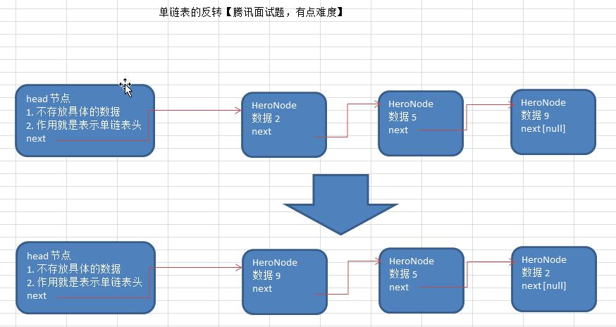
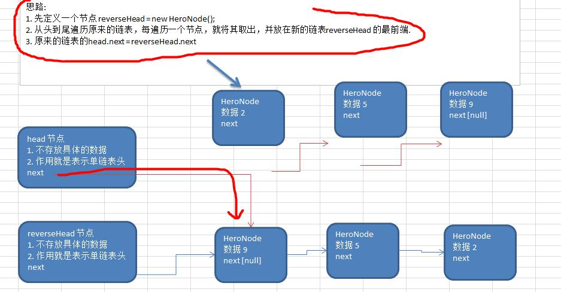
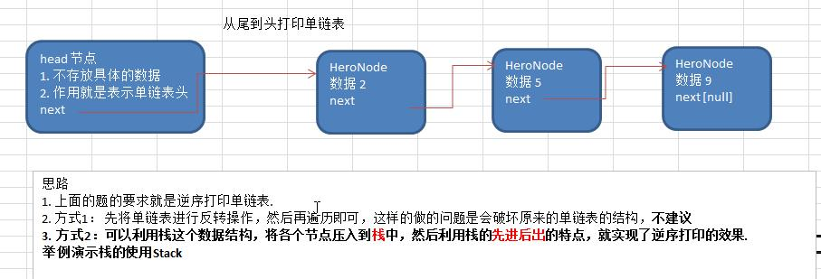

# 单链表的常见面试题有如下:


# 1) 求单链表中有效节点的个数

```javascript
/*
 *获取单链表的节点数（如果是头结点的链表，需要不统计头结点
 */
public static int getLength(HeroNode head){
    if(head.next==null){
        return  0;
    }
    int length=0;
    HeroNode cur=head.next;
    while (cur!=null){
        length++;
        cur=cur.next;
    }
    return length;
}

```

# 2) 查找单链表中的倒数第 k 个结点 【新浪面试题】

```javascript
/*
 *查找单链表的倒数第K个节点
 * 1、编写一个方法接收head节点，同时接收index
 * 2、index 表示是倒数第index个节点
 * 3、先把链表从头到尾遍历，得到链表的总的长度getLength
 * 4、得到size后，我们从链表的第一个开始遍历（size-index）个，就可以得到
 */
public static HeroNode findLastIndexNode(HeroNode head,int index){
    if(head.next==null){
        return  null; //没有找到
    }
    //第一次遍历得到链表的长度size
    int size=getLength(head);
    //第二次遍历size-index位置，就是我们倒数的第K个节点
    //先做一个index 的校验
    if(index<=0||index>size){
        return null;
    }
    HeroNode cur=head.next;
    for(int i=0;i<size-index;i++){
        cur=cur.next;
    }
    return cur;

}
```

# 3) 单链表的反转







```javascript
/*
 *将单链表进行反转
 */
public static void reverseList(HeroNode head){
    //如果当前节点我空或者只有一个节点，无需反转，直接返回
    if(head.next==null||head.next.next==null){
        return;
    }
    HeroNode cur=head.next;
    HeroNode next=null; //指向cur的下一个节点
    HeroNode reverseHead=new HeroNode(0,"","");
    while(cur!=null){
        next=cur.next;
        cur.next=reverseHead.next;
        reverseHead.next=cur;
        cur=next;
    }
    head.next=reverseHead.next;
}

```

# 4) 从尾到头打印单链表




```javascript
/*
 *逆序打印链表
 */
public static void reversePrint(HeroNode head){
    if(head==null){
        return;
    }
    Stack<HeroNode> stack=new Stack<HeroNode>();
    HeroNode cur=head.next;
    while (cur!=null){
        stack.push(cur);
        cur=cur.next;
    }
    while (stack.size()>0){
        System.out.println(stack.pop());
    }
}
```

