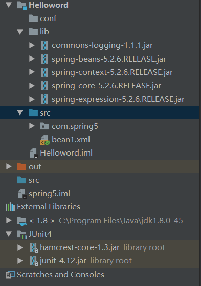
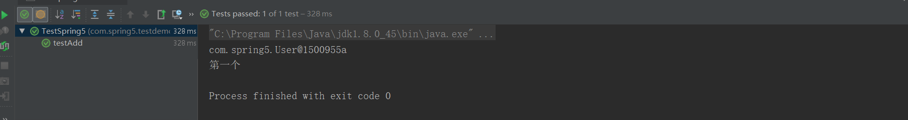

# 1、结构图





---


---

# 2、具体代码

## 1）User.java

```javascript
package com.spring5;

public class User {
    public void add(){
        System.out.println("第一个");
    }
}
```


---

## 2) bean1.xml

```javascript
<?xml version="1.0" encoding="UTF-8"?>
<beans xmlns="http://www.springframework.org/schema/beans"
       xmlns:xsi="http://www.w3.org/2001/XMLSchema-instance"
       xsi:schemaLocation="http://www.springframework.org/schema/beans http://www.springframework.org/schema/beans/spring-beans.xsd">
    <!--配置User对象创建-->
    <bean id="user" class="com.spring5.User"></bean>
</beans>
```


---

## 3)TestSpring5.java

```javascript
package com.spring5.testdemo;

import com.spring5.User;
import org.junit.Test;
import org.springframework.context.ApplicationContext;
import org.springframework.context.support.ClassPathXmlApplicationContext;

public class TestSpring5 {

    @Test
    public void testAdd(){
        //1、加载spring配置文件
        ApplicationContext context=new ClassPathXmlApplicationContext("bean1.xml");
        //2、获取配置创建的对象
        User user=context.getBean("user",User.class);
        System.out.println(user);
        user.add();
    }
}

```


---

## 4）运行结果





