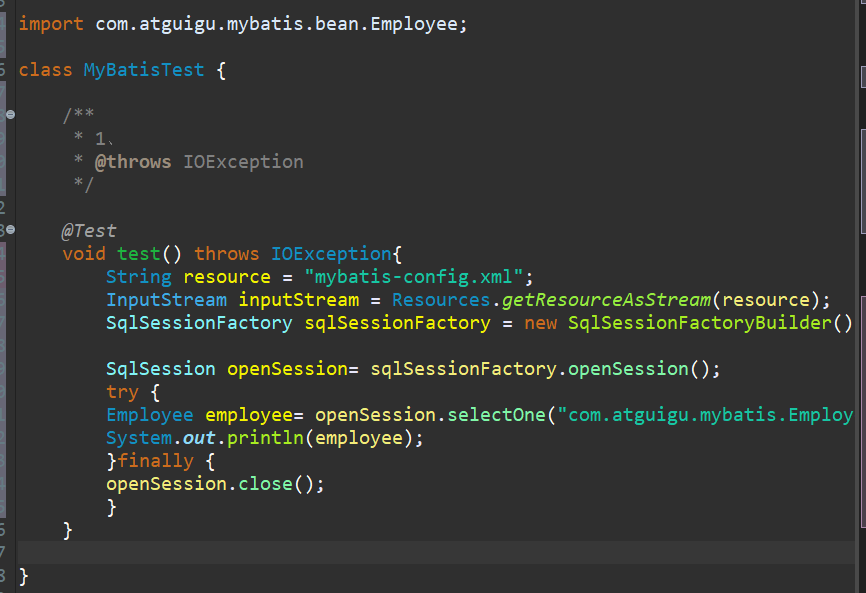

#  一、HelloWorld简单版


– 创建一张测试表


– 创建对应的javaBean

```javascript
package com.atguigu.mybatis.bean;

public class Employee {
	private Integer id;
	private String last_name;
	private String email;
	private String gender;
	
	 public void setId(Integer id) {
	        this.id = id;
	    }

	    public void setLast_name(String lastname) {
	        this.lastname = lastname;
	    }

	    public void setEmail(String email) {
	        this.email = email;
	    }

	    public void setGender(String gender) {
	        this.gender = gender;
	    }
	    public Integer getId() {
	        return id;
	    }

	    public String getLast_name() {
	        return lastname;
	    }

	    public String getEmail() {
	        return email;
	    }

	    public String getGender() {
	        return gender;
	    }
	    @Override
	    public String toString() {
	        return "Employee{" +
	                "id=" + id +
	                ", lastname='" + lastname + '\'' +
	                ", email='" + email + '\'' +
	                ", gender='" + gender + '\'' +
	                '}';
	    }
} 

```

– 创建mybatis配置文件，sql映射文件

- 创建文件夹lib,并导入图中所示的三个jar包（在mybatis软件包中）


- 创建文件夹conf,并导入图中所示文件：


- 将三个文件分别执行buildPath命令


- 


- 在conf中创建一个mybatis-confing1.xml文件：

```javascript
<?xml version="1.0" encoding="UTF-8" ?>
<!DOCTYPE configuration
PUBLIC "-//mybatis.org//DTD Config 3.0//EN"
"http://mybatis.org/dtd/mybatis-3-config.dtd">
<configuration>
<environments default="development">
<environment id="development">
<transactionManager type="JDBC"/>

<dataSource type="POOLED">						//<dataSource>元素的四个属性分别配置数
据库的驱动、URL、用户名和密码。
<property name="driver" value="com.mysql.jdbc.Driver"/>		//driver:设置数据库驱动
<property name="url" value="jdbc:mysql://localhost:3306/mybatis"/>	//修改  ...3306/mybatis 中的“mybatis”是数据库的名称
<property name="username" value="root"/>				//修改 root：数据库用户名
<property name="password" value="123456"/>				//修改	123456：数据库密码；
</dataSource>

</environment>
</environments>

<mappers>		//mapper:映射器
<mapper resource="EmployeeMapper.xml"/>				//<mapper>元素用于配置映射文件的位置
</mappers>
</configuration>
```


---

# 


# 二、MyBatis操作数据库

## 2、具体步骤


### • 1 ）根据 全局配置文件， 利用
SqlSessionFactoryBuilder 创建 SqlSessionFactory

- 创建一个测试类，并添加如下代码,如图：

```javascript
	String resource = "mybatis-confing1.xml";		//加载config配置文件的名称，数据库的连接基础；
		InputStream inputStream = Resources.getResourceAsStream(resource);	//将config.xml文件绑定在输出流上；  
		SqlSessionFactory sqlSessionFactory = new SqlSessionFactoryBuilder().build(inputStream);
  		//通过输出流实例化 SQLSessionFactory；			

		SqlSession openSession= sqlSessionFactory.openSession();	//进行连接；不报错，就连接成功；
  		try {
		Employee employee= openSession.selectOne("com.atguigu.mybatis.EmployeeMapper.selectEmp",1);  //对数据库进行操纵；
  		//selectOne("$1",$2),$1是xxxMapper.xml的id值，一般是"名字空间.id值"； $2是数据库的数据；
		System.out.println(employee);		//输出结果；
		}finally {
		openSession.close();		//关闭连接；
		}
```


## 





- 
在conf文件夹中创建一个EmployeeMapper.xml文件，并添加如下代码

```javascript
<?xml version="1.0" encoding="UTF-8" ?》			
<!DOCTYPE mapper
PUBLIC "-//mybatis.org//DTD Mapper 3.0//EN"
"http://mybatis.org/dtd/mybatis-3-mapper.dtd">

<mapper namespace="com.atguigu.mybatis.EmployeeMapper">
<select id="selectEmp" resultType="com.atguigu.mybatis.bean.Employee">	//resultType:返回类型
select * from tbl_employee where id = #{id}				//需要执行的SQL语句 #{id}变量值
</select>
</mapper>
```


- 右击conf文件夹，选择build path:

- 


## 3）选中测试类文件，运行：


结果显示，输出了数据库的数据，运行成功！


---

# 三、总结

- MyBatis安装的核心文件：

- 1）mybatis-3.4.1.jar:	是MyBatis的核心类库，是MyBatis的主体；

- 2）xxxMapper.xml:	是MyBatists 的映射文件，里面配置了具体的SQL语言，和数据的返回类型（某一Javabean类）可以看做是操作数据库的接口；

- 3）mybatis-config.xml: 是Mybatis的全局配置文件，里面配置了，连接数据库的核心信息，可以看做是连接数据库的接口：

- (驱动)driver：driver：com.mysql.jdbc.Driver;

- (地址)url:jdbc:mysql://localhost:3306/mybatis;

- (用户名）username:root;

- (密码）password：123456；

- 4）xxxMappser.java:javaBean类，与xxxMapper.xml和数据库数据类型相关，其数据名称应与数据库数据名称相一致；

- 5）MaperTest.java：测试类，通过各个核心基础文件，对数据库进行操作：

- 1）加载配置文件config.xml;

- 2)  连接数据库openSession；

- 3）操纵数据库openSesson.SelectOne();

- 4)	  关闭连接openSession.close();


